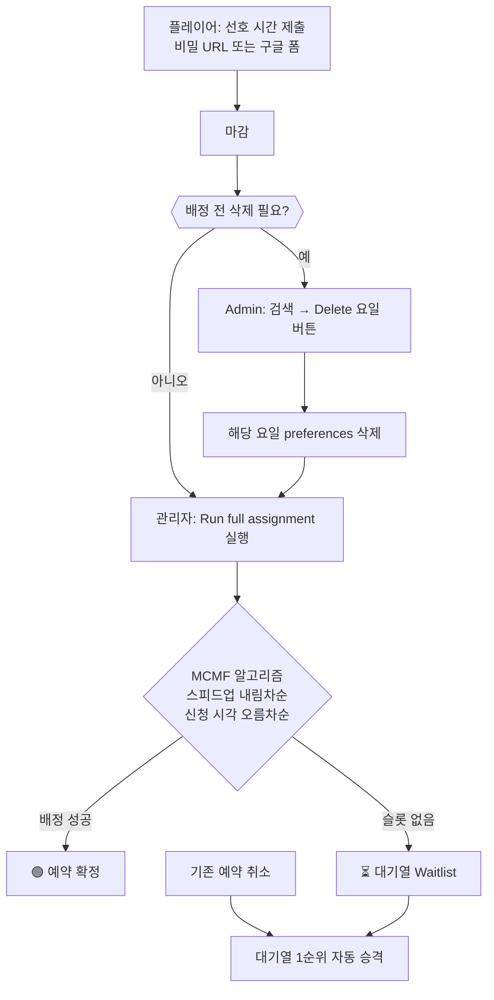
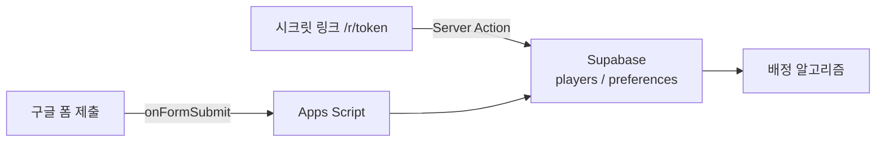

# SVS Reservation

> **Next.js 14 + Supabase + Vercel** 기반의 연맹 SVS(성) 예약·배정 웹앱


---

## 목차

- [로컬 개발](#-로컬-개발)
- [환경 변수](#-환경-변수)
- [Supabase 설정](#-supabase-설정)
- [배포](#-배포-vercel)
- [예약 수정 방법](#-예약-수정-방법)
- [운영 시나리오 요약](#-운영-시나리오-요약)
- [예약 배정 알고리즘](#-예약-배정-알고리즘)
- [구글 폼 연동](#-구글-폼-연동-선택)
- [npm 스크립트](#-npm-스크립트)
- [페이지 구조](#-페이지-구조)
- [폴더 구조](#-폴더-구조)
- [기술 스택](#-기술-스택)

---

## 로컬 개발

```bash
npm install
cp .env.example .env.local   # 또는 이미 있는 .env.local 수정
npm run check-env             # 환경 변수 검증
npm run dev
```

> 상세 설정 가이드: [docs/SETUP.md](docs/SETUP.md)

---

## 환경 변수

| 변수 | 설명 |
|------|------|
| `NEXT_PUBLIC_SUPABASE_URL` | Supabase 프로젝트 URL (예: `https://xxxx.supabase.co`) |
| `NEXT_PUBLIC_SUPABASE_ANON_KEY` | anon public key |
| `SUPABASE_SERVICE_ROLE_KEY` | service role key — **️ 서버 전용, 절대 클라이언트 노출 금지** |
| `IRON_SESSION_SECRET` | 32자 이상 랜덤 문자열 |

세션 시크릿 생성:

```bash
node -e "console.log(require('crypto').randomBytes(32).toString('hex'))"
```

---

## ️ Supabase 설정

1. [Supabase](https://supabase.com)에서 프로젝트 생성
2. SQL Editor에서 `supabase/schema.sql` 전체 실행
3. **Project Settings → API** 에서 URL, anon key, service_role key 복사

---

## ️ 배포 (Vercel)

1. GitHub에 push
2. Vercel에서 **Import** → 환경 변수 4개 등록
3. 배포 후 `/admin/setup`에서 관리자 비밀번호 설정
4. `/admin`에서 비밀 URL 확인 후 연맹원에게 공유

---

## ️ 예약 수정 방법

제출한 예약을 수정해야 할 경우, 아래 상황에 맞는 방법을 따르세요.

### 경우 1 — 구글 폼 마감 전

본인이 직접 수정할 수 있습니다.

1. 제출 당시 수신한 **이메일의 구글 폼 응답 확인 링크**를 클릭
2. 응답을 수정한 뒤 다시 제출

### 경우 2 — 배정 전 (구글 폼 마감 후, 배정 실행 전)

각 연맹의 **R4**에게 요청하세요.

R4는 Admin 페이지의 검색 기능으로 플레이어를 찾은 후, 특정 요일의 신청을 개별 삭제할 수 있습니다 (`Delete mon` / `Delete tue` / `Delete thu` 버튼).
삭제 후 플레이어는 시크릿 URL로 해당 요일을 다시 신청할 수 있습니다.

### 경우 3 — 배정 후

각 연맹의 **R4**에게 문의하세요.

```
요청 내용:
https://wos1234.vercel.app/admin 에서
전체 배정 실행 후 본인 예약 삭제 요청
```

R4가 삭제를 완료하면, **전달받은 시크릿 URL**(`/r/[token]`)로 다시 예약을 제출하세요.

> ️ 삭제 후 재제출하지 않으면 해당 사이클에서 배정 대상에서 제외됩니다.

상세 시나리오 표: [docs/RESERVATION_SYSTEM.md §3.5](docs/RESERVATION_SYSTEM.md#35-운영-시나리오-및-대응)

---

## 운영 시나리오 요약

### 예약 변경·수정

| # | 시점 | 신청 경로 | 플레이어 | R4+ Admin |
|---|------|-----------|----------|-----------|
| A | 구글 폼 **응답 수정 기간 내** | 구글 폼 | 제출 이메일의 **응답 수정 링크**로 직접 변경 | — |
| B | 폼 마감 후 · **배정 실행 전** | 구글 폼 / 시크릿 URL | R4에게 연락 | Search → **Delete mon/tue/thu** → 플레이어가 `/r/[token]`으로 해당 요일 재신청 |
| C | **배정 실행 후** | 구글 폼 / 시크릿 URL | R4에게 취소·변경 요청 | Schedule Grid **Cancel** (또는 배정 전이었다면 Delete) → 플레이어 재신청 |
| D | Admin 취소/삭제 후 **재신청 안 함** | — | 해당 요일·사이클에서 **배정 대상 제외** | — |

### 플레이어 신청

| # | 상황 | 시스템 동작 | 안내 |
|---|------|-------------|------|
| 1 | 신청 기간 · 첫 제출 | `preferences`만 저장 (`reservations` 없음) | *Application received…* |
| 2 | 같은 `player_id` + 요일 + 사이클 재제출 | 거부 | *Contact r4 if you need changes.* |
| 3 | 마감 후 (`reservation_open = false`) | 거부 | *Reservations are closed* |
| 4 | 구글 폼 + 시크릿 URL **동일 Player ID** | 두 번째 채널 거부 | 한 채널만 사용 |
| 5 | `/r/[token]/check` 조회 | 배정 전·후 상태 표시 | Application received / Assigned / On waitlist |

### Admin 단계별 UI

| 단계 | `last_assignment_run` | 주요 UI | 가능 작업 |
|------|----------------------|---------|-----------|
| 신청 기간 | 없음 | Applicants, Search (**Delete** 버튼) | Secret URL, Open/Close |
| 마감 ~ 배정 전 | 없음 | Search + Delete, (그리드 비어 있음) | 스피드업 검증, **Run full assignment** |
| 배정 후 | 있음 | Schedule Grid, Waitlist | 슬롯 **Cancel**, Export Excel |

> English + diagrams: [docs/RESERVATION_SYSTEM_EN.html](docs/RESERVATION_SYSTEM_EN.html)

---

## ️ 예약 배정 알고리즘

현재 시스템은 즉시 배정이 아닌 **일괄 배정(Batch Assignment)** 방식을 사용합니다.



> **MCMF 도입 이유:** 이전 Hopcroft-Karp 방식에서 발생하던 ① 빈 슬롯 + 대기자 동시 존재(V1), ② 스피드업 역전(V4) 문제를 해결했습니다. `verify:assignment` 기준 에러 0건·경고 0건.

 상세 동작: [docs/RESERVATION_SYSTEM.md](docs/RESERVATION_SYSTEM.md)

---

## 구글 폼 연동 (선택)

Vercel 콜드스타트 우회 목적으로 구글 폼 신청을 병행 운영할 수 있습니다.



| 항목 | 내용 |
|------|------|
| 중복 방지 | 구글 폼 응답 1회 제한 + `player_id + cycle_id + day_of_week` 기준 체크 |
| cycle_id | Supabase settings 테이블에서 동적 조회 — Reset 후 코드 수정 불필요 |
| Apps Script | [`scripts/appscript/onFormSubmit.gs`](scripts/appscript/onFormSubmit.gs) |

 설정 방법: [docs/RESERVATION_SYSTEM.md §17](docs/RESERVATION_SYSTEM.md#17-구글-폼-연동-apps-script-파이프라인)

---

## ️ npm 스크립트

### 개발

| 스크립트 | 설명 |
|----------|------|
| `npm run dev` | 로컬 개발 서버 |
| `npm run check-env` | 환경 변수 검증 |
| `npm run set-admin-password` | Admin 비밀번호 설정 |

### 테스트 데이터

| 스크립트 | 설명 |
|----------|------|
| `npm run inject:random -- N` | N명 무작위 신청 주입 (기본 120) |
| `npm run inject:test` | 실제 테스트 데이터 주입 |
| `npm run clear:assignments` | 현재 사이클 배정 결과만 삭제 |
| `npm run seed:stress` | clear + 120명 주입 |

### 배정 실행 및 검증

| 스크립트 | 설명 |
|----------|------|
| `npm run run:batch` | Admin 버튼과 동일한 일괄 배정 실행 |
| `npm run verify:assignment` | 배정 결과 검증 (V1~V5) — 에러 시 exit(1) |
| `npm run audit:reservations` | 사이클 전체 감사 |
| `npm run validate:assignment` | 배정 유효성 검사 |

### 유지보수

| 스크립트 | 설명 |
|----------|------|
| `npm run recover:waitlist` | 대기열 복구 |
| `npm run backfill:slots` | 빈 슬롯 백필 |
| `npm run reconcile:waitlist` | eliminated 정합성 정리 |
| `npm run purge:orphans` | 고아 players 삭제 |
| `npm run build:docs-html` | `RESERVATION_SYSTEM_EN.html` 재생성 |

<details>
<summary>배정 테스트 플로우</summary>

```bash
npm run inject:random -- 10
npm run run:batch
npm run verify:assignment
```

</details>

---

## 페이지 구조

| 경로 | 대상 | 설명 |
|------|------|------|
| `/r/[token]` | 연맹원 | 예약 신청 (비밀 URL) |
| `/r/[token]/check` | 연맹원 | 본인 예약 확인 |
| `/status` | 전체 공개 | 현황 조회 |
| `/admin` | 운영자 | 관리 패널 |

---

## 폴더 구조

<details>
<summary>펼쳐서 보기</summary>

```
wos1234/
├── README.md
├── middleware.ts
├── package.json
├── app/                   # Next.js 페이지·API
│   ├── admin/
│   ├── r/[token]/
│   ├── status/
│   └── api/
├── lib/                   # 공유 로직 (assignment, reservation-guard 등)
├── components/            # UI 컴포넌트
├── docs/
│   ├── RESERVATION_SYSTEM.md
│   ├── RESERVATION_SYSTEM_EN.md
│   ├── RESERVATION_SYSTEM_EN.html   # mobile-friendly (Mermaid)
│   ├── SETUP.md
│   └── implementation_plan.md
├── scripts/
│   ├── appscript/         # onFormSubmit.gs
│   ├── dev/               # inject-random, clear-cycle-assignments 등
│   ├── verify/            # verify-assignment, audit-reservations 등
│   ├── maintenance/       # run-batch-assignment, recover-waitlist 등
│   └── admin/             # check-env, set-admin-password
└── supabase/
    ├── schema.sql
    └── migrations/        # v4.sql, v5.sql
```

</details>

---

## 기술 스택

| 분류 | 기술 |
|------|------|
| 프레임워크 | Next.js 14 (App Router, Server Actions) |
| 데이터베이스 | Supabase (PostgreSQL + Realtime) |
| 스타일 | Tailwind CSS |
| 인증 | iron-session + bcryptjs |
| 배정 알고리즘 | Min-Cost Max-Flow (MCMF) |
| 배포 | Vercel |
