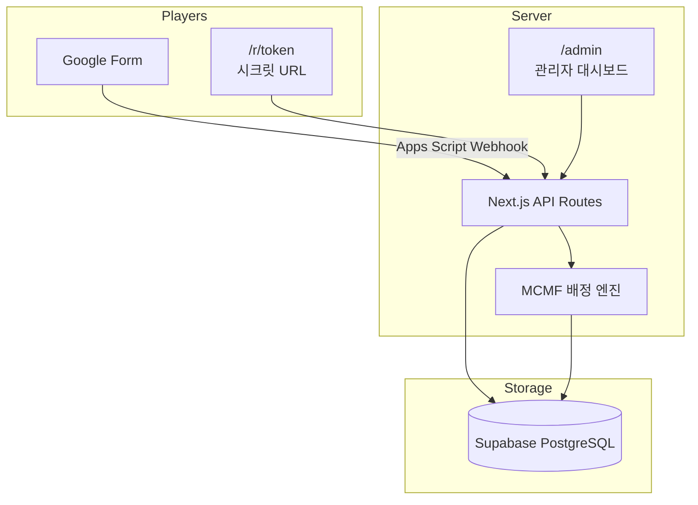
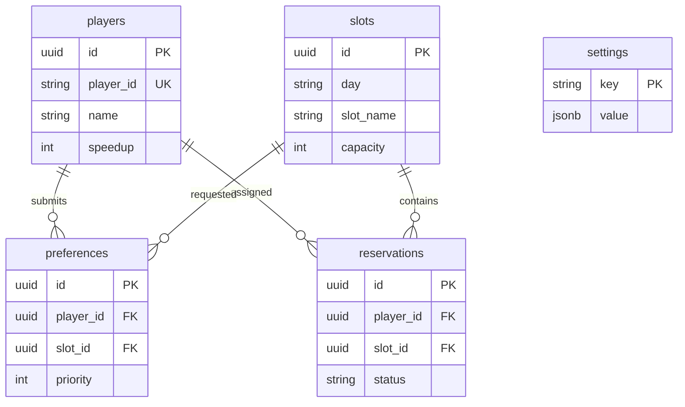
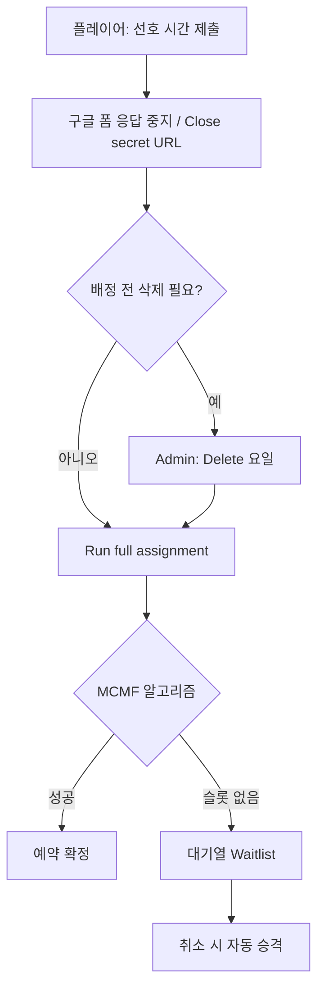

# SVS Reservation


취미 게임 커뮤니티(연맹)의 SVS(관직) 스케줄을 관리하고, **Min-Cost Max-Flow** 알고리즘으로 공정하게 예약·배정하는 모바일 퍼스트 웹앱입니다.

| 항목 | 내용 |
|------|------|
| **상태** | 배포 완료 (Vercel) |
| **유형** | 개인 프로젝트 (1인 풀스택) |
| **저장소** | `wos1234` |

---

## 목차

- [소개](#소개)
- [주요 기능](#주요-기능)
- [기술 스택](#기술-스택)
- [시스템 구조](#시스템-구조)
- [데이터베이스 설계](#데이터베이스-설계)
- [외부 API 키 및 필수 기능](#외부-api-키-및-필수-기능)
- [예약 배정 흐름](#예약-배정-흐름)
- [프로젝트 구조](#프로젝트-구조)
- [시작하기](#시작하기)
- [상세 문서](#상세-문서)
- [보안 · API 키 관리](#보안--api-키-관리)

---

## 소개

연맹원이 희망 시간대·관직을 신청하면, 관리자(R4)가 일괄 배정을 실행해 슬롯을 확정하는 시스템입니다. 구글 폼 또는 시크릿 URL(`/r/[token]`)로 신청을 받고, 스피드업·신청 시각을 기준으로 MCMF 알고리즘이 배정합니다.

---

## 주요 기능

| 기능 | 설명 |
|------|------|
| **예약 신청** | 구글 폼 또는 시크릿 URL로 선호 시간·관직 제출 |
| **일괄 배정** | Min-Cost Max-Flow(MCMF) 알고리즘으로 공정한 슬롯 배정 |
| **대기열** | 슬롯 부족 시 Waitlist, 취소 시 자동 승격 |
| **관리자 대시보드** | 신청자 조회, 배정 실행, 스케줄 그리드, Excel보내기 |
| **Google Forms 연동** | Apps Script → Webhook (선택) |
| **모바일 퍼스트 UI** | 연맹원 모바일 접속 환경에 최적화 |

---

## 기술 스택

| 영역 | 기술 |
|------|------|
| **Framework** | Next.js 14, React 18, TypeScript |
| **Database** | Supabase (PostgreSQL) |
| **인증** | Iron Session, bcryptjs |
| **배포** | Vercel |
| **알고리즘** | Min-Cost Max-Flow |
| **기타** | Tailwind CSS, xlsx |

---

## 시스템 구조


```mermaid
flowchart TB
    subgraph Players
        GF[Google Form]
        SEC["/r/token<br/>시크릿 URL"]
    end

    subgraph Server
        API[Next.js API Routes]
        MCMF[MCMF 배정 엔진]
        ADMIN["/admin<br/>관리자 대시보드"]
    end

    subgraph Storage
        SB[(Supabase PostgreSQL)]
    end

    GF -->|Apps Script Webhook| API
    SEC --> API
    ADMIN --> API
    API --> SB
    API --> MCMF
    MCMF --> SB
```

---

## 데이터베이스 설계

스키마: `supabase/schema.sql`


```mermaid
erDiagram
    players ||--o{ preferences : submits
    players ||--o{ reservations : assigned
    slots ||--o{ reservations : contains
    slots ||--o{ preferences : requested

    players {
        uuid id PK
        string player_id UK
        string name
        int speedup
    }
    slots {
        uuid id PK
        string day
        string slot_name
        int capacity
    }
    preferences {
        uuid id PK
        uuid player_id FK
        uuid slot_id FK
        int priority
    }
    reservations {
        uuid id PK
        uuid player_id FK
        uuid slot_id FK
        string status
    }
    settings {
        string key PK
        jsonb value
    }
```

| 테이블 | 설명 |
|--------|------|
| `players` | 연맹원 (player_id, speedup) |
| `slots` | 배정 슬롯 (요일·시간대·정원) |
| `preferences` | 신청 선호 (재제출 시 전체 교체) |
| `reservations` | 배정·대기열 결과 |
| `settings` | `reservation_open`, 사이클 설정 등 |
| `archived_*` | 이전 사이클 아카이브 |

---

## 외부 API 키 및 필수 기능

| 환경 변수 | 필수 | 연동 기능 | 없을 때 |
|-----------|------|-----------|---------|
| `NEXT_PUBLIC_SUPABASE_URL` | ✅ | DB 연결 (전체) | 앱 동작 불가 |
| `NEXT_PUBLIC_SUPABASE_ANON_KEY` | ✅ | 클라이언트 Supabase | DB 접근 불가 |
| `SUPABASE_SERVICE_ROLE_KEY` | ✅ | 서버 API (관리자·배정) | 서버 기능 불가 |
| `IRON_SESSION_SECRET` | ✅ | 관리자 세션 암호화 | `/admin` 로그인 불가 |
| `GOOGLE_FORM_WEBHOOK_SECRET` | 구글 폼 사용 시 | Webhook 인증 | 구글 폼 제출 거부 |

> `SUPABASE_SERVICE_ROLE_KEY`는 **서버 전용** — 클라이언트에 노출 금지

---

## 예약 배정 흐름


```mermaid
flowchart TD
    A[플레이어: 선호 시간 제출] --> B[구글 폼 응답 중지 / Close secret URL]
    B --> C{배정 전 삭제 필요?}
    C -->|예| D[Admin: Delete 요일]
    C -->|아니오| E[Run full assignment]
    D --> E
    E --> F{MCMF 알고리즘}
    F -->|성공| G[예약 확정]
    F -->|슬롯 없음| H[대기열 Waitlist]
    H --> I[취소 시 자동 승격]
```

---

## 프로젝트 구조

```
wos1234/
├── app/              # Next.js App Router
│   ├── admin/        # 관리자 대시보드
│   ├── api/          # API Routes
│   └── r/[token]/    # 시크릿 URL 예약
├── lib/              # MCMF 배정 로직
├── supabase/         # schema.sql
├── scripts/          # 검증·유지보수
└── docs/             # 운영 시나리오
```

---

## 시작하기

```bash
npm install
cp .env.example .env.local
npm run check-env
npm run dev
```

### 배포 (Vercel)

1. GitHub push → Vercel Import
2. 환경 변수 4~5개 등록
3. `/admin/setup`에서 관리자 비밀번호 설정

---

## 상세 문서

| 문서 | 내용 |
|------|------|
| [docs/RESERVATION_SYSTEM.md](docs/RESERVATION_SYSTEM.md) | 운영 시나리오, 예약 수정, 배정 상세 |

---

## 보안 · API 키 관리

- `.env.local`은 gitignore 처리, `.env.example`에 placeholder만 포함
- `SUPABASE_SERVICE_ROLE_KEY`는 API Route·Server Action에서만 사용
- `GOOGLE_FORM_WEBHOOK_SECRET`은 Apps Script `WEBHOOK_SECRET`과 일치해야 함
- 코드베이스에 하드코딩된 시크릿 없음
