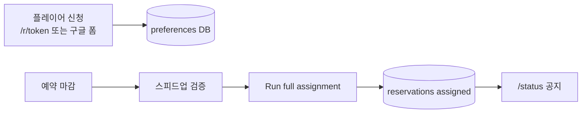
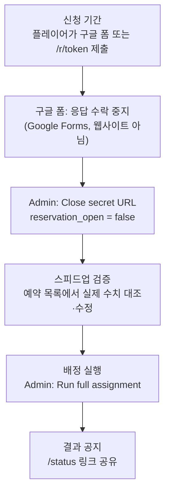

# 1. 기획

> **작성 방식 고지:** 이 문서는 완성된 코드·README·커밋 히스토리를 보고 **사후에 역산**한 것이다. 처음부터 이 형태로 기획서가 있었던 것은 아니다. (초기에 `implementation_plan.md`가 잠깐 있었으나, MCMF 도입 직후 커밋 `96629ae`에서 정리·삭제된 흔적이 있다.)

## 전체 플로우 (문서 기준)

`docs/RESERVATION_SYSTEM.md` §1·§3에서 가져온 다이어그램이다. 기획 시점의 원본이 아니라 **현재 문서에 적힌 운영 흐름**이다.

---

## 무엇을 만들려고 했는지

연맹 **SVS(관직) 예약·배정** 웹앱. 초기 커밋 `dd43e93` README 제목은 「WOS 관직 예약 자동화 시스템」. 현재 README / `docs/RESERVATION_SYSTEM.md` 기준:

- 플레이어가 **선호 시간(preferences)** 만 제출
- R4+ 운영자가 마감 후 **일괄 배정(Run full assignment)** 실행
- 배정 결과를 `/status` 등으로 공유

대상 요일은 **월·화(VP), 목(MO)**. 시간대는 UTC. 연맹 선택지는 현재 코드상 NWO / BOS / MAR / SXY (`lib/types.ts` `ALLIANCE_OPTIONS`).

배포 형태: Next.js 14 + Supabase + Vercel (`wos1234.vercel.app`). 최초 커밋(`dd43e93`, 2026-05-21) README에 **「모바일 우선 UI로 설계」**라고 적혀 있다.

---

## 대상 사용자 / 이해관계자

| 역할 | 근거 | 비고 |
|------|------|------|
| 연맹원(플레이어) | 초기 README: `/r/[token]` 신청, `/admin`에서 「연맹원에게 공유」 | 시크릿 URL로 접속 |
| R4+ 운영자 | 커밋 `7df25ad`: Admin 진입명을 `r4+ only`로 변경 | 비밀번호 + iron-session |
| (나중) 구글 폼 제출자 | README: 구글 폼 병행 | 시크릿 URL과 별 채널 |

**단일 연맹 vs 다중 연맹 (커밋·스키마 기준):**

- **처음부터 “한 연맹만”으로 하드코딩된 구조는 아니다.** 초기 스키마(`dd43e93` `players.alliance TEXT NOT NULL`)와 신청 폼은 연맹을 **자유 텍스트**로 받음.
- **NWO / BOS / MAR / SXY 네 코드로 고정한 UI**는 나중에 추가됨 (`086cec0`, 2026-06-10 — `ALLIANCE_OPTIONS` + 라디오 선택). 커밋 메시지 본문은 `.`라서 **왜 그때 네 연맹으로 고정했는지**는 커밋에 없음.
- Export·Summary도 연맹별 집계를 함 (`0cc8282` 등). 즉 **여러 연맹 코드를 한 사이클 DB에 같이 넣는** 형태.

정리: 데이터 모델은 초부터 multi-alliance 가능(자유 텍스트). 운영상 쓰는 네 연맹 코드는 중반에 UI로 고정.  
`[확인 필요: 실제 운영이 “한 서버/연합의 네 연맹(NWO·BOS·MAR·SXY) 공유 예약”인지, 처음부터 그 네 개만 쓸 계획이었는지]`

---

## 해결하려던 문제 / 동기

README·초기 커밋에 “왜 만들었는지”(수동 배정의 불편, 기존 툴 부재 등)는 **명시되어 있지 않다**.

- `[확인 필요: 연맹 운영에서 실제로 겪은 불편/동기]`

코드·문서에서 확인되는 **기능적 목표**는 다음 정도다.

- 스피드업이 높은 사람을 우선 배정 (`RESERVATION_SYSTEM.md` 개요)
- 빈 자리가 있는데 대기자만 남는 상황·스피드업 역전을 줄일 것 (README MCMF 도입 이유, `verify:assignment` V1·V4)
- 신청 채널을 시크릿 URL뿐 아니라 구글 폼과도 병행 (나중 추가 — README: Vercel 콜드스타트 우회)

---

## 비기능 요구사항

코드·커밋·문서에 **명시된 것**과 **확인 필요**를 나눈다.

### 보안

**사실 (문서·코드):**

- 플레이어 신청 URL은 `settings.access_token`과 일치해야 함 (`middleware.ts` + 서버 검증). Admin에서 재발급 가능 — 재발급 시 기존 `/r/...` 무효 (`RESERVATION_SYSTEM.md` §10).
- Admin은 bcrypt 해시 + iron-session (`requireAdmin`).
- DB 쓰기: service role / RPC. anon은 SELECT 위주 RLS (`RESERVATION_SYSTEM.md` §14).
- 구글 폼 웹훅: `GOOGLE_FORM_WEBHOOK_SECRET` + timing-safe 비교.

**시크릿 URL 유출 리스크:**

- 토큰을 아는 사람은 신청·조회 가능. 로그인 없는 **공유 비밀 링크** 모델이다.
- 문서·커밋에 “유출 시 대응 SOP”나 “토큰 만료” 같은 **명시적 비기능 요구는 없음**. 완화 수단으로 확인되는 것은 **Regenerate token**과 **Close secret URL**뿐.

- `[확인 필요: 시크릿 URL 유출을 기획 단계에서 어느 수준까지 감수했는지? (예: 연맹원만 단톡 공유, 유출 시 즉시 재발급 등)]`

### 동시성 (배정 도중 신청)

**사실:**

- 일괄 배정은 Admin이 **Run full assignment**를 누를 때 `runBatchAssignmentForCycle`이 mon→tue→thu로 돌아가고 `last_assignment_run`을 갱신한다.
- 배정 **실행 중** 신규 신청을 막는 락/트랜잭션은 코드에 **없다**. 운영 문서는 배정 **전에** 구글 폼 응답 중지 + Close secret URL을 하라고 한다 (`RESERVATION_SYSTEM.md` §3).
- 배정 **후** 시크릿 URL은 `reservation_open`에만 의존하고, 구글 폼은 `skipOpenCheck`로 계속 들어올 수 있다. `ASSIGNMENT_LOCKED_MESSAGE`는 정의만 있고 제출 경로에서 강제되지 않음 (`ADMIN_GUIDE_QUICKSTART_EN.md`).

- `[확인 필요: “배정 버튼 누르는 몇 초~수십 초 동안” 신청이 들어오면 그 preferences를 이번 배정에 포함할지 / 무시할지에 대한 의도적 정책이 있었는지?]`
- `[확인 필요: 배정과 신청의 동시성 제어를 DB 락으로 할지, SOP(마감 후 배정)로만 할지 처음에 어떻게 정했는지?]`

### 데이터 정합성 (`day_of_week` CHECK)

**사실:**

- `preferences.day_of_week` / `slots.day_of_week`는 `TEXT NOT NULL`이고, 스키마·마이그레이션 어디에도 `CHECK (day_of_week IN ('mon','tue','thu'))`가 **없다** (초기 `dd43e93`부터 동일).
- 앱·RPC는 `'mon'|'tue'|'thu'`를 가정하고 분기한다 (`lib/types.ts`, `submit_multi_day_reservation`).
- 커밋·문서에 “CHECK는 의도적으로 안 넣었다”는 기록 **없음**.

- `[확인 필요: day_of_week CHECK 미비는 의도적 보류(유연한 요일 확장 대비)인가, 단순 누락인가?]`

---

## 목표 기능 목록 (계획 단계 관점 / 사후 재구성)

실제로는 한 번에 설계된 게 아니라 커밋 순서상 단계적으로 붙었다. 아래는 “결과적으로 시스템이 담당하는 일”을 계획 관점으로 정리한 것.

| 구분 | 내용 | 비고 (커밋/코드 근거) |
|------|------|----------------------|
| 신청 | Player ID·이름·연맹·요일별 스피드업·선호 블록 제출 | 초기부터 `/r/[token]` |
| 다일 신청 | 월/화/목을 한 번에 | 초기엔 요일별 제출 → 이후 통합 |
| 일괄 배정 | 마감 후 Admin이 한 번에 배정 | 초기는 **제출 즉시 배정** → 배치로 전환. `RESERVATION_SYSTEM.md` §18에 차이만 기록. **전환 이유는 커밋 메시지에 없음 — 이유는 본인이 채울 것** |
| 대기열 | 미배정자는 eliminated(waitlist) | 배정 알고리즘과 함께 진화 |
| 공개 현황 | `/status` | 초기부터 |
| 본인 조회 | `/r/[token]/check` | 초기부터 |
| Admin | 시크릿 URL, 마감, 배정 실행, Cancel, Export, Reset | 기능명 변경: `9382f7b` 「Rename reservations to Secret URL & enforce closure」— UI를 Secret URL로 통일하고 마감 가드를 서버에 맞춤. `f00f1be` 「Clarify two-step…」— 구글 폼 마감과 시크릿 URL 마감이 **별개**임을 드러내려고 버튼/문구를 Close secret URL로 정리 |
| 구글 폼 | Apps Script → 웹훅 | **나중에** 추가 (Vercel 콜드스타트 우회 목적 — README 명시) |
| 감사 로그 | 삭제/취소/재제출 스냅샷 | **더 나중에** 추가 (v9, v10) |

구현되지 않았거나 정의만 남은 것 (사실만 — 상세·위험은 [3. 트러블슈팅](./3-트러블슈팅.md) / [2. 설계](./2-설계-및-구현-계획.md#미구현--잔여-갭-사실만)):

- 배정 후 신청 잠금 강제 (`ASSIGNMENT_LOCKED_MESSAGE` — 정의만 존재)
- `preferences.day_of_week` DB CHECK 제약

---

## 성공 기준

이 프로젝트의 **배정 품질 성공 기준**은 `npm run verify:assignment` (`scripts/verify/verify-assignment.ts`)가 정의하는 **V1~V5 위반 0건**이다.  
README도 MCMF 도입 후 「`verify:assignment` 기준 에러 0건·경고 0건」을 목표로 적고 있다.

| 코드 | 스크립트상 심각도 | 의미 (코드 주석·로그 문구) | 통과 조건 |
|------|-------------------|---------------------------|-----------|
| **V1** | 경고 | 어떤 블록에 빈 활성 슬롯이 있는데, 그 블록을 선호한 **미배정(eliminated) 대기자**가 있음 | 0건 |
| **V2** | 에러 | 한 플레이어가 **같은 요일에 슬롯 2개 이상** assigned | 0건 (`errors`에 포함, 있으면 `exit(1)`) |
| **V3** | 에러 | `is_active = false` 슬롯에 assigned | 0건 → `exit(1)` |
| **V4** | 경고 | 같은 블록에서 빈자리가 있을 때, 배정된 사람 중 최소 스피드업보다 **대기자 최대 스피드업이 더 큼** (스피드업 역전) | 0건 |
| **V5** | 에러 | assigned인데 해당 day+block **preferences가 없음** | 0건 → `exit(1)` |

스크립트 동작 요약:

- 현재 `cycle_id`의 reservations / preferences / slots / players를 읽어 위 규칙을 검사한다.
- 요약: `에러 N건 / 경고 M건`. **에러 ≥ 1이면 `process.exit(1)`**.
- 경고(V1·V4)만 있어도 exit code는 0이지만, 문서·README의 **목표 서술**은 경고 포함 **0건**이다.

배정 알고리즘·운영 SOP와 별개로, “이번 사이클 배정이 성공했다”고 말할 때의 기계적 기준은 위와 같다.
