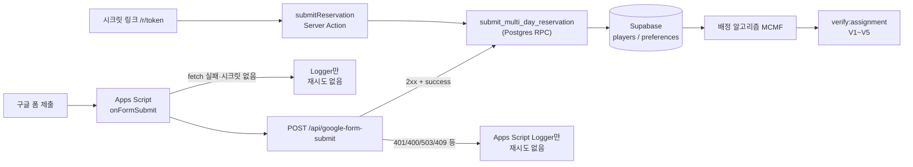
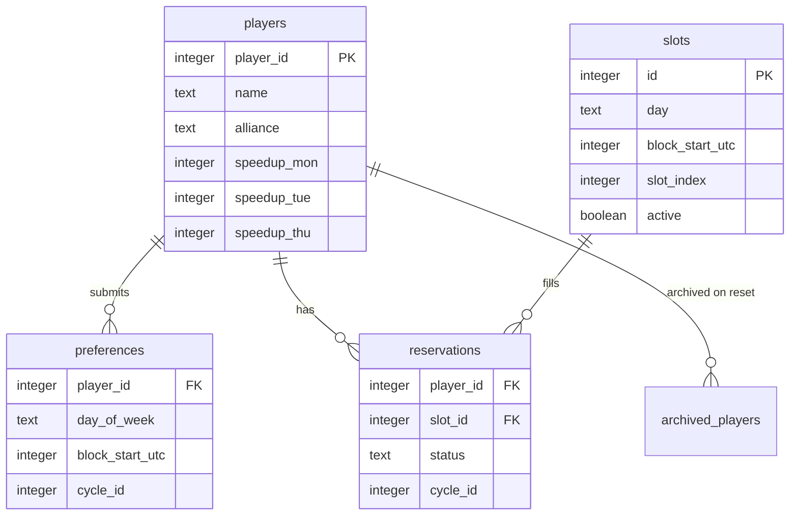

# 2. 설계 및 구현 계획

> **작성 방식 고지:** 완성된 스택을 보고 역산했다. 커밋을 보면 처음부터 MCMF·구글 폼·RPC를 짠 게 아니라, 중간에 갈아엎거나 붙인 흔적이 많다.

## 사용된 스택 / 라이브러리

| 기술 | 코드에서의 사용 | 선택 이유 |
|------|----------------|-----------|
| **Next.js 14** (App Router, Server Actions) | `app/` 페이지·`actions.ts` | 최초 커밋 `dd43e93` `package.json`·README에 「Next.js 14 + Supabase + Vercel」「모바일 우선 UI」로 명시. App Router·Server Actions를 Admin/신청에 사용. `[본인 확인 필요: 왜 Express/별도 API 서버가 아니라 Next 풀스택을 골랐는지]` |
| **React 18** | UI | 동일 최초 `package.json`에서 `next`와 함께 고정. Next 14의 UI 레이어. `[본인 확인 필요: React를 의식적으로 고른 건지, Next 기본이라서인지]` |
| **Supabase (PostgreSQL)** | `lib/supabase.ts`, RPC·테이블 | 최초 README에 스택·설정 절차(`schema.sql`)로 명시. Realtime은 `reservations` publication. `[본인 확인 필요: 왜 Firebase/자체 Postgres가 아니라 Supabase인지]` |
| **Vercel** | 배포 | 최초 README 「배포 (Vercel)」전용 섹션. 이후 구글 폼은 README상 **Vercel 콜드스타트 우회** 목적과 병행. |
| **Tailwind CSS** | 스타일 | 최초 `package.json` + `tailwind.config.ts`·`globals.css`(터치용 `min-h-touch` 등). README 「모바일 우선」과 맞춤. `[본인 확인 필요: 왜 CSS Modules/다른 UI 키트가 아니라 Tailwind인지]` |
| **iron-session + bcryptjs** | Admin 로그인 세션 | 최초부터 `settings.admin_password_hash` + 쿠키 세션(`lib/session.ts`). 플레이어는 Supabase Auth 없음·시크릿 URL만. `[본인 확인 필요: 왜 Supabase Auth 대신 iron-session+bcryptjs를 썼는지]` |
| **@supabase/supabase-js** | DB 클라이언트 | Supabase JS SDK (최초 dependencies) |
| **nanoid** | 시크릿 토큰 등 | 최초 dependencies. `[본인 확인 필요: access_token 생성에 nanoid를 쓴 구체적 이유]` |
| **xlsx / xlsx-js-style** | Admin Export Excel | 초기 CSV → 커밋 `266a8db` 「replace CSV export with Excel export」 |
| **marked + mermaid** | Admin How to use / 문서 HTML | 나중에 문서·가이드용으로 추가 |
| **Google Apps Script** | `scripts/appscript/onFormSubmit.gs` | README: Vercel 콜드스타트 우회. 스크립트 주석: Supabase가 Apps Script User-Agent를 거절해 **웹훅만** 호출 |
| **MCMF (자체 구현)** | `lib/assignment.ts` `solveDayAssignmentMCMF` | README/문서: Hopcroft-Karp의 V1·V4 결함 해결. 도입 커밋 `e6f8ec3` (메시지 본문은 `.`) — 아래 기술 근거 참고 |

### MCMF 도입 기술 근거 (`e6f8ec3` diff 기준)

커밋 `e6f8ec3`는 `hopcroftKarp` / `runFirstPassMatching`(Top-N 제한 1차) / `runSecondPassMatching`(빈 슬롯 2차) / `mergeMatchings`를 제거하고 `solveDayAssignmentMCMF`로 교체했다. 커밋 메시지 본문은 `.`라서 **문장으로 된 도입 이유는 없고**, diff·현재 README·`RESERVATION_SYSTEM.md` §8로 이유를 재구성한다.

Hopcroft-Karp는 **이분 그래프 최대 카디널리티 매칭**이다. 간선에 가중치(스피드업)를 두지 않으므로, “매칭 가능한 사람 수”를 최대화할 뿐 **여러 최대 매칭 중 스피드업이 높은 쪽을 고르는 목적함수가 없다**. 구버전은 스피드업을 **블록별 Top-N 자격 집합(들어가거나 말거나)** 으로만 반영했고, 빈자리를 메우려고 2-phase를 붙이면 Top-N 밖 인원이 들어가며 **V1(빈자리+대기자)** 과 **V4(스피드업 역전)** 이 남았다.

MCMF는 플레이어→슬롯 간선에 `cost = 순위 R`(Top-N 미달이면 `R + 1_000_000`)을 넣어, **최대 유량(배정 수)** 을 유지하면서 **비용 최소화로 스피드업 순위를 한 pass에 인코딩**한다. 그래서 “최대 매칭 + 별도 휴리스틱 백필” 대신 단일 네트워크로 V1·V4 목표(아래 검증 기준)를 맞추는 쪽으로 바뀌었다.

### `submit_multi_day_reservation` RPC 이관 근거

- 마이그레이션 `supabase/migrations/supabase_migration_v8.sql` 헤더: `Migration v8: transactional submit_multi_day_reservation RPC`
- 커밋 `4f14f1a` 메시지: *Move multi-day reservation submission logic to a new PostgreSQL RPC function for **transactional safety and atomicity**. This ensures all player and preference updates happen together or not at all.* (같은 커밋에서 `checkReservation`의 players DELETE 버그도 제거)

즉 앱에서 players / preferences / (조건부) reservations를 **여러 번 나눠 쓰던 구조의 원자성 문제**가 이관 이유로 커밋·마이그레이션에 명시되어 있다. (함수 내부 `BEGIN`/`EXCEPTION`은 에러 메시지 포맷용이며, 원자성의 본체는 **단일 RPC 호출 = 한 트랜잭션** 특성.)

---

## 설계 요구사항: `verify:assignment` (V1~V5)

배정 알고리즘·일괄 배정의 **합격선**으로 `npm run verify:assignment` (`scripts/verify/verify-assignment.ts`)를 둔다. README·`RESERVATION_SYSTEM.md`도 MCMF 이후 **에러 0 · 경고 0**을 목표로 적는다.

| 코드 | 심각도 | 의미 |
|------|--------|------|
| V1 | 경고 | 빈 활성 슬롯 + 해당 블록 선호 대기자(eliminated) 동시 존재 |
| V2 | 에러 | 한 플레이어가 같은 요일에 중복 assigned |
| V3 | 에러 | 비활성 슬롯에 assigned |
| V4 | 경고 | 같은 블록에서 배정 최소 스피드업 &lt; 대기자 최대 스피드업 (역전) |
| V5 | 에러 | preferences 없이 assigned |

에러 ≥ 1이면 `process.exit(1)`. **이 페이지가 V1~V5 정의의 기준 위치**이고, 트러블슈팅에서는 사례만 다루고 여기로 링크한다.

---

## 커밋에서 보이는 “계획과 다른 흐름”

1. **배정 방식:** 제출 즉시 배정 → 일괄 배정 → Hopcroft-Karp(및 2-phase 보완) → **MCMF** (`e6f8ec3`, 2026-06-03). `scripts/maintenance/run-batch-assignment.ts`에는 아직도 `"Running batch assignment (Hopcroft-Karp)…"` 로그 문자열이 남아 있음 (실제 호출은 MCMF).
2. **시간 표시:** UTC/KST 토글 있었음 → `c70f59d`에서 KST 제거, UTC만.
3. **Export:** CSV → Excel (`xlsx`).
4. **신청 채널:** 시크릿 URL만 → 구글 폼 병행. 폼 이메일 수집 ON/OFF·컬럼 인덱스가 문서·스크립트와 어긋난 적 있음.
5. **재제출 정책:** 요일 중복 거부 ↔ full replace 등 여러 번 바뀜 → 현재는 `player_id + cycle_id` 전체 교체.
6. **신청 저장:** 앱 서버에서 여러 쿼리 → `submit_multi_day_reservation` RPC (`4f14f1a`, 2026-07-06) — 위 원자성 근거.
7. **감사 로그:** 운영 중 부재 → v9/v10으로 사후 추가.

---

## 미구현 / 잔여 갭 (사실만)

위험 시나리오·왜 아직 안 고쳤는지는 [3. 트러블슈팅](./3-트러블슈팅.md) 항목 5·7.

| 항목 | 코드·문서상 사실 |
|------|------------------|
| 배정 후 신청 잠금 | `ASSIGNMENT_LOCKED_MESSAGE`가 `lib/reservation-guard.ts`에 정의만 됨. 제출 경로에서 미사용. Admin 가이드에 “not enforced” 명시. |
| `day_of_week` CHECK | `preferences.day_of_week` / `slots.day_of_week`는 `TEXT NOT NULL`, `CHECK (… IN ('mon','tue','thu'))` 없음 (초기 스키마부터). |

---

## 아키텍처 / 모듈 구조

`docs/RESERVATION_SYSTEM.md` §17 구조를 기준으로 하고, **구글 폼 웹훅 실패 분기**를 코드 확인 후 추가했다.

**실패 경로 사실 (`onFormSubmit.gs` / `app/api/google-form-submit/route.ts`):**

- Apps Script는 `UrlFetchApp.fetch` **1회**만 호출한다. 재시도·큐·백오프 **없음**.
- 시크릿 없음·네트워크 실패·비2xx·`success: false`(API는 409 등)면 **Logger에만 남기고 return**. 사용자/시트에 자동 재전송 없음.
- API는 시크릿 미설정 503, 인증 실패 401, 검증 실패 400, RPC 거절 409를 반환한다.



### 데이터 모델 (문서 §5 erDiagram)



텍스트 요약:

```
플레이어
  ├─ 구글 폼 → Apps Script → POST /api/google-form-submit
  │     ├─ 성공 → RPC
  │     └─ 실패 → 로그만 (재시도 없음)
  └─ /r/[token] → Server Action → RPC
        └─ players upsert + preferences 교체 (+ 조건부 reservations 삭제)

Admin /admin
  ├─ Open/Close secret URL
  ├─ Run full assignment (MCMF) → verify:assignment로 검증
  ├─ Cancel / Delete / Export / Reset
  └─ audit_log
```

주요 디렉터리:

| 경로 | 역할 |
|------|------|
| `app/r/[token]/` | 신청·조회 |
| `app/admin/` | 운영 UI·Server Actions |
| `app/api/google-form-submit/` | 폼 웹훅 |
| `lib/assignment.ts` | 신청 RPC 래퍼 + MCMF 배정 |
| `lib/reservation-guard.ts` | 메시지·대기열 dedupe 등 |
| `lib/audit-log.ts` | 감사 로그 |
| `lib/export-grid.ts` / `build-excel-workbook.ts` | Excel |
| `supabase/schema.sql` + `migrations/` | 스키마·RPC (v8 = 신청 원자성) |
| `scripts/verify/` | `verify:assignment` (V1~V5) 등 |
| `scripts/maintenance/` | 배정 실행·백필·복구 |
| `docs/` | 운영·기술 문서 |

DB 핵심 테이블: `players`, `preferences`, `reservations`, `slots`, `settings`, `archived_*`, `audit_log`.
