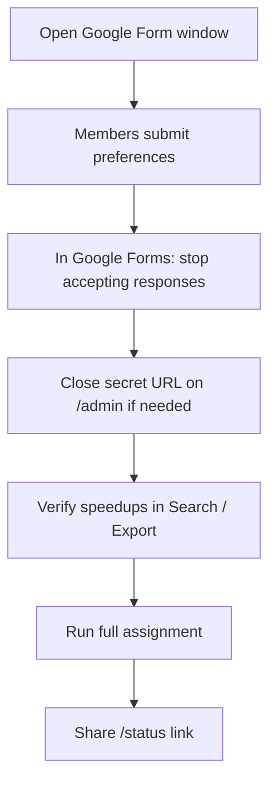

# 6. 사용방법

README와 코드를 대조했다. 환경 변수는 `.env.example` 기준이 README보다 한 항목 많다.

## 요구사항

- Node.js (프로젝트는 Next 14)
- Supabase 프로젝트
- (배포) Vercel
- (선택) Google Form + Apps Script

## 설치·실행

```bash
npm install
cp .env.example .env.local
npm run check-env
npm run dev
```

### Admin 비밀번호 — 언제 무엇을 쓰는지

둘 다 결과는 같다: `settings.admin_password_hash`에 bcrypt 해시를 upsert.

| 방법 | 코드 | 언제 |
|------|------|------|
| `npm run set-admin-password` | `scripts/admin/set-admin-password.mjs` — **로컬 `.env.local`** 의 URL·service role로 DB 접속, CLI 인자로 비밀번호 전달. `settings`에 **upsert**(이미 있어도 덮어씀) | **로컬 개발** (머신에 `.env.local`이 있을 때). Usage: `node scripts/admin/set-admin-password.mjs <password>` |
| `/admin/setup` | `app/admin/setup/` — UI 문구 *One-time setup after first deploy.* `setupAdminPassword`는 해시가 **이미 있으면** `"Password is already configured."`로 거부 | **최초 배포 직후·비밀번호 미설정일 때만**. 이후 변경은 CLI 또는 DB에서 직접 |

정리: **로컬·재설정은 CLI(전자), 배포 직후 최초 1회는 `/admin/setup`(후자).**

### 배포 후 확인 (최소 스모크 테스트)

1. **`/admin/setup`** — 비밀번호 미설정 상태면 폼이 뜨고 설정이 되는지 확인. (이미 설정돼 있으면 로그인·대시보드로 갈 수 있는지 `/admin/login`으로 확인.)
2. **`/status`** — 페이지가 로드되고 요일 탭·슬롯 그리드가 보이는지 확인.
3. **테스트 신청 1건** — 시크릿 URL(`/r/[token]`) 또는 구글 폼으로 Player ID 하나 제출한 뒤, `/admin` Search·Applicants(Pending) 등에서 해당 신청이 보이는지 확인.

## 환경 변수

| 변수 | 필수 | 설명 |
|------|------|------|
| `NEXT_PUBLIC_SUPABASE_URL` | O | Supabase URL |
| `NEXT_PUBLIC_SUPABASE_ANON_KEY` | O | anon key |
| `SUPABASE_SERVICE_ROLE_KEY` | O | 서버 전용 |
| `IRON_SESSION_SECRET` | O | 32자 이상 |
| `GOOGLE_FORM_WEBHOOK_SECRET` | 폼 쓸 때 | Apps Script `WEBHOOK_SECRET`과 동일 |
| `NEXT_PUBLIC_BASE_URL` | 선택 | Admin 시크릿 URL 표시용 (문서에만, `.env.example`엔 없음) |

세션 시크릿 생성: `npm run setup:secret` 또는 README의 `crypto.randomBytes` 한 줄.

## Supabase

1. SQL Editor에서 `supabase/schema.sql` 전체 실행 (초기 스키마).
2. 이어서 `supabase/migrations/`를 **아래 순서대로 전부** SQL Editor에서 실행한다.

| 순서 | 파일 | 내용 (파일 헤더·본문 기준) |
|------|------|---------------------------|
| 1 | `supabase_migration_v4.sql` | archive 테이블 + `archive_and_reset_cycle` RPC |
| 2 | `supabase_migration_v5.sql` | `players.email` 추가 (이후 v6에서 삭제) |
| 3 | `supabase_migration_v6.sql` | `email` 컬럼 제거 |
| 4 | `supabase_migration_v7.sql` | `game_id` → `player_id` 리네임 |
| 5 | `supabase_migration_v8.sql` | `submit_multi_day_reservation` RPC |
| 6 | `v9_audit_log.sql` | `audit_log` 테이블 |
| 7 | `v10_audit_log_resubmit.sql` | `resubmit_preference` + `source` 등 |

**프로덕션에 뭐가 들어가 있는지는 본인만 확인 가능.** 이 레포는 Supabase CLI `db push` 이력이 문서화되어 있지 않고, SQL Editor 수동 적용을 전제로 한다.

확인 방법 (택1):

1. **Supabase Dashboard → Table Editor**  
   - `audit_log` 존재? → v9(+v10) 반영 여부  
   - `players`에 `player_id`이고 `game_id`/`email` 없는지 → v6·v7  
2. **SQL Editor**에서 함수 확인:  
   `select proname from pg_proc where proname in ('submit_multi_day_reservation','archive_and_reset_cycle');`
3. CLI로 마이그레이션을 관리 중이면 **`supabase_migrations.schema_migrations`**(또는 프로젝트의 migrations 이력 테이블)를 열어 적용된 버전과 위 목록을 대조.  
   → **직접 대시보드에서 확인 필요.** 여기서 프로덕션 상태를 단정하지 않는다.

## 배포 (Vercel)

1. GitHub push → Vercel Import  
2. 환경 변수 등록 (폼 쓰면 웹훅 시크릿 포함)  
3. `/admin/setup` → `/admin`에서 Secret URL 확인  
4. 위 **배포 후 확인** 스모크 3단계

## 자주 쓰는 npm 스크립트

| 명령 | 용도 |
|------|------|
| `npm run run:batch` | 일괄 배정 (Admin 버튼과 동일 로직) |
| `npm run verify:assignment` | V1~V5 검증 |
| `npm run inject:random -- N` | 테스트 신청 주입 |
| `npm run clear:assignments` | 배정만 삭제 — **⚠️ 프로덕션에서 절대 실행 금지 (테스트/스테이징 전용)** |
| `npm run seed:stress` | clear + 120명 — **⚠️ 프로덕션에서 절대 실행 금지 (테스트/스테이징 전용)** |

## 사이클 운영 흐름 (Admin 가이드)

`docs/ADMIN_GUIDE_QUICKSTART_EN.md`의 플로우. (스크린샷은 해당 문서에 없음.)



## 운영 시 마감 (중요)

1. Google Forms에서 **응답 수락 중지**  
2. Admin **Close secret URL** (`reservation_open = false`)  

둘은 독립이다. 하나만 닫으면 다른 채널로 계속 들어온다.

## 구글 폼 (선택)

- 스크립트: `scripts/appscript/onFormSubmit.gs`  
- Script properties: `WEBHOOK_URL`, `WEBHOOK_SECRET`  

### 시트 행 인덱스 (중요)

로컬 `onFormSubmit.gs`에는 **이메일 ON/OFF 분기 로직이 없다.** 주석·코드 모두 **이메일 수집 ON** 고정이다.

| 설정 | `e.values` (관례) | 현재 로컬 스크립트가 읽는 값 |
|------|-------------------|------------------------------|
| **이메일 수집 ON** (현 로컬 파일) | `row[0]` 시각, `row[1]` email, `row[2]` Player ID, `row[3]` Name … | `row[2]` = Player ID, `row[3]` = Name … (**코드와 일치**) |
| **이메일 수집 OFF** | `row[0]` 시각, `row[1]` Player ID, `row[2]` Name … | 코드가 그대로면 **`row[2]`를 Player ID로 오인** (실제는 Name 등). OFF면 **`row[1]`=Player ID**로 인덱스를 고쳐야 함 |

즉 「OFF일 때는 row[1]=Player ID」는 **폼 레이아웃 사실**이고, **스크립트는 자동으로 바꿔 주지 않는다.** 배포 Apps Script와 로컬·문서가 어긋난 이력이 있음 → [3. 트러블슈팅 §8 로컬–배포 드리프트](./3-트러블슈팅.md#8-로컬배포-코드-드리프트-진행-예정--경미-운영-불편).  
붙여넣기 전 **실제 배포 스크립트·폼 이메일 설정**을 반드시 대조할 것.

## 페이지

| 경로 | 용도 |
|------|------|
| `/r/[token]` | 신청 |
| `/r/[token]/check` | 본인 조회 |
| `/status` | 공개 현황 |
| `/admin` | 운영 |
| `/admin/setup` | 최초 Admin 비밀번호 |
| `/admin/guide` | How to use |

상세 시나리오: `docs/RESERVATION_SYSTEM.md`, `docs/ADMIN_GUIDE_QUICKSTART_EN.md`.
