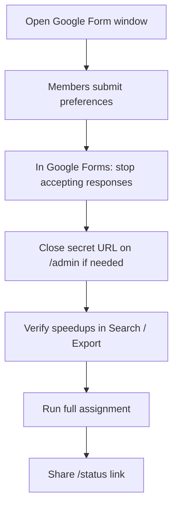

# Admin Quick Reference

For R4+ admins with access to this site. Explains how the reservation system works and how to run each cycle on the dashboard.

## How the system works

| Phase | What happens |
|-------|----------------|
| Application window | Members submit **preferences only** (day, speedup, preferred UTC blocks). No slot assignment yet. |
| After deadline | In **Google Forms** (not this website), stop accepting responses on the form. On `/admin`, close the secret URL if needed, verify speedups, then **Run full assignment**. |
| After assignment | Results appear on **`/status`**. Members can check their own status via `/r/.../check` or `/status`. |

**Application channels**

| Channel | When to use |
|---------|-------------|
| **Google Form** | **Normal path** during the application window (email collection **off** — no post-submit edit link; **re-submit form** to update) |
| **Secret link** (`/r/...`) | **Plan B only** — not the everyday path. Use for corrections during the window or late/special cases after the form closes. Share from the dashboard only when needed. |

**Re-submit rule (both channels):** same **Player ID + cycle** → **full replace** via `processMultiDayReservation` (DELETE all preferences for that player in the cycle, then INSERT the new submission). Latest submission wins. **Google Form** ignores `reservation_open` (`skipOpenCheck`). **Secret link** is rejected when `reservation_open = false` (dashboard shows **Close secret URL** / banner **Secret URL closed**). **After assignment**, re-submitting also DELETEs that player's `reservations` (assigned and eliminated) before replacing preferences — accidental re-submits can clear slots. (`ASSIGNMENT_LOCKED_MESSAGE` exists in code but is **not** enforced on submit.)

## Operating rules (read first)

- **Secret URL is not the normal path.** It is plan B for special situations only. Day-to-day applications go through the **Google Form**.
- **Closing reservations** means stopping responses **in Google Forms itself** (Responses → accept responses off / equivalent). That is done on Google Forms, **not** on this website. The dashboard button **Close secret URL** only toggles `reservation_open` for `/r/...` — it does **not** stop Google Form submissions.
- **Do not press Run full assignment casually.** It recalculates Mon → Tue → Thu for the whole cycle; a re-run **replaces** current assignments. Close the form, verify speedups, then run it once you are ready.
- **Delete** (Search, pre-assignment) and **Cancel** (Schedule Grid, post-assignment) are written to the `audit_log` table (snapshot of the deleted/cancelled rows) before the action runs. Review logs in Supabase if you need a trail.

## Dashboard workflow (each cycle)

| Step | Action |
|------|--------|
| 1 | Distribute the **Google Form** link (main path). Keep secret URL available only as plan B. |
| 2 | When the window ends → in **Google Forms** (not `/admin`), stop accepting responses (close reservations). On `/admin`, use **Close secret URL** if `/r/...` should also reject submits. |
| 3 | **Search** or **Export Excel** — cross-check speedup values; edit if needed |
| 4 | **Run full assignment** (yellow panel) — only when ready (see Operating rules) |
| 5 | Share **`/status`** with the alliance |
| 6 | After assignment: use **Schedule Grid** for slot **Cancel**; **Waitlist** to review eliminated players |

> Before assignment, the schedule grid is expected to be empty — only `preferences` exist until you run assignment. Dashboard open/close controls are labeled **Open secret URL** / **Close secret URL**.

## Handling member changes

| # | Timing | Member | R4 action |
|---|--------|--------|-----------|
| A | During application window · needs to change | **Re-submit** via Google Form (same Player ID); secret link only if needed (plan B) | (Optional) Search → **Delete** if removal only (logged to `audit_log`) |
| B | After form close · before assignment | Contact R4 → **re-submit via secret link** (plan B; requires secret URL open) | (Optional) Search → **Delete** (logged to `audit_log`) |
| C | After assignment · re-submit | Google Form (always) or secret link (`reservation_open = true`) — **re-submit** deletes existing assignment + replaces preferences | — |
| C-2 | After assignment · R4 adjustment | Request change from R4 (case by case — may affect others) | Schedule Grid **Cancel** (logged to `audit_log`) |

Full scenario tables: **Technical Reference → §3.5 Operational Scenarios** below.

## Site pages (this deployment)

| Path | Who | Purpose |
|------|-----|---------|
| `/admin` | R4+ | Dashboard — secret URL open/close, assign, search, grid |
| `/admin/guide` | R4+ | This page |
| `/status` | Public | Live schedule and waitlist after assignment |
| `/r/[token]` | Members (late/special — plan B) | Application form |
| `/r/[token]/check` | Members | Check application / assignment by Player ID |

## Warnings

- **Do not press Run full assignment** unless you intend to (re)assign the whole cycle. Prefer verifying applicants first.
- **Do not press Reset cycle** during an active booking period unless you intentionally want to archive and wipe the entire cycle’s data and start a new cycle number.
- Regenerating the **secret URL** on the dashboard invalidates all existing `/r/...` links immediately.
- Admin **Delete** / **Cancel** leave an `audit_log` snapshot; they do not remove the player row from `players`.

---

# Player Quick Reference

How members apply and what they experience — useful when answering questions or handling change requests.

## Before they apply

- **Player ID**, **Player Name**, and **alliance** (NWO / BOS / MAR / SXY).
- All times are **UTC** (not KST).
- Submitting saves **preferences only**; slots are assigned after the booking window closes.

## How to apply

**Google Form** (main, during the application window)

Paste this in the form description (see [RESERVATION_SYSTEM.md §17](RESERVATION_SYSTEM.md#폼-상단-안내-문구-복사용) for full text):

> Resubmitting with the same Player ID **replaces your entire application** for this cycle with your latest submission. Monday, Tuesday, and Thursday can each be applied for separately. If you play multiple characters, **submit the form once per Player ID**. You cannot edit a Google Form response after submit — submit the form again with the same Player ID, use the **secret link**, or contact ops (r4). After assignment runs, re-submitting **deletes your existing assignment** and replaces your preferences — contact r4 if you need to keep a slot or need an ops adjustment.

1. Enter Player ID, Player Name, and alliance.
2. For each day (**Monday VP**, **Tuesday VP**, **Thursday MO**): speedup (days) + one or more UTC blocks.
3. Submit.

- **Cannot edit** the form after submit (email collection is off). To fix a mistake: **submit the form again** with the same Player ID, or use the **secret link** (when `reservation_open = true` for the secret link).

**Secret link** (`/r/...`) — **plan B only**, when R4 provides it

- Not the everyday application path (Google Form is).
- Corrections during the application window.
- Late or special cases after the form closes (requires secret URL open on the dashboard).
- Re-submitting **replaces** your entire application for the cycle (only days in this submit remain).

## Rules members should know

| Rule | Detail |
|------|--------|
| Re-submit | Same **Player ID** in the current cycle → **latest submission replaces** the previous one (Mon / Tue / Thu can be combined in one submit) |
| Days omitted | Days **not** included in a re-submit are **removed** from preferences |
| No form edit after submit | Google Form has no edit link — re-submit form or use secret link |
| Google account vs Player ID | **Limit to 1 response: Off** — same Google account can submit **multiple times** for **different Player IDs** |
| Deadline | Main channel: stop accepting responses **in Google Forms** (not this site). Secret link rejected after R4 uses **Close secret URL** (`reservation_open = false`); Google Form still accepts until you stop it in Google Forms |
| Both channels | Form and secret link both **full replace** — latest wins |
| After assignment | Google Form re-submit always allowed (deletes `reservations` + replaces preferences). Secret link: same when `reservation_open = true`. Contact R4 to keep a slot or for ops adjustments |

## Check status

| When | Where | What they see |
|------|-------|---------------|
| Anytime | `/r/.../check` | Application / assigned / waitlist by Player ID |
| After assignment | `/status` | Public schedule (no login) |

| Status | Meaning |
|--------|---------|
| Application received | Saved; assignment not run yet |
| Assigned | Slot confirmed with time |
| On waitlist | No slot; preferred blocks listed |

## Member change requests

| Situation | Member action |
|-----------|---------------|
| During application window · wrong answers | **Re-submit** Google Form (same Player ID) or **secret link** |
| After form close, before assignment | Contact R4 → **secret link** re-submit |
| After assignment · re-submit | Google Form (always) or secret link (`reservation_open = true`) — **re-submit** replaces preferences and deletes existing assignment rows |
| After assignment · keep slot / ops change | Contact R4 — Schedule Grid **Cancel** etc. |

---
