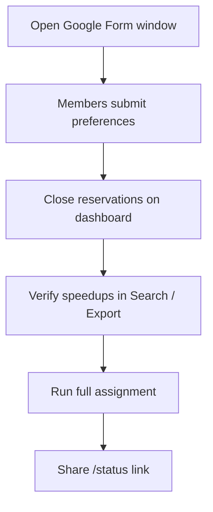

# Admin Quick Reference

For R4+ admins with access to this site. Explains how the reservation system works and how to run each cycle on the dashboard.

## How the system works

| Phase | What happens |
|-------|----------------|
| Application window | Members submit **preferences only** (day, speedup, preferred UTC blocks). No slot assignment yet. |
| After deadline | You close reservations, verify speedups, then **Run full assignment**. |
| After assignment | Results appear on **`/status`**. Members can check their own status via the secret link. |

**Application channels**

| Channel | When to use |
|---------|-------------|
| **Google Form** | Main path during the normal application window (email collection **off** — no post-submit edit via form) |
| **Secret link** (`/r/...`) | Corrections during the window, late cases after form closes — share from dashboard when needed |

Duplicate rule (both channels): same **Player ID + same day + cycle** → second submission is rejected. Different days (Mon/Tue/Thu) are OK.

## Dashboard workflow (each cycle)

| Step | Action on `/admin` |
|------|---------------------|
| 1 | Confirm **reservations open**; distribute the Google Form link |
| 2 | When the window ends → **Close reservations** |
| 3 | **Search** or **Export Excel** — cross-check speedup values; edit if needed |
| 4 | **Run full assignment** (yellow panel) |
| 5 | Share **`/status`** with the alliance |
| 6 | After assignment: use **Schedule Grid** for slot cancellations; **Waitlist** to review eliminated players |

> Before assignment, the schedule grid is expected to be empty — only `preferences` exist until you run assignment.

## Handling member changes

| # | Timing | Member | R4 action |
|---|--------|--------|-----------|
| A | During application window · needs to change | Contact R4 → re-apply **via secret link** | Search → **Delete mon/tue/thu** for that day |
| B | After form close · before assignment | Contact R4 → re-apply **via secret link** | Search → **Delete mon/tue/thu** for that day |
| C | After assignment | Request change from R4 (case by case — may affect others) | Schedule Grid **Cancel** only when appropriate |

Full scenario tables: **Technical Reference → §3.5 Operational Scenarios** below.

## Site pages (this deployment)

| Path | Who | Purpose |
|------|-----|---------|
| `/admin` | R4+ | Dashboard — open/close, assign, search, grid |
| `/admin/guide` | R4+ | This page |
| `/status` | Public | Live schedule and waitlist after assignment |
| `/r/[token]` | Members (late/special) | Application form |
| `/r/[token]/check` | Members | Check application / assignment by Player ID |

## Warnings

- **Do not press Reset cycle** during an active booking period unless you intentionally want to archive and wipe the entire cycle’s data and start a new cycle number.
- Regenerating the **secret URL** on the dashboard invalidates all existing `/r/...` links immediately.

---

# Player Quick Reference

How members apply and what they experience — useful when answering questions or handling change requests.

## Before they apply

- **Player ID**, **Player Name**, and **alliance** (NWO / BOS / MAR / SXY).
- All times are **UTC** (not KST).
- Submitting saves **preferences only**; slots are assigned after the booking window closes.

## How to apply

**Google Form** (main, during the application window)

Paste this in the form description (see [RESERVATION_SYSTEM.md §17](RESERVATION_SYSTEM.md#폼-상단-안내-문구-복사용) for full text):

> Submitting the same Player ID for the same day more than once will only count **once per day**. Monday, Tuesday, and Thursday can each be applied for separately. If you play multiple characters, **submit the form once per Player ID**. You cannot edit your form response after submission. To make changes, use the **secret link** or contact ops (r4).

1. Enter Player ID, Player Name, and alliance.
2. For each day (**Monday VP**, **Tuesday VP**, **Thursday MO**): speedup (days) + one or more UTC blocks.
3. Submit.

- **Cannot edit** the form after submit (email collection is off). To fix a mistake: contact R4 → they delete that day → you re-apply via **secret link**.

**Secret link** (`/r/...`) — when R4 provides it

- Corrections during the application window (after R4 deletes that day).
- Late or special cases after the form closes.
- Do not use if they already applied for that day via the Google Form without R4 deleting first (duplicate rejected).

## Rules members should know

| Rule | Detail |
|------|--------|
| One application per day | Same **Player ID** cannot apply twice for the **same day** in the current cycle (Mon / Tue / Thu are separate) |
| No form edit after submit | Google Form does not send an edit link — contact R4 for changes |
| Google account vs Player ID | **Limit to 1 response: Off** — same Google account can submit **multiple times** for **different Player IDs**; duplicate rule is **per Player ID per day** only |
| Deadline | Rejected after R4 closes reservations |
| Both channels | Same Player ID + same day on Form and secret link → second attempt rejected |

## Check status

| When | Where | What they see |
|------|-------|---------------|
| Anytime | `/r/.../check` | Application / assigned / waitlist by Player ID |
| After assignment | `/status` | Public schedule (no login) |

| Status | Meaning |
|--------|---------|
| Application received | Saved; assignment not run yet |
| Assigned | Slot confirmed with time |
| On waitlist | No slot; preferred blocks listed |

## Member change requests

| Situation | Member action |
|-----------|---------------|
| During application window · wrong answers | Contact R4 → **secret link** after R4 deletes that day |
| After form close, before assignment | Contact R4 → re-apply **via secret link** after R4 deletes that day |
| After assignment | Contact R4 — changes depend on situation and may affect other players |

---
