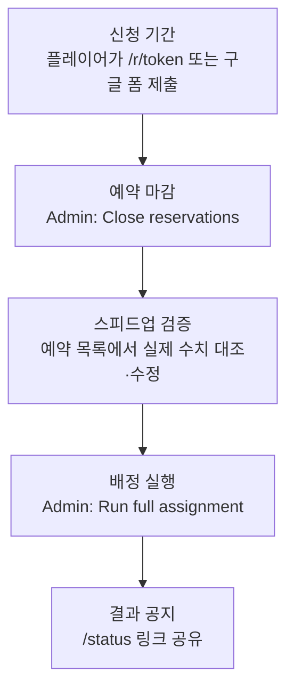
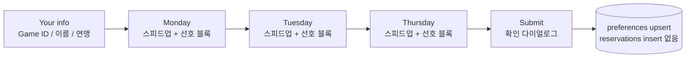
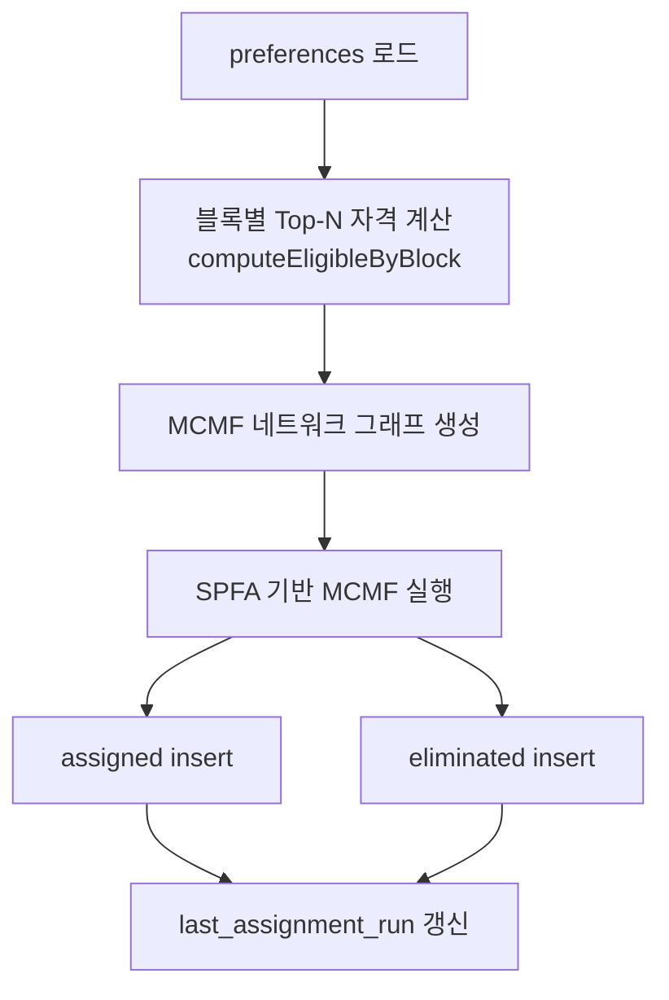
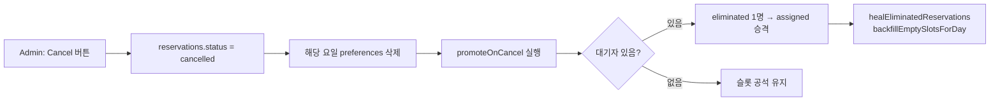
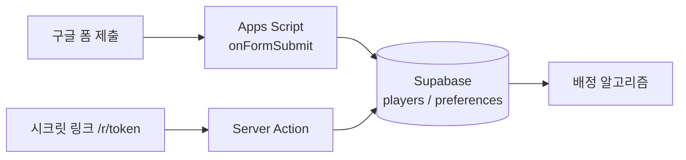

# SVS 예약 시스템 — 상세 설명

Next.js 14 + Supabase 기반의 연맹 SVS(성) 예약·배정 시스템입니다.
플레이어는 **신청 기간에 선호 시간만 제출**하고, R4+ 운영자가 **마감·검증 후 일괄 배정**합니다.
배정 알고리즘은 **Min-Cost Max-Flow (MCMF)** 최소 비용 최대 유량을 사용합니다.

> English version: [RESERVATION_SYSTEM_EN.md](RESERVATION_SYSTEM_EN.md)

---

## 목차

1. [개요](#1-개요)
2. [환경 변수](#2-환경-변수)
3. [운영 워크플로](#3-운영-워크플로)
4. [페이지·URL](#4-페이지url)
5. [데이터 모델](#5-데이터-모델)
6. [시간·슬롯 구조](#6-시간슬롯-구조-utc)
7. [플레이어 신청 흐름](#7-플레이어-신청-흐름)
8. [일괄 배정 알고리즘](#8-일괄-배정-알고리즘)
9. [배정 후 동작](#9-배정-후-동작-취소승격)
10. [관리자 기능](#10-관리자admin-기능)
11. [공개 현황](#11-공개-현황-status)
12. [사이클](#12-사이클cycle)
13. [settings 키](#13-설정settings-키)
14. [보안·접근 제어](#14-보안접근-제어)
15. [개발·테스트 스크립트](#15-개발테스트용-스크립트)
16. [관련 소스 파일](#16-관련-소스-파일)
17. [구글 폼 연동](#17-구글-폼-연동-apps-script-파이프라인)
18. [구버전과의 차이](#18-부록-구버전과의-차이)

---

## 1. 개요

| 구분 | 내용 |
|------|------|
| 목적 | 월/화(VP)·목(MO) 성 예약을 스피드업 우선으로 공정 배정 |
| 신청 | 비밀 URL `/r/[token]` 또는 구글 폼 — 선호(preferences)만 DB 저장, 슬롯 배정 없음 |
| 배정 | Admin **Run full assignment** — 사이클 전체를 Mon → Tue → Thu 순으로 재계산 |
| 알고리즘 | Min-Cost Max-Flow (MCMF) — 빈 슬롯·대기자 동시 존재 및 스피드업 역전 문제 해결 |
| 시간대 | UTC만 표시 (KST 토글 없음) |
| 인증 | 플레이어: URL 토큰 / 운영자: Admin 비밀번호(iron-session) |

```mermaid
flowchart LR
  A[플레이어 신청\n/r/token 또는 구글 폼] --> B[(preferences DB)]
  C[예약 마감] --> D[스피드업 검증]
  D --> E[Run full assignment]
  E --> F[(reservations assigned)]
  F --> G[/status 공지]
```

---

## 2. 환경 변수

| 변수 | 설명 |
|------|------|
| `NEXT_PUBLIC_SUPABASE_URL` | Supabase 프로젝트 URL (예: `https://xxxx.supabase.co`) |
| `NEXT_PUBLIC_SUPABASE_ANON_KEY` | Supabase anon public key |
| `SUPABASE_SERVICE_ROLE_KEY` | service role key — **서버 전용, 절대 클라이언트 노출 금지** |
| `IRON_SESSION_SECRET` | Admin 세션 암호화 키 (32자 이상 랜덤 문자열) |

```bash
# 세션 시크릿 생성
node -e "console.log(require('crypto').randomBytes(32).toString('hex'))"

# 환경 변수 검증
npm run check-env
```

---

## 3. 운영 워크플로



| 단계 | 담당 | 동작 | DB 변화 |
|------|------|------|---------|
| 신청 기간 | 플레이어 | `/r/[token]` 또는 구글 폼에서 요일·스피드업·선호 블록 제출 | `players`, `preferences` |
| 예약 마감 | R4+ Admin | **Close reservations** 토글 | `settings.reservation_open = false` |
| 스피드업 검증 | R4+ Admin | 예약 목록·검색·그리드에서 실제 수치 대조·수정 | `players` (필요 시) |
| 배정 실행 | R4+ Admin | **Run full assignment** | `reservations` (assigned / eliminated), `last_assignment_run` |
| 결과 공지 | R4+ | `/status` 링크 공유 | — (조회만) |

> **주의:** 신청 단계에서는 `reservations`에 `assigned` 행이 생기지 않습니다. 그리드가 비어 있어야 정상입니다.

---

## 4. 페이지·URL

| 경로 | 접근 | 설명 |
|------|------|------|
| `/r/[token]` | 비밀 토큰 일치 시 | 다단계 신청 폼 (정보 → 월 → 화 → 목) |
| `/r/[token]/check` | 동일 토큰 | Game ID로 신청·배정·대기 상태 조회 |
| `/status` | 공개 | 실시간 스케줄·대기열 (배정 전/후 문구 분기) |
| `/admin` | 로그인 후 | URL·마감·배정·검색·그리드·Reset |
| `/admin/login` | — | 비밀번호 로그인 |
| `/admin/setup` | 최초 1회 | 관리자 비밀번호 해시 저장 |

**API (관리자 세션 필요)**

| 메서드 | 경로 | body | 설명 |
|--------|------|------|------|
| POST | `/api/admin/login` | `{ password }` | 세션 생성 |
| POST | `/api/admin/action` | `{ action: "run_batch_assignment" }` | 버튼과 동일한 일괄 배정 |
| GET | `/api/admin/assignment-preview` | — | 신청자 수·마지막 배정 시각 |

---

## 5. 데이터 모델

### 테이블 구조


### `reservations.status` 값

| status | slot_id | 의미 |
|--------|---------|------|
| `assigned` | 슬롯 ID | 해당 30분 슬롯 배정 완료 |
| `eliminated` | `NULL` | 그 요일 슬롯 없음 (대기열) |
| `cancelled` | (기존 슬롯) | Admin 취소 — 해당 요일 `preferences` 삭제 후 재신청 가능 |

### 아카이브 테이블

Reset cycle 실행 시 삭제 전 현재 사이클 데이터를 백업합니다.

| 테이블 | 백업 원본 |
|--------|---------|
| `archived_players` | `players` |
| `archived_preferences` | `preferences` |
| `archived_reservations` | `reservations` |

---

## 6. 시간·슬롯 구조 (UTC)

### 요일·관직 대응

| 요일 | 관직 | 스피드업 필드 |
|------|------|----------------|
| 월요일 | VP | `speedup_mon` |
| 화요일 | VP | `speedup_tue` |
| 목요일 | MO | `speedup_thu` |

수·금·토·일은 시스템에 없습니다.

### 블록·슬롯 구조

```
하루 (UTC)
├── 블록 0  (00:00~02:00)  ── 슬롯 0~3 (각 30분)
├── 블록 2  (02:00~04:00)  ── 슬롯 0~3
├── ...
└── 블록 22 (22:00~24:00)  ── 슬롯 0~3

총 12블록 × 4슬롯 = 48슬롯 / 일
```

---

## 7. 플레이어 신청 흐름

### 신청 단계



### 서버 처리 규칙

| 조건 | 결과 |
|------|------|
| `reservation_open = false` | 거부 |
| 같은 사이클·같은 요일에 `preferences` 이미 존재 | 거부 (`DUPLICATE_DAY_MESSAGE`) |
| 정상 | `players` upsert + `preferences` upsert |

> 성공 메시지: *"Your application has been received. Assignment results will be announced after the booking window closes."*

### 중복 방지 기준

`game_id + cycle_id + day_of_week` 조합으로 중복을 판단합니다. 다른 `game_id`로의 신청은 허용됩니다.

### 본인 조회 (`/r/[token]/check`)

| 시점 | 상태 표시 |
|------|-----------|
| 배정 실행 전 | **Application received** |
| 배정 후 — 슬롯 있음 | **Assigned** + 시간 |
| 배정 후 — 슬롯 없음 | **On waitlist** + 선호 블록 |

---

## 8. 일괄 배정 알고리즘

진입점: `runBatchAssignmentForCycle` → 요일별 `runBatchAssignment` (순서: **mon → tue → thu**)

### 처리 흐름



### 블록별 자격 (Top-N)

각 2시간 블록마다, 해당 블록을 선호에 넣은 신청자를 아래 기준으로 정렬합니다.

1. 스피드업 내림차순
2. 신청 시각(`appliedAt`) 오름차순
3. `player_id` 오름차순 (동률 타이브레이커)

상위 N명만 자격 부여 (N = 해당 블록의 활성 슬롯 수, 최대 4). 한 플레이어가 여러 블록의 Top-N 정원을 중복 점유하지 않도록 제한됩니다.

### MCMF 네트워크 모델

```
Source
  └── 플레이어 노드 (용량: 1, 비용: 0)
        ├── Top-N 통과 슬롯 노드 (용량: 1, 비용: R)
        └── Top-N 미달 슬롯 노드 (용량: 1, 비용: R + 1,000,000)
              └── Sink (용량: 1, 비용: 0)

R = 스피드업 전체 통합 순위 (1위=1, 2위=2, ...)
```

- 알고리즘: SPFA(Shortest Path Faster Algorithm) 기반 MCMF
- 목표: 최대 배정 수(Max Flow) 확보 + 스피드업 높은 인원 우선(Min Cost)

> **알고리즘 교체 배경:** 이전 Hopcroft-Karp 방식은 2-Phase 구조로 인해 빈 슬롯 + 대기자 동시 존재(V1), 스피드업 역전(V4) 문제가 발생했습니다. MCMF는 비용 함수로 우선순위를 인코딩해 단일 Pass로 두 문제를 동시에 해결합니다.

**재실행:** 같은 사이클에서 다시 실행하면 해당 요일 배정이 전부 삭제 후 재계산됩니다.

---

## 9. 배정 후 동작 (취소·승격) 및 배정 전 삭제

### 배정 전: 요일별 신청 삭제


- **표시 조건:** `last_assignment_run`이 없는 경우(배정 전)에만 검색 결과에 Delete 버튼 표시
- 배정 후에는 버튼이 자동으로 숨겨짐
- `players` 테이블은 건드리지 않음 — `preferences`만 삭제
- 서버 액션: `deletePreferenceByDay(player_id, day_of_week, cycle_id)`
- 확인 다이얼로그 → 로딩 스피너 → 완료 토스트 알림

### 배정 후: Admin 슬롯 취소



- 취소 후 해당 플레이어는 재신청 가능
- Admin UI에 완료 토스트 알림 표시

### 대기자 승격 (`promoteOnCancel`)

해당 블록 선호가 있는 `eliminated` 중, 같은 요일 미배정자만 대상으로 블록별 Top-N 자격 기준을 동일하게 적용해 1명을 승격합니다.

---

## 10. 관리자(Admin) 기능

로그인: bcrypt 해시(`settings.admin_password_hash`) + iron-session 쿠키

| 기능 | 설명 |
|------|------|
| Secret URL | `access_token` 표시·복사·재발급 (재발급 시 기존 `/r/...` 무효) |
| Open / Close reservations | `reservation_open` 토글 |
| Export Excel | 사이클별 시트(요일별 등) |
| **Run full assignment** | `runFullBatchAssignment` — Search Reservations 위 노란 패널 |
| Reset cycle | `RESET` 입력 → players·preferences·reservations를 아카이브 후 삭제, `current_cycle_id` +1 |
| Search | 배정 전: 신청자 검색 (요일별 Delete 버튼 포함) / 배정 후: 예약·대기 검색 |
| Delete application per day | 배정 전만 — 검색 결과에서 플레이어의 특정 요일 신청(`preferences`) 삭제 |
| Applicants | 배정 전만 — `preferences` 기반 신청자 목록 |
| Schedule Grid | 배정 후만 — UTC 그리드·슬롯별 Cancel |
| Waitlist | 배정 후만 — 해당 요일 `eliminated` + 선호 블록 |

---

## 11. 공개 현황 (/status)

- 익명(anon) 읽기 + Supabase Realtime으로 `reservations` 변경 구독
- `last_assignment_run` 없음 → "배정 미공개" 안내, 그리드 비어 있음
- 배정 후 → `assigned` 슬롯 표시 + Waitlist(VP/MO)
- 마감 배너: `reservation_open === false`

---

## 12. 사이클(Cycle)

- `settings.current_cycle_id` (정수, 기본 1)
- 모든 `preferences` / `reservations`는 `cycle_id`로 구분
- **Reset cycle** 실행 시 삭제 전 `archived_*` 테이블에 백업 후 ID만 증가

---

## 13. 설정(settings) 키

| key | 용도 |
|-----|------|
| `access_token` | `/r/[token]` 비밀 문자열 |
| `admin_password_hash` | Admin bcrypt 해시 |
| `current_cycle_id` | 현재 사이클 번호 |
| `reservation_open` | `"true"` / `"false"` |
| `last_assignment_run` | ISO 시각, 일괄 배정 완료 시각 |

---

## 14. 보안·접근 제어

| 계층 | 내용 |
|------|------|
| RLS | anon은 SELECT만 (`players`, `slots`, `reservations`, `preferences`, `reservation_open`) |
| 쓰기 | Server Actions / API는 service role (`createServiceClient`) |
| Admin | 세션 없으면 `requireAdmin()` 실패 |
| 토큰 URL | middleware + 서버에서 token 검증 |

`.env.local`의 `SUPABASE_SERVICE_ROLE_KEY`는 서버 전용, 클라이언트에 노출 금지.

---

## 15. 개발·테스트용 스크립트

**개발 도구**

| npm script | 설명 |
|------------|------|
| `inject:random -- N` | N명 무작위 신청 주입 (기본 120, preferences만) |
| `inject:test` | 실제 테스트 데이터 주입 |
| `clear:assignments` | 현재 사이클 배정 결과만 삭제 |
| `seed:stress` | clear + 120명 주입 |

**배정 실행 및 검증**

| npm script | 설명 |
|------------|------|
| `run:batch` | Admin 버튼과 동일한 배정 실행 |
| `verify:assignment` | 배정 결과 검증 (V1~V5) — 에러 시 exit(1) |
| `audit:reservations` | 사이클 전체 감사 |
| `validate:assignment` | 배정 유효성 검사 |

**유지보수**

| npm script | 설명 |
|------------|------|
| `recover:waitlist` | 대기열 복구 |
| `backfill:slots` | 빈 슬롯 백필 |
| `reconcile:waitlist` | eliminated 정합성 정리 |
| `purge:orphans` | preferences 없는 고아 players 삭제 |

### `verify:assignment` 검증 항목

| 코드 | 심각도 | 검증 내용 |
|------|--------|-----------|
| V1 | 경고 | 빈 슬롯 + 대기자 동시 존재 |
| V2 | 에러 | 한 플레이어가 같은 요일 중복 배정 |
| V3 | 에러 | 비활성 슬롯에 배정됨 |
| V4 | 경고 | 스피드업 역전 (낮은 순위가 더 좋은 슬롯 배정) |
| V5 | 에러 | preferences 없는 배정 |

에러 1건 이상이면 `process.exit(1)`으로 종료됩니다.

<details>
<summary>로컬 배정 테스트 플로우</summary>

```bash
npm run inject:random -- 10
npm run run:batch
npm run verify:assignment
```

</details>

---

## 16. 관련 소스 파일

| 영역 | 파일 |
|------|------|
| 배정·MCMF | `lib/assignment.ts` |
| 중복·메시지 | `lib/reservation-guard.ts` |
| 요일·블록 상수 | `lib/types.ts` |
| UTC 포맷 | `lib/utils.ts` |
| Admin UI | `app/admin/AdminDashboard.tsx`, `app/admin/actions.ts` |
| 신청·조회 | `app/r/[token]/ReservationForm.tsx`, `app/r/[token]/actions.ts` |
| 공개 현황 | `app/status/StatusView.tsx`, `app/status/page.tsx` |
| 배정 검증 | `scripts/verify/verify-assignment.ts` |
| 감사·유효성 | `scripts/verify/audit-reservations.ts`, `scripts/verify/validate-assignment.ts` |
| 유지보수 | `scripts/maintenance/` |
| 개발 도구 | `scripts/dev/` |
| 운영 설정 | `scripts/admin/` |
| Apps Script | `scripts/appscript/onFormSubmit.gs` |
| 스키마 | `supabase/schema.sql` |
| 마이그레이션 | `supabase/migrations/` |

---

## 17. 구글 폼 연동 (Apps Script 파이프라인)

Vercel 콜드스타트 우회 및 신청 편의성 향상을 위해 구글 폼 신청 경로를 병행 운영합니다.

### 전체 구조



두 경로 모두 동일한 `players` / `preferences` 테이블에 씁니다.

### 구글 폼 항목 구성

| row 인덱스 | 항목명 | 유형 |
|-----------|--------|------|
| `row[0]` | 타임스탬프 | 자동 |
| `row[1]` | 이메일 주소 | 자동 수집 (응답 수정 기능용) |
| `row[2]` | Game ID | 단답형 — 정수 유효성 검사 |
| `row[3]` | Game Name | 단답형 |
| `row[4]` | Alliance | 단답형 |
| `row[5]` | Monday Speedups (days) | 단답형 — 정수 유효성 검사 |
| `row[6]` | Preferred time on Monday | 체크박스 |
| `row[7]` | Tuesday Speedups (days) | 단답형 — 정수 유효성 검사 |
| `row[8]` | Preferred time on Tuesday | 체크박스 |
| `row[9]` | Thursday Speedups (days) | 단답형 — 정수 유효성 검사 |
| `row[10]` | Preferred time on Thursday | 체크박스 |

체크박스 블록 옵션 (세 요일 동일):

```
0  (00:00~02:00 UTC)      12 (12:00~14:00 UTC)
2  (02:00~04:00 UTC)      14 (14:00~16:00 UTC)
4  (04:00~06:00 UTC)      16 (16:00~18:00 UTC)
6  (06:00~08:00 UTC)      18 (18:00~20:00 UTC)
8  (08:00~10:00 UTC)      20 (20:00~22:00 UTC)
10 (10:00~12:00 UTC)      22 (22:00~24:00 UTC)
```

### 폼 설정

1. [Google Forms](https://forms.google.com)에서 새 폼 생성
2. 폼 설정(톱니바퀴) → **응답** 탭:
   - 이메일 주소 수집: **켜기** (응답 수정 기능을 위해 반드시 켜기)
   - 응답 횟수 1회로 제한: **켜기**
   - 응답 수정 허용: **켜기**
3. 폼 완성 후 응답 탭 → 스프레드시트 아이콘 → **새 스프레드시트 만들기**

### Apps Script 설정

1. 연결된 구글 시트 → **확장 프로그램 → Apps Script**
2. 기존 코드 전체 삭제 후 [`scripts/appscript/onFormSubmit.gs`](../scripts/appscript/onFormSubmit.gs) 내용 붙여넣기
3. `SUPABASE_URL`과 `SUPABASE_SERVICE_KEY`를 본인 프로젝트 값으로 교체
4. 트리거 설정:
   - 왼쪽 메뉴 시계 아이콘(트리거) → **트리거 추가**
   - 실행할 함수: `onFormSubmit`
   - 이벤트 소스: **스프레드시트에서**
   - 이벤트 유형: **양식 제출 시**
5. 테스트 제출 후 Supabase `players`, `preferences` 테이블에 데이터 확인

### 중복 방지 동작

| 경로 | 1차 | 2차 |
|------|-----|-----|
| 구글 폼 | 폼 응답 1회 제한 (구글 계정 기준) | Apps Script: `game_id + cycle_id + day_of_week` |
| 시크릿 링크 | `game_id + cycle_id + day_of_week` | — |

같은 `game_id`로 두 경로에서 같은 요일을 신청하면 두 번째 시도는 무시됩니다.

### 주의 사항

- `SUPABASE_SERVICE_KEY`는 Apps Script 코드에만 보관하고, GitHub·채팅 등에 **절대 공유하지 마세요.** 유출 시 Supabase 대시보드에서 즉시 재발급하세요.
- Apps Script는 구글 서버에서만 실행되어 클라이언트에 노출되지 않으므로 service role 키를 여기에 보관하는 것은 안전합니다.

---

## 18. 부록: 구버전과의 차이

| 항목 | 구버전 | 현재 |
|------|--------|------|
| 신청 시 동작 | 즉시 `assignToBlock` 등으로 슬롯 배정 | `preferences`만 저장 |
| 배정 방식 | 신청마다 실시간 | Admin **Run full assignment** 일괄 |
| 대기열 생성 | eliminated 즉시 생성 | 일괄 배정 후 `slot_id = null` eliminated |
| 알고리즘 | Hopcroft-Karp | Min-Cost Max-Flow (MCMF) |
| 스피드업 필드 | `speedup_vp`, `speedup_mo` | `speedup_mon`, `speedup_tue`, `speedup_thu` |
| 중복 체크 기준 | email + game_id 혼용 | `game_id + cycle_id + day_of_week`만 |
| Reset 동작 | 데이터 소멸 | `archived_*` 테이블에 백업 후 삭제 |
| 신청 경로 | 시크릿 링크만 | 시크릿 링크 + 구글 폼 병행 |
| 시간 표시 | UTC/KST 토글 | UTC만 |
| Cancel 버튼 | 즉시 취소 | 로딩 스피너 + 완료 토스트 알림 |
| 배정 전 삭제 | 불가능 | 검색 결과에서 요일별 `preferences` 삭제 가능 (배정 전 한정) |

---

*문서 기준: 저장소 `main` 브랜치 (MCMF 배정 + UTC 전용 UI + 구글 폼 파이프라인)*
