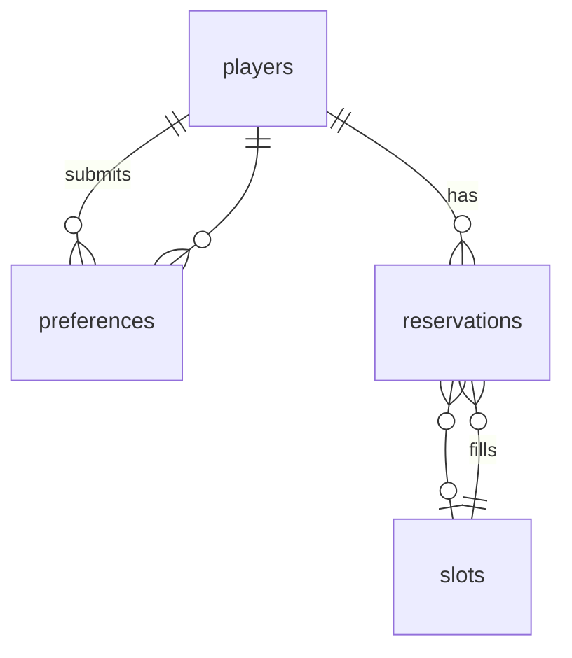
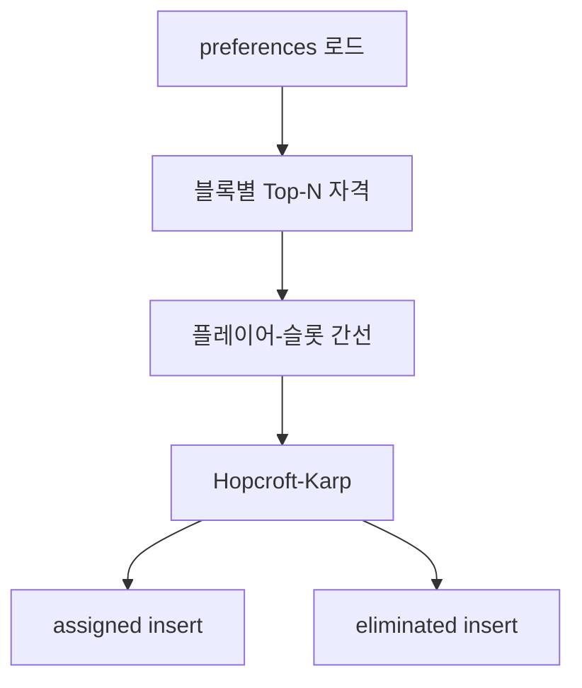

# SVS 예약 시스템 — 상세 설명

Next.js 14 + Supabase 기반의 연맹 SVS(성) 예약·배정 시스템입니다.  
플레이어는 **신청 기간에 선호 시간만 제출**하고, R4+ 운영자가 **마감·검증 후 일괄 배정**합니다. 배정 알고리즘은 **Hopcroft-Karp** 최대 매칭을 사용합니다.

---

## 목차

1. [개요](#1-개요)
2. [운영 워크플로 (5단계)](#2-운영-워크플로-5단계)
3. [페이지·URL](#3-페이지url)
4. [데이터 모델](#4-데이터-모델)
5. [시간·슬롯 구조 (UTC)](#5-시간슬롯-구조-utc)
6. [플레이어 신청 흐름](#6-플레이어-신청-흐름)
7. [일괄 배정 알고리즘](#7-일괄-배정-알고리즘)
8. [배정 후 동작 (취소·승격)](#8-배정-후-동작-취소승격)
9. [관리자(Admin) 기능](#9-관리자admin-기능)
10. [공개 현황 (/status)](#10-공개-현황-status)
11. [사이클(Cycle)](#11-사이클cycle)
12. [설정(settings) 키](#12-설정settings-키)
13. [보안·접근 제어](#13-보안접근-제어)
14. [개발·테스트용 스크립트](#14-개발테스트용-스크립트)
15. [관련 소스 파일](#15-관련-소스-파일)

---

## 1. 개요

| 구분 | 내용 |
|------|------|
| 목적 | 월/화(VP)·목(MO) 성 예약을 스피드업 우선으로 공정 배정 |
| 신청 | 비밀 URL `/r/[token]` — **선호(preferences)만 DB 저장**, 슬롯 배정 없음 |
| 배정 | Admin **Run full assignment** — 사이클 전체를 Mon → Tue → Thu 순으로 재계산 |
| 시간대 | **UTC만** 표시 (KST 토글 없음) |
| 인증 | 플레이어: URL 토큰 / 운영자: Admin 비밀번호(iron-session) |

```mermaid
flowchart LR
  A[플레이어 신청] --> B[(preferences)]
  C[예약 마감] --> D[스피드업 검증]
  D --> E[Run full assignment]
  E --> F[(reservations assigned)]
  F --> G[/status 공지]
```

---

## 2. 운영 워크플로 (5단계)

| 단계 | 담당 | 동작 | DB 변화 |
|------|------|------|---------|
| ① 신청 기간 | 플레이어 | `/r/[token]`에서 요일·스피드업·선호 블록 제출 | `players`, `preferences` |
| ② 예약 마감 | R4+ Admin | **Close reservations** 토글 | `settings.reservation_open = false` |
| ③ 스피드업 검증 | R4+ Admin | 예약 목록·검색·그리드에서 실제 수치 대조·수정 | `players` (필요 시) |
| ④ 배정 실행 | R4+ Admin | **Run full assignment** | `reservations` (assigned / eliminated), `last_assignment_run` |
| ⑤ 결과 공지 | R4+ | `/status` 링크 공유 | — (조회만) |

**중요:** ① 단계에서는 `reservations`에 `assigned` 행이 생기지 않습니다. 그리드가 비어 있어야 정상입니다. 슬롯이 채워져 있다면 ④를 이미 실행했거나, 구버전(즉시 배정) 데이터·테스트 스크립트 배정일 수 있습니다.

---

## 3. 페이지·URL

| 경로 | 접근 | 설명 |
|------|------|------|
| `/r/[token]` | 비밀 토큰 일치 시 | 다단계 신청 폼 (정보 → 월 → 화 → 목) |
| `/r/[token]/check` | 동일 토큰 | Game ID로 신청·배정·대기 상태 조회 |
| `/status` | 공개 | 실시간 스케줄·대기열 (배정 전/후 문구 분기) |
| `/admin` | 로그인 후 | URL·마감·배정·검색·그리드·Reset |
| `/admin/login` | — | 비밀번호 로그인 |
| `/admin/setup` | 최초 1회 | 관리자 비밀번호 해시 저장 |

**API (관리자 세션 필요)**

| 메서드 | 경로 | body | 설명 |
|--------|------|------|------|
| POST | `/api/admin/login` | `{ password }` | 세션 생성 |
| POST | `/api/admin/action` | `{ action: "run_batch_assignment" }` | 버튼과 동일한 일괄 배정 |
| GET | `/api/admin/assignment-preview` | — | 신청자 수·마지막 배정 시각 |

---

## 4. 데이터 모델

### 4.1 테이블

```
players          게임 ID, 이름, 연맹, speedup_vp, speedup_mo
slots            요일·블록·30분 슬롯(0~3)·활성 여부
preferences      (player, day, block, cycle) 선호 블록 — 신청의 핵심
reservations     배정 결과: assigned | eliminated | cancelled
settings         토큰, 사이클 ID, 마감 여부, admin 해시, last_assignment_run
```

### 4.2 `preferences` (신청 데이터)

- 한 플레이어가 같은 **사이클·요일**에 여러 **2시간 블록**을 선택할 수 있음.
- 유니크: `(player_id, day_of_week, block_start_utc, cycle_id)`.
- 일괄 배정 시 이 테이블만 읽어 “신청자”를 구성합니다.

### 4.3 `reservations` (배정 결과)

| status | slot_id | 의미 |
|--------|---------|------|
| `assigned` | 슬롯 ID | 해당 30분 슬롯 배정 |
| `eliminated` | `NULL` | 그 요일 슬롯 없음 (대기열) |
| `cancelled` | (기존 슬롯) | Admin 취소 — 해당 요일 `preferences` 삭제 후 재신청 가능 |

배정 전: `reservations`에 해당 사이클 `assigned`/`eliminated`가 없거나, Admin 그리드 쿼리는 `slot_id IS NOT NULL`만 표시하므로 **빈 그리드**.

### 4.4 ER 개요



---

## 5. 시간·슬롯 구조 (UTC)

### 5.1 요일·관직

| 요일 | 코드 | 관직 | 스피드업 필드 |
|------|------|------|----------------|
| 월요일 | `mon` | VP | `speedup_vp` |
| 화요일 | `tue` | VP | `speedup_vp` |
| 목요일 | `thu` | MO | `speedup_mo` |

화·수·금·토·일은 시스템에 없습니다.

### 5.2 블록·슬롯

- **블록:** UTC 기준 2시간 단위, `block_start_utc` = 0, 2, 4, …, 22 (총 12블록/일).
- **슬롯:** 블록당 **4개** (`slot_index` 0~3), 각 **30분**.
- DB: `slots` 테이블에 요일×블록×인덱스 조합 (스키마 시드: `supabase/schema.sql`).

표시 예: `10:00~10:30 UTC`, `10:00~12:00 UTC` (블록 헤더).

---

## 6. 플레이어 신청 흐름

### 6.1 URL 보호

`middleware.ts`가 `/r/[token]` 경로에서 `settings.access_token`과 비교합니다. 불일치 시 404.

### 6.2 신청 단계 (`ReservationForm`)

1. **Your info** — Game ID, 이름, 연맹 (기존 신청 요일은 API로 표시, 중복 제출 방지).
2. **Monday (VP)** — 스피드업(일), 선호 블록(UTC) 복수 선택.
3. **Tuesday (VP)** — 동일.
4. **Thursday (MO)** — 동일 후 **Submit** → 확인 다이얼로그 → 확정.

### 6.3 서버 처리 (`processReservation` / `processMultiDayReservation`)

조건:

- `reservation_open !== "false"` (마감 시 거부).
- 같은 사이클·같은 요일에 `preferences`가 이미 있으면 거부 (`DUPLICATE_DAY_MESSAGE`).

처리:

1. `players` upsert (VP는 월·화 중 큰 값, MO는 목 값).
2. 요일별 `preferences` upsert.
3. **`reservations` insert 없음** — 성공 메시지:

   > Your application has been received. Assignment results will be announced after the booking window closes.

### 6.4 본인 조회 (`/r/[token]/check`)

| 배정 실행 전 (`last_assignment_run` 없음) | 배정 실행 후 |
|-------------------------------------------|--------------|
| 선호만 있으면 **Application received** | 슬롯 있으면 **Assigned** + 시간 |
| | 없으면 **On waitlist** + 선호 블록 |

---

## 7. 일괄 배정 알고리즘

진입점: `runBatchAssignmentForCycle` → 요일별 `runBatchAssignment` (순서: **mon → tue → thu**).

### 7.1 요일 단위 처리 순서

1. 해당 요일 **활성 슬롯** 목록 로드.
2. 해당 사이클·요일 **preferences**로 신청자 맵 구성 (`BatchApplicant`: playerId, speedup, appliedAt, blocks).
3. 그 요일 슬롯에 걸린 기존 `assigned` 삭제 후, 미배정 신청자의 `eliminated` 행 정리.
4. 매칭 계산 후 `assigned` / `eliminated` insert.
5. 세 요일 완료 후 `settings.last_assignment_run` 갱신.

**재실행:** 같은 사이클에서 다시 누르면 해당 요일 배정이 **전부 삭제 후 재계산**됩니다.

### 7.2 블록별 자격 (Top-N)

`computeEligibleByBlock`:

- 각 2시간 블록마다, 그 블록을 선호에 넣은 신청자 중 **스피드업 내림차순 → appliedAt 오름차순** 정렬.
- 상위 **N명**만 자격 (N = 그 블록의 활성 슬롯 수, 최대 4).
- 블록마다 독립 — 같은 사람이 여러 블록에서 자격을 가질 수 있음.

### 7.3 이분 매칭 (Hopcroft-Karp)

`buildMatchingEdges` → `hopcroftKarp`:

- **왼쪽:** 자격 있는 플레이어.
- **오른쪽:** 빈 슬롯(활성).
- **간선:** 플레이어가 그 블록에서 Top-N에 들었고, 해당 블록의 슬롯 ID.

목표: **최대 매칭 수** (전역적으로 배정 인원 최대화).  
동률 스피드업·신청 시각은 자격 단계에서 이미 반영됩니다.



### 7.4 appliedAt

일괄 배정 시 `players.created_at`을 신청 시각 대용으로 사용합니다. (다중 블록 preference 시 가장 이른 시각.)

---

## 8. 배정 후 동작 (취소·승격)

### 8.1 Admin 슬롯 취소 (`cancelReservation`)

1. `reservations.status = cancelled`.
2. 해당 요일 `preferences` 삭제 → 플레이어 **재신청 가능**.
3. `promoteOnCancel(slotId)` — 빈 슬롯에 대기자 승격 시도.

### 8.2 `promoteOnCancel`

- 해당 **블록** 선호가 있는 `eliminated` 중, 같은 요일 미배정자만 대상.
- 블록별 Top-N 자격 + Hopcroft-Karp와 동일한 기준으로 **그 슬롯 1개**에 가장 적합한 1명을 `assigned`로 승격.
- 이후 `healEliminatedReservations`, `backfillEmptySlotsForDay`로 연쇄 정리 (빈 슬롯·중복 eliminated 정리).

**참고:** 최초 일괄 배정은 Admin 버튼만 사용. 취소 후 승격만 자동으로 돌아갑니다.

---

## 9. 관리자(Admin) 기능

로그인: bcrypt 해시 (`settings.admin_password_hash`), iron-session 쿠키.

| 기능 | 설명 |
|------|------|
| Secret URL | `access_token` 표시·복사·재발급 (재발급 시 기존 `/r/...` 무효) |
| Open / Close reservations | `reservation_open` 토글 |
| Export Excel | 사이클별 시트(요일별 등) |
| **Run full assignment** | `runFullBatchAssignment` — Search Reservations **위** 노란 패널 |
| Reset cycle | `RESET` 입력 — players·preferences·reservations 전 삭제, `current_cycle_id` +1, `last_assignment_run` 삭제 |
| Search | 배정 전: 신청자 검색 / 배정 후: 예약·대기 검색 |
| Applicants | 배정 전만 — `preferences` 기반 신청자 목록 (그리드 비표시) |
| Schedule Grid | 배정 후만 — UTC 그리드·슬롯별 Cancel |
| Waitlist | 배정 후만 — 해당 요일 `eliminated` + 선호 블록 |

---

## 10. 공개 현황 (/status)

- 익명(anon) 읽기 + Supabase Realtime으로 `reservations` 변경 구독.
- `last_assignment_run` 없음 → 상단에 “배정 미공개” 안내, 그리드는 비어 있거나 배정 전 상태.
- 배정 후 → assigned 슬롯 표시 + Waitlist(VP/MO).
- 마감 배너: `reservation_open === false`.

---

## 11. 사이클(Cycle)

- `settings.current_cycle_id` (정수, 기본 1).
- 모든 `preferences` / `reservations`는 `cycle_id`로 구분.
- **Reset cycle** 시 ID만 증가하고 이전 사이클 데이터는 삭제됩니다 (히스토리 보존 없음).

---

## 12. 설정(settings) 키

| key | 용도 |
|-----|------|
| `access_token` | `/r/[token]` 비밀 문자열 |
| `admin_password_hash` | Admin bcrypt |
| `current_cycle_id` | 현재 사이클 |
| `reservation_open` | `"true"` / `"false"` |
| `last_assignment_run` | ISO 시각, 일괄 배정 완료 시각 |

---

## 13. 보안·접근 제어

| 계층 | 내용 |
|------|------|
| RLS | anon은 SELECT만 (players, slots, reservations, preferences, reservation_open) |
| 쓰기 | Server Actions / API는 **service role** (`createServiceClient`) |
| Admin | 세션 없으면 `requireAdmin()` 실패 |
| 토큰 URL | middleware + 서버에서 token 검증 |

`.env.local`의 `SUPABASE_SERVICE_ROLE_KEY`는 서버 전용, 클라이언트에 노출 금지.

---

## 14. 개발·테스트용 스크립트

| npm script | 설명 |
|------------|------|
| `inject:random -- N` | N명 무작위 신청 (기본 120, preferences만) |
| `clear:assignments` | 현재 사이클 배정 결과만 삭제 (`last_assignment_run` 초기화) |
| `seed:stress` | clear + 120명 주입 |
| `run:batch` | Admin 버튼과 동일한 `runBatchAssignmentForCycle` |
| `test:assignment` | 배정·승격 시나리오 테스트 |
| `purge:orphans` | preferences 없는 고아 `players` 삭제 |
| `set-admin-password` | Admin 비밀번호 설정 |

**로컬에서 버튼과 동일하게 배정만 테스트:**

```bash
npm run inject:random -- 10
npm run run:batch
```

---

## 15. 관련 소스 파일

| 영역 | 파일 |
|------|------|
| 배정·매칭 | `lib/assignment.ts` |
| 중복·메시지 | `lib/reservation-guard.ts` |
| 요일·블록 상수 | `lib/types.ts` |
| UTC 포맷 | `lib/utils.ts` |
| Admin UI | `app/admin/AdminDashboard.tsx`, `app/admin/actions.ts` |
| 신청·조회 | `app/r/[token]/ReservationForm.tsx`, `app/r/[token]/actions.ts` |
| 공개 현황 | `app/status/StatusView.tsx`, `app/status/page.tsx` |
| 스키마 | `supabase/schema.sql`, `supabase_migration_v2.sql` |

---

## 부록: 구버전과의 차이

| 항목 | 구버전 | 현재 |
|------|--------|------|
| 신청 시 | 즉시 `assignToBlock` 등으로 슬롯 배정 | `preferences`만 저장 |
| 배정 | 신청마다 실시간 | Admin **Run full assignment** 일괄 |
| 대기 | eliminated 즉시 생성 | 일괄 배정 후 `slot_id = null` eliminated |
| 시간 표시 | UTC/KST 토글 | **UTC만** |

프로덕션에 슬롯이 신청만으로 채워져 있다면 **구버전 배포** 또는 **`run:batch` / API 배정** 이력을 의심하면 됩니다.

---

*문서 기준: 저장소 `main` 브랜치 (일괄 배정 + UTC 전용 UI).*
