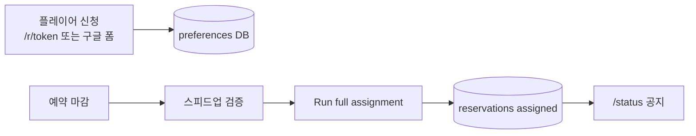
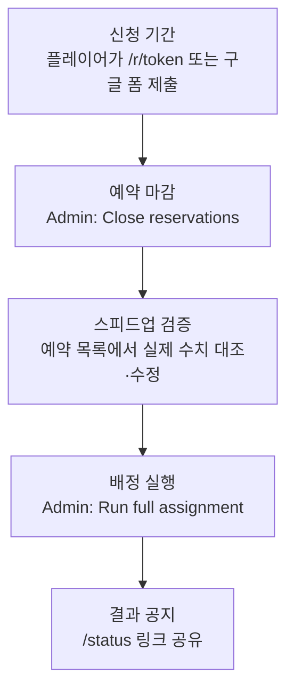
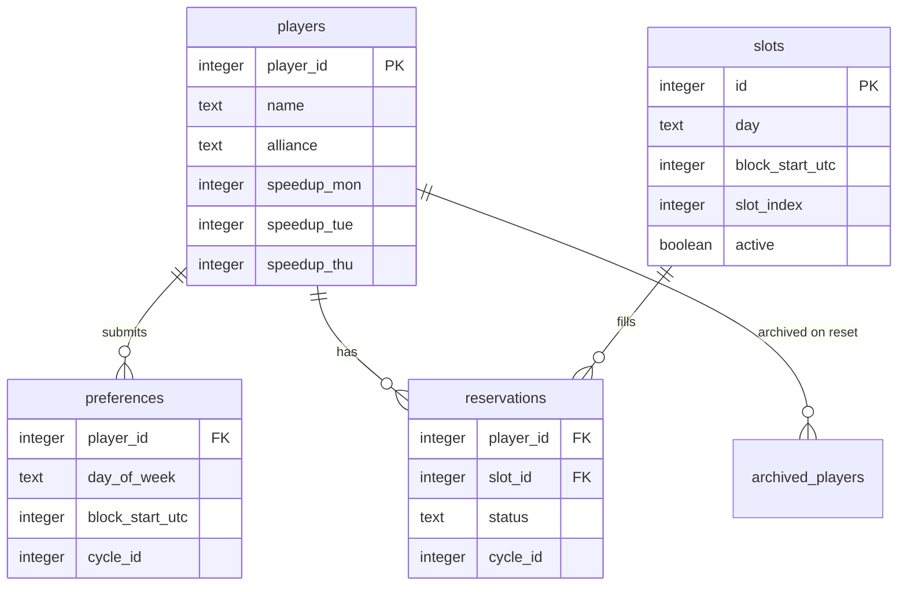
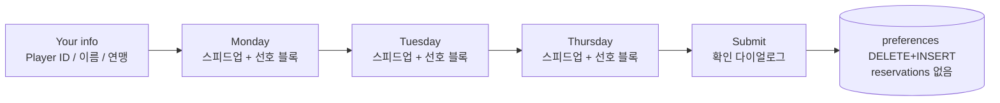
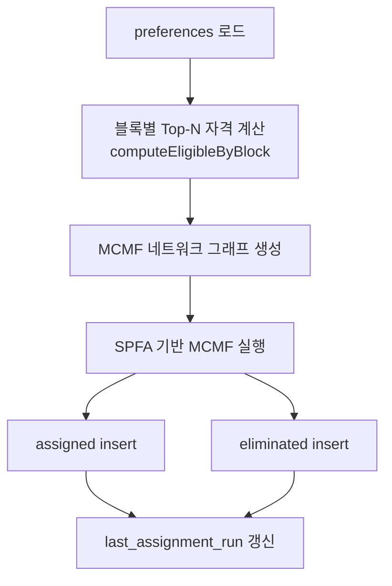
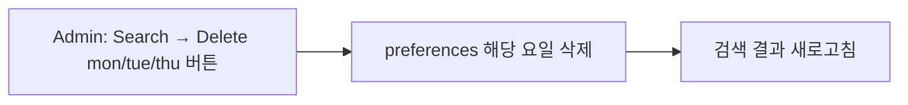
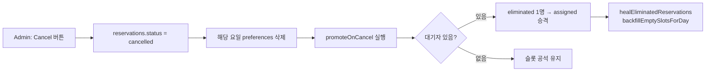
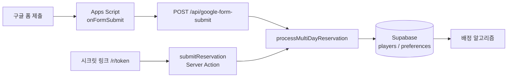

# SVS 예약 시스템 — 상세 설명

Next.js 14 + Supabase 기반의 연맹 SVS(성) 예약·배정 시스템입니다.
플레이어는 **신청 기간에 선호 시간만 제출**하고, R4+ 운영자가 **마감·검증 후 일괄 배정**합니다.
배정 알고리즘은 **Min-Cost Max-Flow (MCMF)** 최소 비용 최대 유량을 사용합니다.

> **모바일 HTML:** [RESERVATION_SYSTEM.html](RESERVATION_SYSTEM.html)

---

## 목차

1. [개요](#1-개요)
2. [환경 변수](#2-환경-변수)
3. [운영 워크플로](#3-운영-워크플로)
   - [3.5 운영 시나리오 및 대응](#35-운영-시나리오-및-대응)
4. [페이지·URL](#4-페이지url)
5. [데이터 모델](#5-데이터-모델)
6. [시간·슬롯 구조](#6-시간슬롯-구조-utc)
7. [플레이어 신청 흐름](#7-플레이어-신청-흐름)
8. [일괄 배정 알고리즘](#8-일괄-배정-알고리즘)
9. [배정 후 동작](#9-배정-후-동작-취소승격)
10. [관리자 기능](#10-관리자admin-기능)
11. [공개 현황](#11-공개-현황-status)
12. [사이클](#12-사이클cycle)
13. [settings 키](#13-설정settings-키)
14. [보안·접근 제어](#14-보안접근-제어)
15. [개발·테스트 스크립트](#15-개발테스트용-스크립트)
16. [관련 소스 파일](#16-관련-소스-파일)
17. [구글 폼 연동](#17-구글-폼-연동-apps-script-파이프라인)
18. [구버전과의 차이](#18-부록-구버전과의-차이)

---

## 1. 개요

| 구분 | 내용 |
|------|------|
| 목적 | 월/화(VP)·목(MO) 성 예약을 스피드업 우선으로 공정 배정 |
| 신청 | 비밀 URL `/r/[token]` 또는 구글 폼 — 선호(preferences)만 DB 저장, 슬롯 배정 없음 |
| 배정 | Admin **Run full assignment** — 사이클 전체를 Mon → Tue → Thu 순으로 재계산 |
| 알고리즘 | Min-Cost Max-Flow (MCMF) — 빈 슬롯·대기자 동시 존재 및 스피드업 역전 문제 해결 |
| 시간대 | UTC만 표시 (KST 토글 없음) |
| 인증 | 플레이어: URL 토큰 / 운영자: Admin 비밀번호(iron-session) |



---

## 2. 환경 변수

| 변수 | 설명 |
|------|------|
| `NEXT_PUBLIC_SUPABASE_URL` | Supabase 프로젝트 URL (예: `https://xxxx.supabase.co`) |
| `NEXT_PUBLIC_SUPABASE_ANON_KEY` | Supabase anon public key |
| `SUPABASE_SERVICE_ROLE_KEY` | service role key — **서버 전용, 절대 클라이언트 노출 금지** |
| `IRON_SESSION_SECRET` | Admin 세션 암호화 키 (32자 이상 랜덤 문자열) |

```bash
# 세션 시크릿 생성
node -e "console.log(require('crypto').randomBytes(32).toString('hex'))"

# 환경 변수 검증
npm run check-env
```

---

## 3. 운영 워크플로



| 단계 | 담당 | 동작 | DB 변화 |
|------|------|------|---------|
| 신청 기간 | 플레이어 | `/r/[token]` 또는 구글 폼에서 요일·스피드업·선호 블록 제출 | `players`, `preferences` |
| 예약 마감 | R4+ Admin | **Close reservations** 토글 | `settings.reservation_open = false` |
| 스피드업 검증 | R4+ Admin | 예약 목록·검색·그리드에서 실제 수치 대조·수정 | `players` (필요 시) |
| 배정 실행 | R4+ Admin | **Run full assignment** | `reservations` (assigned / eliminated), `last_assignment_run` |
| 결과 공지 | R4+ | `/status` 링크 공유 | — (조회만) |

> **주의:** 신청 단계에서는 `reservations`에 `assigned` 행이 생기지 않습니다. 그리드가 비어 있어야 정상입니다.

### 3.5 운영 시나리오 및 대응

아래 표는 실제 운영·테스트에서 정리한 **상황별 대응**입니다. (README 요약: [../README.md#운영-시나리오-요약](../README.md#운영-시나리오-요약))

#### 예약 변경·수정

| # | 시점 | 신청 경로 | 플레이어 대응 | R4+ Admin 대응 | DB 변화 |
|---|------|-----------|---------------|----------------|---------|
| A | 신청 기간 중 · **내용 수정 필요** | `/r/[token]` 또는 구글 폼 재제출 | **같은 Player ID로 재제출** (전체 교체) | (선택) Search → **Delete** — 제거만 필요할 때 | 기존 `preferences` DELETE 후 새 내용 INSERT |
| B | 폼 마감 후 · **Run full assignment 전** | `/r/[token]` (시크릿 URL) | R4에게 연락 후 시크릿 URL로 **재제출** | (선택) Search → **Delete** | 해당 사이클 `preferences` 전체 교체 |
| B-2 | B 이후 | `/r/[token]` | 시크릿 URL로 **재제출** (이번 제출에 포함된 요일만 남음) | — | `preferences` 전체 교체 |
| C | **배정 실행 후** · 재제출 | 구글 폼 (항상) / 시크릿 URL (`reservation_open = true`) | **재제출** — 기존 `reservations` 삭제 후 `preferences` 전체 교체 | — | assigned·eliminated 동일 처리 |
| C-2 | **배정 실행 후** · 시크릿 URL 마감 | `/r/[token]` | `reservation_open = false`이면 **거부** | — | DB 변화 없음 |
| D | **배정 실행 후** · R4 조정 | — | R4에게 취소·변경 요청 | Schedule Grid **Cancel** | `cancelled` + 해당 요일 `preferences` 삭제 |
| E | Admin 취소/삭제 후 **미재신청** | — | 해당 사이클 해당 요일 **배정 제외** | — | 선호 없음 → 배정 대상 아님 |

> **Delete vs Cancel:** Delete는 **배정 전**(`last_assignment_run` 없음) Search에서만 표시. Cancel은 **배정 후** Schedule Grid에서 슬롯 단위 취소 + 대기자 승격.

#### 플레이어 신청

| # | 상황 | 조건 | 결과 | 사용자 메시지 |
|---|------|------|------|---------------|
| 1 | 정상 첫 신청 | 구글 폼 또는 시크릿 URL (`reservation_open = true`) | `processMultiDayReservation` → `players` upsert + `preferences` DELETE(해당 player+cycle) + INSERT | *Your application has been received.* |
| 2 | 같은 `player_id` 재제출 | 동일 사이클에 기존 `preferences` 있음 | 동일 함수, 전체 교체 | *Your application has been updated.* |
| 3 | 시크릿 URL 마감 | `reservation_open = false` (시크릿 URL만) | 거부 | *Secret URL applications are currently closed.* |
| 3b | 구글 폼 제출 | `reservation_open` **무관** (`skipOpenCheck`) | 정상 처리 (마감 여부와 무관) | *Your application has been received.* / *…updated.* |
| 4 | 배정 실행 후 재제출 | `last_assignment_run` 있음 | 구글 폼: 항상 허용. 시크릿 URL: `reservation_open = true`일 때만. 해당 player `reservations` DELETE + `preferences` 전체 교체 (assigned·eliminated 동일) | *Your application has been updated.* |
| 5 | 선호 블록 없는 요일 | speedup/블록 비움 | 해당 요일 skip (제출에 미포함) | — |
| 6 | 상태 조회 | `/r/[token]/check` | 배정 전/후 분기 | Application received / Assigned / On waitlist |

#### Admin 운영 단계

| 단계 | `last_assignment_run` | Admin UI | 주요 액션 |
|------|----------------------|----------|-----------|
| 1. 신청 개시 | 없음 | Secret URL, Open | `access_token` 공유, `reservation_open = true` |
| 2. 신청 수집 | 없음 | Applicants, Search | 신청자·스피드업 확인 |
| 3. 마감 | 없음 | Close reservations | `reservation_open = false` |
| 4. 검증 | 없음 | Search, Export | 스피드업 실제 수치 대조·수정 |
| 5. 배정 | 없음 → 설정됨 | **Run full assignment** | mon → tue → thu MCMF 일괄 배정 |
| 6. 공지 | 있음 | `/status` | 링크 공유 |
| 7. 사후 조정 | 있음 | Grid Cancel, Waitlist | 취소·승격·재신청 유도 |
| 8. 사이클 종료 | — | Reset cycle (`RESET`) | `archived_*` 백업 후 cycle_id +1 |

#### 배정 후 취소·승격

| # | 상황 | Admin 동작 | 알고리즘/DB |
|---|------|------------|-------------|
| 1 | 배정된 슬롯 취소 | Grid **Cancel** | `status = cancelled`, 해당 요일 `preferences` 삭제 |
| 2 | 같은 블록 대기자 있음 | (자동) | `promoteOnCancel` → `eliminated` 1명 `assigned` 승격 |
| 3 | 대기자 없음 | Cancel만 | 빈 슬롯 유지 (`healEliminated` / backfill) |
| 4 | 취소된 플레이어 재신청 | 구글 폼 또는 `/r/[token]` (`reservation_open = true`) | Admin Cancel로 해당 요일 `preferences` 삭제 후 전체 교체 재제출 가능 |
| 5 | 배정 **재실행** | Run full assignment 다시 | 해당 요일 배정 전부 삭제 후 MCMF 재계산 |

#### 배정 검증 (`verify:assignment`)

| 코드 | 심각도 | 의미 | MCMF 도입 후 |
|------|--------|------|--------------|
| V1 | 경고 | 빈 슬롯 + 대기자 동시 존재 | **0건 목표** (Hopcroft-Karp 시 발생) |
| V2 | 에러 | 같은 요일 중복 배정 | 항상 0이어야 함 |
| V3 | 에러 | 비활성 슬롯 배정 | 항상 0이어야 함 |
| V4 | 경고 | 스피드업 역전 | **0건 목표** |
| V5 | 에러 | preferences 없는 배정 | 항상 0이어야 함 |

---

## 4. 페이지·URL

| 경로 | 접근 | 설명 |
|------|------|------|
| `/r/[token]` | 비밀 토큰 일치 시 | 다단계 신청 폼 (정보 → 월 → 화 → 목) |
| `/r/[token]/check` | 동일 토큰 | Player ID로 신청·배정·대기 상태 조회 |
| `/status` | 공개 | 실시간 스케줄·대기열 (배정 전/후 문구 분기) |
| `/admin` | 로그인 후 | URL·마감·배정·검색·그리드·Reset |
| `/admin/login` | — | 비밀번호 로그인 |
| `/admin/setup` | 최초 1회 | 관리자 비밀번호 해시 저장 |

**API (관리자 세션 필요)**

| 메서드 | 경로 | body | 설명 |
|--------|------|------|------|
| POST | `/api/admin/login` | `{ password }` | 세션 생성 |
| POST | `/api/admin/action` | `{ action: "run_batch_assignment" }` | 버튼과 동일한 일괄 배정 |
| GET | `/api/admin/assignment-preview` | — | 신청자 수·마지막 배정 시각 |

**API (웹훅 — 관리자 세션 불필요)**

| 메서드 | 경로 | 인증 | 설명 |
|--------|------|------|------|
| POST | `/api/google-form-submit` | `X-Webhook-Secret` 헤더 | 구글 폼 payload → `processMultiDayReservation` (시크릿 URL과 동일 로직) |

---

## 5. 데이터 모델

### 테이블 구조



### `reservations.status` 값

| status | slot_id | 의미 |
|--------|---------|------|
| `assigned` | 슬롯 ID | 해당 30분 슬롯 배정 완료 |
| `eliminated` | `NULL` | 그 요일 슬롯 없음 (대기열) |
| `cancelled` | (기존 슬롯) | Admin 취소 — 해당 요일 `preferences` 삭제 후 재신청 가능 |

### 아카이브 테이블

Reset cycle 실행 시 삭제 전 현재 사이클 데이터를 백업합니다.

| 테이블 | 백업 원본 |
|--------|---------|
| `archived_players` | `players` |
| `archived_preferences` | `preferences` |
| `archived_reservations` | `reservations` |

---

## 6. 시간·슬롯 구조 (UTC)

### 요일·관직 대응

| 요일 | 관직 | 스피드업 필드 |
|------|------|----------------|
| 월요일 | VP | `speedup_mon` |
| 화요일 | VP | `speedup_tue` |
| 목요일 | MO | `speedup_thu` |

수·금·토·일은 시스템에 없습니다.

### 블록·슬롯 구조

```
하루 (UTC)
├── 블록 0  (00:00~02:00)  ── 슬롯 0~3 (각 30분)
├── 블록 2  (02:00~04:00)  ── 슬롯 0~3
├── ...
└── 블록 22 (22:00~24:00)  ── 슬롯 0~3

총 12블록 × 4슬롯 = 48슬롯 / 일
```

---

## 7. 플레이어 신청 흐름

### 신청 단계



### 서버 처리 규칙

**공통:** 두 경로 모두 `lib/assignment.ts`의 `processMultiDayReservation`을 호출합니다. (구글 폼: `app/api/google-form-submit/route.ts` → 시크릿 URL: `app/r/[token]/actions.ts`)  
성공 시 `players` upsert + 해당 `player_id`+`cycle_id`의 `preferences` DELETE 후 INSERT.

| 경로 | `reservation_open` 검사 | `last_assignment_run` 있을 때 |
|------|-------------------------|------------------------------|
| **구글 폼** | **검사 안 함** (`skipOpenCheck: true`) | 해당 player의 `reservations` DELETE 후 `preferences` 전체 교체 (assigned·eliminated 동일) |
| **시크릿 URL** | `false`이면 **거부** (`actions.ts`에서 선검사) | `reservation_open = true`이면 구글 폼과 동일 |

| 상황 | 사용자 메시지 |
|------|---------------|
| 첫 신청 | *Your application has been received.* |
| 재제출 (배정 전·후 공통) | *Your application has been updated.* |
| 시크릿 URL 마감 | *Secret URL applications are currently closed.* |

> 재제출 시 **이번 제출에 포함된 요일만** `preferences`에 남습니다. 예: 처음 월·화 신청 후 화만 재제출하면 월 preferences는 삭제됩니다.  
> **배정 실행 후** 재제출하면 기존 슬롯 배정(`assigned`)·대기(`eliminated`) 행이 먼저 삭제되므로, 재배정 전까지 `/status`·조회 화면에 배정 결과가 보이지 않을 수 있습니다.  
> 조회 페이지(`/r/[token]/check`) 대기 문구는 기존과 같이 *"Your application has been received. Assignment results will be announced after the booking window closes."* (`SUBMIT_SUCCESS_MESSAGE`)

### 재제출(전체 교체) 기준

같은 `player_id` + `cycle_id`로 재제출하면 해당 사이클의 **모든** `preferences`를 DELETE한 뒤, 이번 제출 내용으로 INSERT합니다. `last_assignment_run`이 설정된 이후에는 같은 player의 `reservations`도 먼저 DELETE됩니다. 다른 `player_id`로의 신청은 독립적으로 처리됩니다.

### 본인 조회 (`/r/[token]/check`)

| 시점 | 상태 표시 |
|------|-----------|
| 배정 실행 전 | **Application received** |
| 배정 후 — 슬롯 있음 | **Assigned** + 시간 |
| 배정 후 — 슬롯 없음 | **On waitlist** + 선호 블록 |

---

## 8. 일괄 배정 알고리즘

진입점: `runBatchAssignmentForCycle` → 요일별 `runBatchAssignment` (순서: **mon → tue → thu**)

### 처리 흐름



### 블록별 자격 (Top-N)

각 2시간 블록마다, 해당 블록을 선호에 넣은 신청자를 아래 기준으로 정렬합니다.

1. 스피드업 내림차순
2. 신청 시각(`appliedAt`) 오름차순
3. `player_id` 오름차순 (동률 타이브레이커)

상위 N명만 자격 부여 (N = 해당 블록의 활성 슬롯 수, 최대 4). 한 플레이어가 여러 블록의 Top-N 정원을 중복 점유하지 않도록 제한됩니다.

### MCMF 네트워크 모델

```
Source
  └── 플레이어 노드 (용량: 1, 비용: 0)
        ├── Top-N 통과 슬롯 노드 (용량: 1, 비용: R)
        └── Top-N 미달 슬롯 노드 (용량: 1, 비용: R + 1,000,000)
              └── Sink (용량: 1, 비용: 0)

R = 스피드업 전체 통합 순위 (1위=1, 2위=2, ...)
```

- 알고리즘: SPFA(Shortest Path Faster Algorithm) 기반 MCMF
- 목표: 최대 배정 수(Max Flow) 확보 + 스피드업 높은 인원 우선(Min Cost)

> **알고리즘 교체 배경:** 이전 Hopcroft-Karp 방식은 2-Phase 구조로 인해 빈 슬롯 + 대기자 동시 존재(V1), 스피드업 역전(V4) 문제가 발생했습니다. MCMF는 비용 함수로 우선순위를 인코딩해 단일 Pass로 두 문제를 동시에 해결합니다.

**재실행:** 같은 사이클에서 다시 실행하면 해당 요일 배정이 전부 삭제 후 재계산됩니다.

---

## 9. 배정 후 동작 (취소·승격) 및 배정 전 삭제

### 배정 전: 요일별 신청 삭제



- **표시 조건:** `last_assignment_run`이 없는 경우(배정 전)에만 검색 결과에 Delete 버튼 표시
- 배정 후에는 버튼이 자동으로 숨겨짐
- `players` 테이블은 건드리지 않음 — `preferences`만 삭제
- 서버 액션: `deletePreferenceByDay(player_id, day_of_week, cycle_id)`
- 확인 다이얼로그 → 로딩 스피너 → 완료 토스트 알림

### 배정 후: Admin 슬롯 취소



- 취소 후 해당 플레이어는 재신청 가능
- Admin UI에 완료 토스트 알림 표시

### 대기자 승격 (`promoteOnCancel`)

해당 블록 선호가 있는 `eliminated` 중, 같은 요일 미배정자만 대상으로 블록별 Top-N 자격 기준을 동일하게 적용해 1명을 승격합니다.

---

## 10. 관리자(Admin) 기능

로그인: bcrypt 해시(`settings.admin_password_hash`) + iron-session 쿠키

| 기능 | 설명 |
|------|------|
| Secret URL | `access_token` 표시·복사·재발급 (재발급 시 기존 `/r/...` 무효) |
| Open / Close reservations | `reservation_open` 토글 |
| Export Excel | 사이클별 시트(요일별 등) |
| **Run full assignment** | `runFullBatchAssignment` — Search Reservations 위 노란 패널 |
| Reset cycle | `RESET` 입력 → players·preferences·reservations를 아카이브 후 삭제, `current_cycle_id` +1 |
| Search | 배정 전: 신청자 검색 (요일별 Delete 버튼 포함) / 배정 후: 예약·대기 검색 |
| Delete application per day | 배정 전만 — 검색 결과에서 플레이어의 특정 요일 신청(`preferences`) 삭제 |
| Applicants | 배정 전만 — `preferences` 기반 신청자 목록 |
| Schedule Grid | 배정 후만 — UTC 그리드·슬롯별 Cancel |
| Waitlist | 배정 후만 — 해당 요일 `eliminated` + 선호 블록 |

---

## 11. 공개 현황 (/status)

- 익명(anon) 읽기 + Supabase Realtime으로 `reservations` 변경 구독
- `last_assignment_run` 없음 → "배정 미공개" 안내, 그리드 비어 있음
- 배정 후 → `assigned` 슬롯 표시 + Waitlist(VP/MO)
- 마감 배너: `reservation_open === false`

---

## 12. 사이클(Cycle)

- `settings.current_cycle_id` (정수, 기본 1)
- 모든 `preferences` / `reservations`는 `cycle_id`로 구분
- **Reset cycle** 실행 시 삭제 전 `archived_*` 테이블에 백업 후 ID만 증가

---

## 13. 설정(settings) 키

| key | 용도 |
|-----|------|
| `access_token` | `/r/[token]` 비밀 문자열 |
| `admin_password_hash` | Admin bcrypt 해시 |
| `current_cycle_id` | 현재 사이클 번호 |
| `reservation_open` | `"true"` / `"false"` |
| `last_assignment_run` | ISO 시각, 일괄 배정 완료 시각 |

---

## 14. 보안·접근 제어

| 계층 | 내용 |
|------|------|
| RLS | anon은 SELECT만 (`players`, `slots`, `reservations`, `preferences`, `reservation_open`) |
| 쓰기 | Server Actions / API는 service role (`createServiceClient`) |
| Admin | 세션 없으면 `requireAdmin()` 실패 |
| 토큰 URL | middleware + 서버에서 token 검증 |

`.env.local`의 `SUPABASE_SERVICE_ROLE_KEY`는 서버 전용, 클라이언트에 노출 금지.

---

## 15. 개발·테스트용 스크립트

**개발 도구**

| npm script | 설명 |
|------------|------|
| `inject:random -- N` | N명 무작위 신청 주입 (기본 120, preferences만) |
| `inject:test` | 실제 테스트 데이터 주입 |
| `clear:assignments` | 현재 사이클 배정 결과만 삭제 |
| `seed:stress` | clear + 120명 주입 |

**배정 실행 및 검증**

| npm script | 설명 |
|------------|------|
| `run:batch` | Admin 버튼과 동일한 배정 실행 |
| `verify:assignment` | 배정 결과 검증 (V1~V5) — 에러 시 exit(1) |
| `audit:reservations` | 사이클 전체 감사 |
| `validate:assignment` | 배정 유효성 검사 |

**유지보수**

| npm script | 설명 |
|------------|------|
| `recover:waitlist` | 대기열 복구 |
| `backfill:slots` | 빈 슬롯 백필 |
| `reconcile:waitlist` | eliminated 정합성 정리 |
| `purge:orphans` | preferences 없는 고아 players 삭제 |

### `verify:assignment` 검증 항목

| 코드 | 심각도 | 검증 내용 |
|------|--------|-----------|
| V1 | 경고 | 빈 슬롯 + 대기자 동시 존재 |
| V2 | 에러 | 한 플레이어가 같은 요일 중복 배정 |
| V3 | 에러 | 비활성 슬롯에 배정됨 |
| V4 | 경고 | 스피드업 역전 (낮은 순위가 더 좋은 슬롯 배정) |
| V5 | 에러 | preferences 없는 배정 |

에러 1건 이상이면 `process.exit(1)`으로 종료됩니다.

<details>
<summary>로컬 배정 테스트 플로우</summary>

```bash
npm run inject:random -- 10
npm run run:batch
npm run verify:assignment
```

</details>

---

## 16. 관련 소스 파일

| 영역 | 파일 |
|------|------|
| 신청 처리·배정·MCMF | `lib/assignment.ts` (`processMultiDayReservation`) |
| 재제출·메시지 | `lib/reservation-guard.ts` |
| 요일·블록 상수 | `lib/types.ts` |
| UTC 포맷 | `lib/utils.ts` |
| 구글 폼 웹훅 | `app/api/google-form-submit/route.ts` |
| Admin UI | `app/admin/AdminDashboard.tsx`, `app/admin/actions.ts` |
| 신청·조회 | `app/r/[token]/ReservationForm.tsx`, `app/r/[token]/actions.ts` |
| 공개 현황 | `app/status/StatusView.tsx`, `app/status/page.tsx` |
| 배정 검증 | `scripts/verify/verify-assignment.ts` |
| 감사·유효성 | `scripts/verify/audit-reservations.ts`, `scripts/verify/validate-assignment.ts` |
| 유지보수 | `scripts/maintenance/` |
| 개발 도구 | `scripts/dev/` |
| 운영 설정 | `scripts/admin/` |
| Apps Script | `scripts/appscript/onFormSubmit.gs` |
| 스키마 | `supabase/schema.sql` |
| 마이그레이션 | `supabase/migrations/` |

---

## 17. 구글 폼 연동 (Apps Script 파이프라인)

Vercel 콜드스타트 우회 및 신청 편의성 향상을 위해 구글 폼 신청 경로를 병행 운영합니다.

### 전체 구조



두 경로 모두 `processMultiDayReservation`을 거쳐 동일한 `players` / `preferences` 테이블에 씁니다. Apps Script는 Supabase를 직접 호출하지 않습니다.

### 폼 상단 안내 문구 (복사용)

구글 폼 설명란에 아래 문구를 붙여 넣으세요. **이메일 수집을 끈 설정** 기준이며, 제출 후 구글 폼으로는 수정할 수 없음을 명시합니다.

**한글**

> 같은 Player ID로 **다시 제출하면 이번 제출 내용으로 신청 전체가 교체**됩니다 (해당 사이클).  
> 월·화·목은 각각 별도로 신청할 수 있습니다. **이번 제출에 넣지 않은 요일은 preferences에서 제거**됩니다.  
> 여러 캐릭터를 운영하는 경우 **Player ID마다 폼을 따로 제출**하세요.  
> 구글 폼은 **제출 후 수정 링크가 없습니다** — 내용 변경은 **같은 Player ID로 폼을 다시 제출**하거나 **시크릿 링크**로 재제출하세요. 배정 실행 후 재제출하면 **기존 배정이 삭제**되고 신청 내용이 교체됩니다 — 슬롯 유지·운영진 조정이 필요하면 r4에게 문의하세요.

**English**

> Resubmitting with the same Player ID **replaces your entire application** for this cycle with your latest submission.  
> Monday, Tuesday, and Thursday can each be applied for separately. **Days not included in this submission are removed** from your preferences.  
> If you play multiple characters, **submit the form once per Player ID**.  
> You cannot edit a Google Form response after submit — submit the form again with the same Player ID, use the **secret link**, or contact ops (r4). After assignment runs, resubmitting **deletes your existing assignment** and replaces your preferences — contact r4 if you need to keep a slot or need an ops adjustment.

**시스템 동작 요약**

| 상황 | 결과 |
|------|------|
| 같은 Player ID 재제출 (같은 사이클) | **최신 제출만** DB에 남음 (전체 DELETE + INSERT) |
| 같은 Player ID, 요일만 다름 (월/화/목) | 한 번의 제출에 여러 요일 포함 가능 |
| **다른 Player ID** (같은 구글 계정) | **각각 반영** — 폼을 Player ID마다 따로 제출 |
| 구글 폼 제출 후 수정 | **폼 재제출** 또는 시크릿 링크 재제출 (배정 전·후 동일) |
| 구글 폼 + 시크릿 링크, 동일 Player ID | **최신 제출이 이전 내용을 덮어씀** |
| 배정 실행 후 재제출 (`last_assignment_run`) | 기존 `reservations` DELETE + `preferences` 전체 교체 (구글 폼 항상 / 시크릿 URL은 `reservation_open = true`일 때) |
| 시크릿 URL 마감 후 (`reservation_open = false`) | 시크릿 URL만 거부 — 구글 폼은 계속 접수 |

### 구글 폼 항목 구성

| row 인덱스 | 항목명 | 유형 |
|-----------|--------|------|
| `row[0]` | 타임스탬프 | 자동 |
| `row[1]` | Player ID | 단답형 — 정수 유효성 검사 |
| `row[2]` | Player Name | 단답형 |
| `row[3]` | Alliance | 단답형 |
| `row[4]` | Monday Speedups (days) | 단답형 — 정수 유효성 검사 |
| `row[5]` | Preferred time on Monday | 체크박스 |
| `row[6]` | Tuesday Speedups (days) | 단답형 — 정수 유효성 검사 |
| `row[7]` | Preferred time on Tuesday | 체크박스 |
| `row[8]` | Thursday Speedups (days) | 단답형 — 정수 유효성 검사 |
| `row[9]` | Preferred time on Thursday | 체크박스 |

체크박스 블록 옵션 (세 요일 동일):

```
0  (00:00~02:00 UTC)      12 (12:00~14:00 UTC)
2  (02:00~04:00 UTC)      14 (14:00~16:00 UTC)
4  (04:00~06:00 UTC)      16 (16:00~18:00 UTC)
6  (06:00~08:00 UTC)      18 (18:00~20:00 UTC)
8  (08:00~10:00 UTC)      20 (20:00~22:00 UTC)
10 (10:00~12:00 UTC)      22 (22:00~24:00 UTC)
```

### 폼 설정

1. [Google Forms](https://forms.google.com)에서 새 폼 생성
2. 폼 설정(톱니바퀴) → **응답** 탭:
   - 이메일 주소 수집: **끄기** (이메일을 수집하지 않음 — 제출 후 응답 수정 링크도 발송되지 않음)
   - 응답 횟수 1회로 제한: **끄기** (한 사람이 **여러 Player ID**로 각각 제출해야 함)
   - 응답 수정 허용: 이메일 수집이 꺼져 있으면 실질적으로 동작하지 않음 — **끄기 권장**
3. 폼 완성 후 응답 탭 → 스프레드시트 아이콘 → **새 스프레드시트 만들기**
4. 테스트 제출 후 시트에서 `row[1]`이 Player ID인지 확인 (`onFormSubmit.gs` 인덱스와 일치해야 함)

### Apps Script 설정

1. 연결된 구글 시트 → **확장 프로그램 → Apps Script**
2. 기존 코드 전체 삭제 후 [`scripts/appscript/onFormSubmit.gs`](../scripts/appscript/onFormSubmit.gs) 내용 붙여넣기
3. Vercel 환경 변수에 `GOOGLE_FORM_WEBHOOK_SECRET`(임의의 긴 문자열) 추가 후 재배포
4. **프로젝트 설정 → 스크립트 속성** (소스 코드에 넣지 말 것):
   - `WEBHOOK_SECRET` = Vercel의 `GOOGLE_FORM_WEBHOOK_SECRET`과 **동일한 값**
   - (선택) `WEBHOOK_URL` = `https://wos1234.vercel.app/api/google-form-submit` — 기본값과 다를 때만
5. 에디터에서 `testWebhookConnection` 실행 → `OK — webhook reachable` 확인
6. 트리거 설정:
   - 왼쪽 메뉴 시계 아이콘(트리거) → **트리거 추가**
   - 실행할 함수: `onFormSubmit`
   - 이벤트 소스: **스프레드시트에서**
   - 이벤트 유형: **양식 제출 시**
7. 테스트 제출 후 Supabase `players`, `preferences` 테이블에 데이터 확인

> **왜 Supabase 키를 Apps Script에 넣지 않나요?**  
> Supabase `sb_secret_` 키는 Google Apps Script의 User-Agent(`Mozilla/5.0 (compatible; Google-Apps-Script)`)를 브라우저로 간주해 401을 반환합니다. Apps Script는 User-Agent를 바꿀 수 없으므로, Vercel API가 서버에서 Supabase를 호출합니다.

### 재제출(전체 교체) 동작

| 경로 | `reservation_open` | 배정 후 (`last_assignment_run`) |
|------|-------------------|----------------------------------|
| 구글 폼 | **검사 안 함** (`skipOpenCheck`) | 해당 player `reservations` DELETE + `preferences` 전체 교체 |
| 시크릿 링크 | `false`이면 거부 | `true`이면 구글 폼과 동일 |

같은 `player_id`로 구글 폼과 시크릿 URL **어느 쪽에서든** 재제출하면 **가장 최근 제출만** 남습니다.  
**요일이 다르면** (월·화·목) 한 제출에 함께 넣을 수 있습니다. **Player ID가 다르면** 같은 구글 계정으로 폼을 여러 번 제출해도 됩니다.  
이메일 수집을 끈 구글 폼은 **제출 후 수정 링크 없음** — 변경은 **폼 재제출** 또는 **시크릿 링크** 재제출로 처리합니다. 배정 실행 후에도 구글 폼 재제출은 허용되며, 기존 배정·대기 행이 삭제된 뒤 preferences가 교체됩니다.

### 주의 사항

- `WEBHOOK_SECRET`은 Apps Script 스크립트 속성에만 보관하고, GitHub·채팅 등에 **절대 공유하지 마세요.** 유출 시 Vercel에서 `GOOGLE_FORM_WEBHOOK_SECRET`을 재발급하세요.
- Supabase `service_role` 키는 **Vercel 환경 변수에만** 두세요. Apps Script에는 넣지 않습니다.

---

## 18. 부록: 구버전과의 차이

| 항목 | 구버전 | 현재 |
|------|--------|------|
| 신청 시 동작 | 즉시 `assignToBlock` 등으로 슬롯 배정 | `preferences`만 저장 |
| 배정 방식 | 신청마다 실시간 | Admin **Run full assignment** 일괄 |
| 대기열 생성 | eliminated 즉시 생성 | 일괄 배정 후 `slot_id = null` eliminated |
| 알고리즘 | Hopcroft-Karp | Min-Cost Max-Flow (MCMF) |
| 스피드업 필드 | `speedup_vp`, `speedup_mo` | `speedup_mon`, `speedup_tue`, `speedup_thu` |
| 재제출 방식 | (구버전) 요일당 1회, 중복 거부 | `player_id + cycle_id` 전체 DELETE 후 INSERT (full replace) |
| 신청 처리 함수 | `processReservation` (요일별 upsert) | `processMultiDayReservation` 단일 진입점 (제거됨: `processReservation`) |
| Reset 동작 | 데이터 소멸 | `archived_*` 테이블에 백업 후 삭제 |
| 신청 경로 | 시크릿 링크만 | 시크릿 링크 + 구글 폼 병행 |
| 시간 표시 | UTC/KST 토글 | UTC만 |
| Cancel 버튼 | 즉시 취소 | 로딩 스피너 + 완료 토스트 알림 |
| 배정 전 삭제 | 불가능 | 검색 결과에서 요일별 `preferences` 삭제 가능 (배정 전 한정) |

---

*문서 기준: 저장소 `main` 브랜치 (MCMF 배정 + UTC 전용 UI + 구글 폼 파이프라인)*
