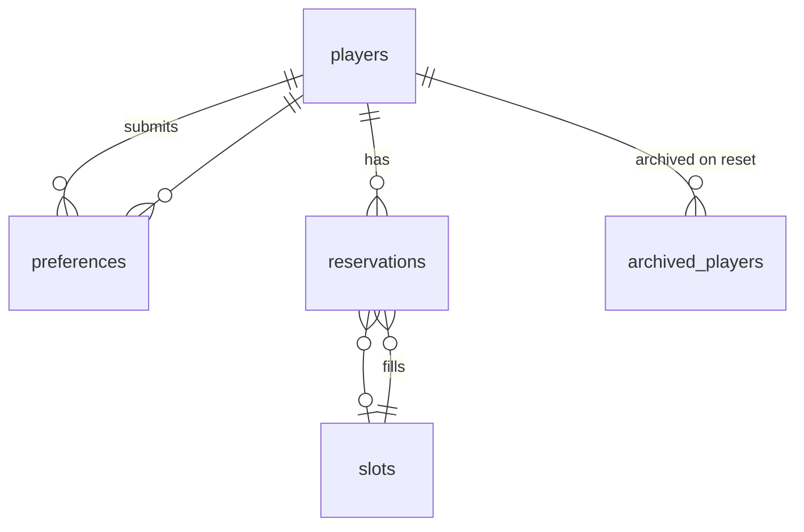
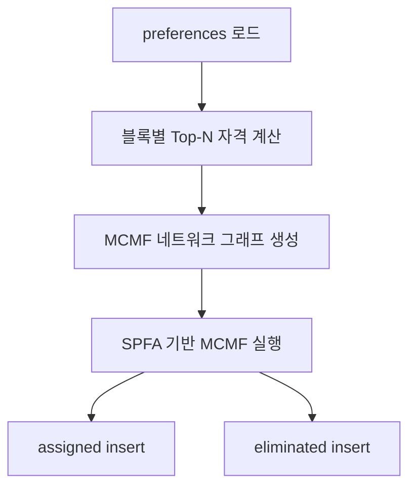
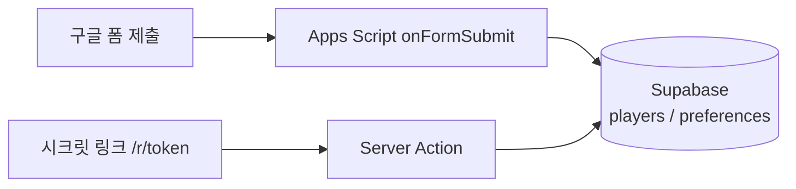

# SVS 예약 시스템 — 상세 설명

Next.js 14 + Supabase 기반의 연맹 SVS(성) 예약·배정 시스템입니다.  
플레이어는 **신청 기간에 선호 시간만 제출**하고, R4+ 운영자가 **마감·검증 후 일괄 배정**합니다.  
배정 알고리즘은 **Min-Cost Max-Flow (MCMF)** 최소 비용 최대 유량을 사용합니다.

---

## 목차

1. [개요](#1-개요)
2. [운영 워크플로 (5단계)](#2-운영-워크플로-5단계)
3. [페이지·URL](#3-페이지url)
4. [데이터 모델](#4-데이터-모델)
5. [시간·슬롯 구조 (UTC)](#5-시간슬롯-구조-utc)
6. [플레이어 신청 흐름](#6-플레이어-신청-흐름)
7. [일괄 배정 알고리즘](#7-일괄-배정-알고리즘)
8. [배정 후 동작 (취소·승격)](#8-배정-후-동작-취소승격)
9. [관리자(Admin) 기능](#9-관리자admin-기능)
10. [공개 현황 (/status)](#10-공개-현황-status)
11. [사이클(Cycle)](#11-사이클cycle)
12. [설정(settings) 키](#12-설정settings-키)
13. [보안·접근 제어](#13-보안접근-제어)
14. [개발·테스트용 스크립트](#14-개발테스트용-스크립트)
15. [관련 소스 파일](#15-관련-소스-파일)
16. [구글 폼 연동 (Apps Script 파이프라인)](#16-구글-폼-연동-apps-script-파이프라인)

---

## 1. 개요

| 구분 | 내용 |
|------|------|
| 목적 | 월/화(VP)·목(MO) 성 예약을 스피드업 우선으로 공정 배정 |
| 신청 | 비밀 URL `/r/[token]` 또는 **구글 폼** — **선호(preferences)만 DB 저장**, 슬롯 배정 없음 |
| 배정 | Admin **Run full assignment** — 사이클 전체를 Mon → Tue → Thu 순으로 재계산 |
| 알고리즘 | **Min-Cost Max-Flow (MCMF)** — 빈 슬롯·대기자 동시 존재 및 스피드업 역전 문제 해결 |
| 시간대 | **UTC만** 표시 (KST 토글 없음) |
| 인증 | 플레이어: URL 토큰 / 운영자: Admin 비밀번호(iron-session) |

```mermaid
flowchart LR
  A[플레이어 신청\n/r/token 또는 구글 폼] --> B[(preferences)]
  C[예약 마감] --> D[스피드업 검증]
  D --> E[Run full assignment]
  E --> F[(reservations assigned)]
  F --> G[/status 공지]
```

---

## 2. 운영 워크플로 (5단계)

| 단계 | 담당 | 동작 | DB 변화 |
|------|------|------|---------|
| ① 신청 기간 | 플레이어 | `/r/[token]` 또는 구글 폼에서 요일·스피드업·선호 블록 제출 | `players`, `preferences` |
| ② 예약 마감 | R4+ Admin | **Close reservations** 토글 | `settings.reservation_open = false` |
| ③ 스피드업 검증 | R4+ Admin | 예약 목록·검색·그리드에서 실제 수치 대조·수정 | `players` (필요 시) |
| ④ 배정 실행 | R4+ Admin | **Run full assignment** | `reservations` (assigned / eliminated), `last_assignment_run` |
| ⑤ 결과 공지 | R4+ | `/status` 링크 공유 | — (조회만) |

**중요:** ① 단계에서는 `reservations`에 `assigned` 행이 생기지 않습니다. 그리드가 비어 있어야 정상입니다. 슬롯이 채워져 있다면 ④를 이미 실행했거나, 구버전(즉시 배정) 데이터·테스트 스크립트 배정일 수 있습니다.

---

## 3. 페이지·URL

| 경로 | 접근 | 설명 |
|------|------|------|
| `/r/[token]` | 비밀 토큰 일치 시 | 다단계 신청 폼 (정보 → 월 → 화 → 목) |
| `/r/[token]/check` | 동일 토큰 | Game ID로 신청·배정·대기 상태 조회 |
| `/status` | 공개 | 실시간 스케줄·대기열 (배정 전/후 문구 분기) |
| `/admin` | 로그인 후 | URL·마감·배정·검색·그리드·Reset |
| `/admin/login` | — | 비밀번호 로그인 |
| `/admin/setup` | 최초 1회 | 관리자 비밀번호 해시 저장 |

**API (관리자 세션 필요)**

| 메서드 | 경로 | body | 설명 |
|--------|------|------|------|
| POST | `/api/admin/login` | `{ password }` | 세션 생성 |
| POST | `/api/admin/action` | `{ action: "run_batch_assignment" }` | 버튼과 동일한 일괄 배정 |
| GET | `/api/admin/assignment-preview` | — | 신청자 수·마지막 배정 시각 |

---

## 4. 데이터 모델

### 4.1 테이블

```
players               game_id(integer PK), name, alliance, email(nullable)
                      speedup_mon, speedup_tue, speedup_thu
slots                 요일·블록·30분 슬롯(0~3)·활성 여부
preferences           (player_id→integer, day, block, cycle) 선호 블록 — 신청의 핵심
reservations          배정 결과: assigned | eliminated | cancelled
settings              토큰, 사이클 ID, 마감 여부, admin 해시, last_assignment_run
archived_players      Reset 시 백업 (archive_id, game_id, name, alliance, speedup_*)
archived_preferences  Reset 시 백업 (original_id, player_id, day, block, cycle)
archived_reservations Reset 시 백업 (original_id, player_id, slot_id, status, cycle)
```

> **참고:** `archived_players`에는 `email` 컬럼이 없습니다. 아카이브 대상에서 제외된 컬럼입니다.

> **스키마 변경 이력:**
> - `v5` 마이그레이션: `players.email` 컬럼 추가 (nullable), `speedup_vp`/`speedup_mo` → `speedup_mon`/`speedup_tue`/`speedup_thu` 로 변경, 아카이브 테이블 3종 추가

### 4.2 `players` 주요 컬럼

| 컬럼 | 타입 | 설명 |
|------|------|------|
| `game_id` | integer PK | 게임 내 고유 ID (정수) |
| `name` | text | 플레이어 이름 |
| `alliance` | text | 연맹명 |
| `email` | text \| null | 구글 폼 연동 시 사용. 중복 신청 방지 키 |
| `speedup_mon` | integer (default 0) | 월요일 스피드업(일) |
| `speedup_tue` | integer (default 0) | 화요일 스피드업(일) |
| `speedup_thu` | integer (default 0) | 목요일 스피드업(일) |

### 4.3 `preferences` (신청 데이터)

- 한 플레이어가 같은 **사이클·요일**에 여러 **2시간 블록**을 선택할 수 있음.
- 유니크: `(player_id, day_of_week, block_start_utc, cycle_id)`.
- 일괄 배정 시 이 테이블만 읽어 "신청자"를 구성합니다.

### 4.4 `reservations` (배정 결과)

| status | slot_id | 의미 |
|--------|---------|------|
| `assigned` | 슬롯 ID | 해당 30분 슬롯 배정 |
| `eliminated` | `NULL` | 그 요일 슬롯 없음 (대기열) |
| `cancelled` | (기존 슬롯) | Admin 취소 — 해당 요일 `preferences` 삭제 후 재신청 가능 |

배정 전: `reservations`에 해당 사이클 `assigned`/`eliminated`가 없거나, Admin 그리드 쿼리는 `slot_id IS NOT NULL`만 표시하므로 **빈 그리드**.

### 4.5 아카이브 테이블

Reset cycle 실행 시 삭제 전에 현재 사이클 데이터를 아카이브 테이블에 백업합니다.

| 테이블 | 백업 원본 |
|--------|---------|
| `archived_players` | `players` |
| `archived_preferences` | `preferences` |
| `archived_reservations` | `reservations` |

### 4.6 ER 개요



---

## 5. 시간·슬롯 구조 (UTC)

### 5.1 요일·관직

| 요일 | 코드 | 관직 | 스피드업 필드 |
|------|------|------|----------------|
| 월요일 | `mon` | VP | `speedup_mon` |
| 화요일 | `tue` | VP | `speedup_tue` |
| 목요일 | `thu` | MO | `speedup_thu` |

화·수·금·토·일은 시스템에 없습니다.

### 5.2 블록·슬롯

- **블록:** UTC 기준 2시간 단위, `block_start_utc` = 0, 2, 4, …, 22 (총 12블록/일).
- **슬롯:** 블록당 **4개** (`slot_index` 0~3), 각 **30분**.
- DB: `slots` 테이블에 요일×블록×인덱스 조합 (스키마 시드: `supabase/schema.sql`).

표시 예: `10:00~10:30 UTC`, `10:00~12:00 UTC` (블록 헤더).

---

## 6. 플레이어 신청 흐름

### 6.1 URL 보호

`middleware.ts`가 `/r/[token]` 경로에서 `settings.access_token`과 비교합니다. 불일치 시 404.

### 6.2 신청 단계 (`ReservationForm`)

1. **Your info** — Game ID, 이름, 연맹 (기존 신청 요일은 API로 표시, 중복 제출 방지).
2. **Monday (VP)** — 스피드업(일), 선호 블록(UTC) 복수 선택.
3. **Tuesday (VP)** — 동일.
4. **Thursday (MO)** — 동일 후 **Submit** → 확인 다이얼로그 → 확정.

### 6.3 서버 처리 (`processReservation` / `processMultiDayReservation`)

조건:

- `reservation_open !== "false"` (마감 시 거부).
- 같은 사이클·같은 요일에 `preferences`가 이미 있으면 거부 (`DUPLICATE_DAY_MESSAGE`).

처리:

1. `players` upsert (각 요일의 스피드업을 해당 컬럼에 저장: `speedup_mon`, `speedup_tue`, `speedup_thu`).
2. 요일별 `preferences` upsert.
3. **`reservations` insert 없음** — 성공 메시지:

   > Your application has been received. Assignment results will be announced after the booking window closes.

### 6.4 중복 신청 방지 (`lib/reservation-guard.ts`)

| 체크 순서 | 조건 | 설명 |
|-----------|------|------|
| 1차 (email) | `email + cycle_id + day_of_week` | email이 있을 때 먼저 적용 (구글 폼 중복 방지) |
| 2차 (game_id) | `game_id + cycle_id + day_of_week` | 시크릿 링크 또는 email 없는 경우 |

구글 폼과 시크릿 링크 양쪽에서 같은 플레이어가 중복 신청하는 경우를 모두 차단합니다.

### 6.5 본인 조회 (`/r/[token]/check`)

| 배정 실행 전 (`last_assignment_run` 없음) | 배정 실행 후 |
|-------------------------------------------|--------------:|
| 선호만 있으면 **Application received** | 슬롯 있으면 **Assigned** + 시간 |
| | 없으면 **On waitlist** + 선호 블록 |

---

## 7. 일괄 배정 알고리즘

진입점: `runBatchAssignmentForCycle` → 요일별 `runBatchAssignment` (순서: **mon → tue → thu**).

### 7.1 요일 단위 처리 순서

1. 해당 요일 **활성 슬롯** 목록 로드.
2. 해당 사이클·요일 **preferences**로 신청자 맵 구성 (`BatchApplicant`: playerId, speedup, appliedAt, blocks).
3. 그 요일 슬롯에 걸린 기존 `assigned` 삭제 후, 미배정 신청자의 `eliminated` 행 정리.
4. 매칭 계산 후 `assigned` / `eliminated` insert.
5. 세 요일 완료 후 `settings.last_assignment_run` 갱신.

**재실행:** 같은 사이클에서 다시 누르면 해당 요일 배정이 **전부 삭제 후 재계산**됩니다.

### 7.2 블록별 자격 (Top-N)

`computeEligibleByBlock`:

- 각 2시간 블록마다, 그 블록을 선호에 넣은 신청자 중 **스피드업 내림차순 → appliedAt 오름차순** 정렬.
- 상위 **N명**만 자격 (N = 그 블록의 활성 슬롯 수, 최대 4).
- 전역적으로 중복 제약을 해소하기 위해 `countedPlayers`를 통해 한 플레이어가 여러 블록의 Top-N 정원을 중복 점유하지 않도록 제한합니다.

### 7.3 최소 비용 최대 유량 (Min-Cost Max-Flow)

`solveDayAssignmentMCMF`:

- **네트워크 모델링:**
  - Source(0) $\to$ 플레이어 노드 (용량: 1, 비용: 0)
  - 플레이어 노드 $\to$ 슬롯 노드 (용량: 1, 비용: 가중치)
  - 슬롯 노드 $\to$ Sink(1) (용량: 1, 비용: 0)
- **비용(Cost) 정책:**
  - 플레이어의 스피드업 전체 통합 순위 $R$ (1위=1, 2위=2...)를 기준으로 설계합니다.
  - **Top-N 자격 통과 간선:** $\text{Cost} = R$
  - **Top-N 자격 미달 간선:** $\text{Cost} = R + 1{,}000{,}000$ (용량 한계 도달 시 후순위 백필)
- **알고리즘:** SPFA (Shortest Path Faster Algorithm) 기반의 MCMF 알고리즘을 사용합니다.
- **목표:** 최대 매칭 수(Max Flow)를 확보하면서 스피드업이 높은(Min Cost) 인원을 우선하여 단일 Phase 내에 최적 배정합니다.

> **알고리즘 교체 배경:** 이전 Hopcroft-Karp 방식은 2-Phase(자격자 우선 → 잔여 슬롯 백필) 구조로 인해 특정 조건에서 빈 슬롯과 대기자가 동시에 존재하거나(V1), 스피드업이 낮은 플레이어가 높은 플레이어보다 좋은 슬롯에 배정되는 역전(V4) 문제가 발생했습니다. MCMF는 비용 함수로 우선순위를 인코딩하여 단일 Pass에 두 문제를 동시에 해결합니다.



### 7.4 appliedAt

일괄 배정 시 `preferences.applied_at`을 신청 시각으로 사용합니다. (다중 블록 preference 시 가장 이른 시각.)

---

## 8. 배정 후 동작 (취소·승격)

### 8.1 Admin 슬롯 취소 (`cancelReservation`)

1. `reservations.status = cancelled`.
2. 해당 요일 `preferences` 삭제 → 플레이어 **재신청 가능**.
3. `promoteOnCancel(slotId)` — 빈 슬롯에 대기자 승격 시도.

### 8.2 `promoteOnCancel`

- 해당 **블록** 선호가 있는 `eliminated` 중, 같은 요일 미배정자만 대상.
- 블록별 Top-N 자격 + 동일한 기준으로 **그 슬롯 1개**에 가장 적합한 1명을 `assigned`로 승격.
- 이후 `healEliminatedReservations`, `backfillEmptySlotsForDay`로 연쇄 정리 (빈 슬롯·중복 eliminated 정리).

**참고:** 최초 일괄 배정은 Admin 버튼만 사용. 취소 후 승격만 자동으로 돌아갑니다.

---

## 9. 관리자(Admin) 기능

로그인: bcrypt 해시 (`settings.admin_password_hash`), iron-session 쿠키.

| 기능 | 설명 |
|------|------|
| Secret URL | `access_token` 표시·복사·재발급 (재발급 시 기존 `/r/...` 무효) |
| Open / Close reservations | `reservation_open` 토글 |
| Export Excel | 사이클별 시트(요일별 등) |
| **Run full assignment** | `runFullBatchAssignment` — Search Reservations **위** 노란 패널 |
| Reset cycle | `RESET` 입력 — players·preferences·reservations를 **아카이브 후** 삭제, `current_cycle_id` +1, `last_assignment_run` 삭제 |
| Search | 배정 전: 신청자 검색 / 배정 후: 예약·대기 검색 |
| Applicants | 배정 전만 — `preferences` 기반 신청자 목록 (그리드 비표시) |
| Schedule Grid | 배정 후만 — UTC 그리드·슬롯별 Cancel |
| Waitlist | 배정 후만 — 해당 요일 `eliminated` + 선호 블록 |

---

## 10. 공개 현황 (/status)

- 익명(anon) 읽기 + Supabase Realtime으로 `reservations` 변경 구독.
- `last_assignment_run` 없음 → 상단에 "배정 미공개" 안내, 그리드는 비어 있거나 배정 전 상태.
- 배정 후 → assigned 슬롯 표시 + Waitlist(VP/MO).
- 마감 배너: `reservation_open === false`.

---

## 11. 사이클(Cycle)

- `settings.current_cycle_id` (정수, 기본 1).
- 모든 `preferences` / `reservations`는 `cycle_id`로 구분.
- **Reset cycle** 시 삭제 전 `archived_*` 테이블에 데이터를 백업한 뒤 ID만 증가합니다.

---

## 12. 설정(settings) 키

| key | 용도 |
|-----|------|
| `access_token` | `/r/[token]` 비밀 문자열 |
| `admin_password_hash` | Admin bcrypt |
| `current_cycle_id` | 현재 사이클 |
| `reservation_open` | `"true"` / `"false"` |
| `last_assignment_run` | ISO 시각, 일괄 배정 완료 시각 |

---

## 13. 보안·접근 제어

| 계층 | 내용 |
|------|------|
| RLS | anon은 SELECT만 (players, slots, reservations, preferences, reservation_open) |
| 쓰기 | Server Actions / API는 **service role** (`createServiceClient`) |
| Admin | 세션 없으면 `requireAdmin()` 실패 |
| 토큰 URL | middleware + 서버에서 token 검증 |

`.env.local`의 `SUPABASE_SERVICE_ROLE_KEY`는 서버 전용, 클라이언트에 노출 금지.

---

## 14. 개발·테스트용 스크립트

| npm script | 스크립트 위치 | 설명 |
|------------|-------------|------|
| `inject:random -- N` | `scripts/dev/` | N명 무작위 신청 (기본 120, preferences만) |
| `inject:test` | `scripts/dev/` | 실제 테스트 데이터 주입 |
| `clear:assignments` | `scripts/dev/` | 현재 사이클 배정 결과만 삭제 |
| `seed:stress` | `scripts/dev/` | clear + 120명 주입 |
| `verify:assignment` | `scripts/verify/` | 배정 결과 검증 (V1~V5) — 에러 1건 이상 시 exit(1) |
| `audit:reservations` | `scripts/verify/` | 사이클 전체 감사 (assigned·waitlist·빈 슬롯) |
| `validate:assignment` | `scripts/verify/` | 배정 유효성 검사 |
| `run:batch` | `scripts/maintenance/` | Admin 버튼과 동일한 배정 실행 |
| `recover:waitlist` | `scripts/maintenance/` | 대기열 복구 |
| `backfill:slots` | `scripts/maintenance/` | 빈 슬롯 백필 |
| `reconcile:waitlist` | `scripts/maintenance/` | eliminated 정합성 정리 |
| `purge:orphans` | `scripts/maintenance/` | preferences 없는 고아 `players` 삭제 |
| `check-env` | `scripts/admin/` | 환경 변수 검증 |
| `set-admin-password` | `scripts/admin/` | Admin 비밀번호 설정 |

### `verify:assignment` 검증 항목

| 코드 | 심각도 | 검증 내용 |
|------|--------|-----------|
| V1 | 경고 | 빈 슬롯 + 대기자 동시 존재 |
| V2 | 에러 | 한 플레이어가 같은 요일 중복 배정 |
| V3 | 에러 | 비활성 슬롯에 배정됨 |
| V4 | 경고 | 스피드업 역전 (낮은 순위가 더 좋은 슬롯 배정) |
| V5 | 에러 | preferences 없는 배정 |

에러가 1건 이상이면 `process.exit(1)`로 종료됩니다.

**로컬에서 버튼과 동일하게 배정만 테스트:**

```bash
npm run inject:random -- 10
npm run run:batch
npm run verify:assignment
```

---

## 15. 관련 소스 파일

| 영역 | 파일 |
|------|------|
| 배정·MCMF | `lib/assignment.ts` |
| 중복·메시지 | `lib/reservation-guard.ts` |
| 요일·블록 상수 | `lib/types.ts` |
| UTC 포맷 | `lib/utils.ts` |
| Admin UI | `app/admin/AdminDashboard.tsx`, `app/admin/actions.ts` |
| 신청·조회 | `app/r/[token]/ReservationForm.tsx`, `app/r/[token]/actions.ts` |
| 공개 현황 | `app/status/StatusView.tsx`, `app/status/page.tsx` |
| 배정 검증 | `scripts/verify/verify-assignment.ts` |
| 감사·유효성 | `scripts/verify/audit-reservations.ts`, `scripts/verify/validate-assignment.ts` |
| 유지보수 | `scripts/maintenance/` |
| 개발 도구 | `scripts/dev/` |
| 운영 설정 | `scripts/admin/` |
| 스키마 | `supabase/schema.sql` |
| 마이그레이션 | `supabase/migrations/` (v4, v5) |

---

## 16. 구글 폼 연동 (Apps Script 파이프라인)

Vercel 콜드스타트 우회 및 신청 편의성 향상을 위해 구글 폼을 통한 신청 경로를 병행 운영할 수 있습니다.

### 16.1 구조



- 구글 폼과 시크릿 링크는 **동일한 `players` / `preferences` 테이블**에 데이터를 씁니다.
- 두 경로 모두 `lib/reservation-guard.ts`의 중복 방지 로직이 적용됩니다.

### 16.2 구글 폼 설정

1. [Google Forms](https://forms.google.com)에서 새 폼 생성.
2. 필드 구성 예시:

   | 질문 | 유형 | 비고 |
   |------|------|------|
   | Game ID | 단답형 | 필수 |
   | 이름 | 단답형 | 필수 |
   | 연맹 | 단답형 | 필수 |
   | 이메일 | 이메일 | 필수 — 중복 방지 키 |
   | 요일 선택 | 체크박스 (mon/tue/thu) | 필수 |
   | 선호 블록 (월) | 체크박스 | 선택 |
   | 선호 블록 (화) | 체크박스 | 선택 |
   | 선호 블록 (목) | 체크박스 | 선택 |
   | 스피드업 (월, 일) | 단답형 숫자 | 선택 |
   | 스피드업 (화, 일) | 단답형 숫자 | 선택 |
   | 스피드업 (목, 일) | 단답형 숫자 | 선택 |

3. **응답 1회 제한** 설정 (폼 설정 → "1회 응답 제한").
4. 폼을 저장하고 **스프레드시트에 연결** (응답 탭 → 스프레드시트 아이콘).

### 16.3 Apps Script 설정

1. 연결된 스프레드시트 열기 → **확장 프로그램 → Apps Script**.
2. 아래 코드를 붙여넣고 상수를 본인 프로젝트 값으로 교체:

```javascript
const SUPABASE_URL = "https://xxxx.supabase.co";
const SUPABASE_SERVICE_KEY = "eyJ...";  // service_role key — 공유 금지
const CYCLE_ID = 1; // 현재 사이클 ID

function onFormSubmit(e) {
  const r = e.namedValues;

  const gameId   = (r["Game ID"]   || [""])[0].trim();
  const name     = (r["이름"]       || [""])[0].trim();
  const alliance = (r["연맹"]       || [""])[0].trim();
  const email    = (r["이메일"]     || [""])[0].trim().toLowerCase();
  const days     = (r["요일 선택"]  || [""])[0].split(",").map(d => d.trim());

  if (!gameId || !email) return;

  // 중복 체크: game_id(integer) + cycle_id + day_of_week
  const gameIdInt = parseInt(gameId);
  for (const day of days) {
    const chkRes = UrlFetchApp.fetch(
      `${SUPABASE_URL}/rest/v1/preferences?select=id&player_id=eq.${gameIdInt}&day_of_week=eq.${day}&cycle_id=eq.${CYCLE_ID}`,
      { headers: { apikey: SUPABASE_SERVICE_KEY, Authorization: `Bearer ${SUPABASE_SERVICE_KEY}` } }
    );
    if (JSON.parse(chkRes.getContentText()).length > 0) continue; // 이미 신청

    // speedup 결정 (요일별 독립)
    const speedupMap = { mon: "스피드업 (월, 일)", tue: "스피드업 (화, 일)", thu: "스피드업 (목, 일)" };
    const speedupField = speedupMap[day] || "";
    const speedup = parseInt((r[speedupField] || ["0"])[0]) || 0;

    // players upsert (game_id는 integer)
    UrlFetchApp.fetch(`${SUPABASE_URL}/rest/v1/players`, {
      method: "post",
      headers: {
        apikey: SUPABASE_SERVICE_KEY,
        Authorization: `Bearer ${SUPABASE_SERVICE_KEY}`,
        "Content-Type": "application/json",
        Prefer: "resolution=merge-duplicates"
      },
      payload: JSON.stringify({
        game_id: gameIdInt, name, alliance, email,
        [`speedup_${day}`]: speedup
      })
    });

    // 선호 블록 파싱 후 preferences insert
    const blockField = { mon: "선호 블록 (월)", tue: "선호 블록 (화)", thu: "선호 블록 (목)" }[day];
    const blocks = (r[blockField] || [""])[0].split(",").map(b => parseInt(b.trim())).filter(b => !isNaN(b));
    for (const block of blocks) {
      UrlFetchApp.fetch(`${SUPABASE_URL}/rest/v1/preferences`, {
        method: "post",
        headers: {
          apikey: SUPABASE_SERVICE_KEY,
          Authorization: `Bearer ${SUPABASE_SERVICE_KEY}`,
          "Content-Type": "application/json",
          Prefer: "resolution=merge-duplicates"
        },
        payload: JSON.stringify({
          player_id: gameIdInt, day_of_week: day,
          block_start_utc: block, cycle_id: CYCLE_ID
        })
      });
    }
  }
}
```

3. **트리거 설정:** 왼쪽 알람(⏰) 아이콘 → **+ 트리거 추가** → 함수 `onFormSubmit`, 이벤트 소스 **스프레드시트에서**, 이벤트 유형 **양식 제출 시**.
4. 권한 허용 후 저장.

### 16.4 중복 방지 동작

| 경로 | 1차 중복 체크 | 2차 중복 체크 |
|------|------------|------------|
| 구글 폼 | 폼 응답 1회 제한 | Apps Script: `email + cycle_id + day_of_week` |
| 시크릿 링크 | `reservation-guard.ts`: `email + cycle_id + day_of_week` | `game_id + cycle_id + day_of_week` |

### 16.5 주의 사항

- `SUPABASE_SERVICE_KEY`는 Apps Script 코드에만 보관하고, GitHub·채팅 등에 절대 공유하지 마세요.
- 스프레드시트 공유 설정에서 service_role 키가 노출되지 않도록 **편집 권한을 제한**하세요.
- 구글 폼과 시크릿 링크 병행 운영 시 **같은 `CYCLE_ID`** 값을 유지해야 합니다.

---

## 부록: 구버전과의 차이

| 항목 | 구버전 | 현재 |
|------|--------|------|
| 신청 시 | 즉시 `assignToBlock` 등으로 슬롯 배정 | `preferences`만 저장 |
| 배정 | 신청마다 실시간 | Admin **Run full assignment** 일괄 |
| 대기 | eliminated 즉시 생성 | 일괄 배정 후 `slot_id = null` eliminated |
| 알고리즘 | Hopcroft-Karp | **Min-Cost Max-Flow (MCMF)** |
| 스피드업 필드 | `speedup_vp`, `speedup_mo` | `speedup_mon`, `speedup_tue`, `speedup_thu` |
| email 필드 | 없음 | `players.email` (nullable) |
| 아카이브 | Reset 시 데이터 소멸 | Reset 전 `archived_*` 테이블에 백업 |
| 신청 경로 | 시크릿 링크만 | 시크릿 링크 + **구글 폼** 병행 가능 |
| 시간 표시 | UTC/KST 토글 | **UTC만** |

프로덕션에 슬롯이 신청만으로 채워져 있다면 **구버전 배포** 또는 **`run:batch` / API 배정** 이력을 의심하면 됩니다.

---

*문서 기준: 저장소 `main` 브랜치 (MCMF 배정 + UTC 전용 UI + 구글 폼 파이프라인).*
