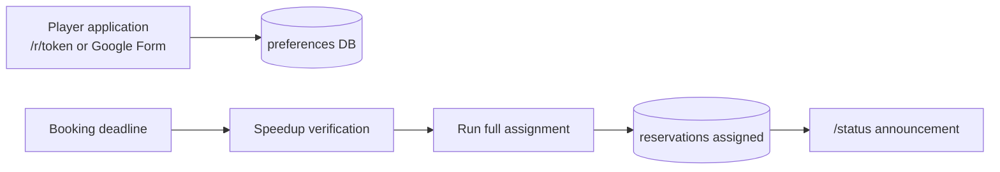
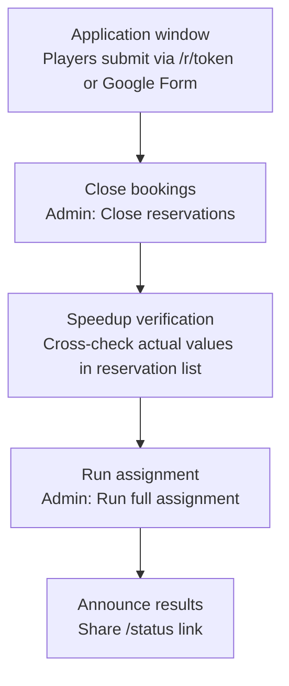
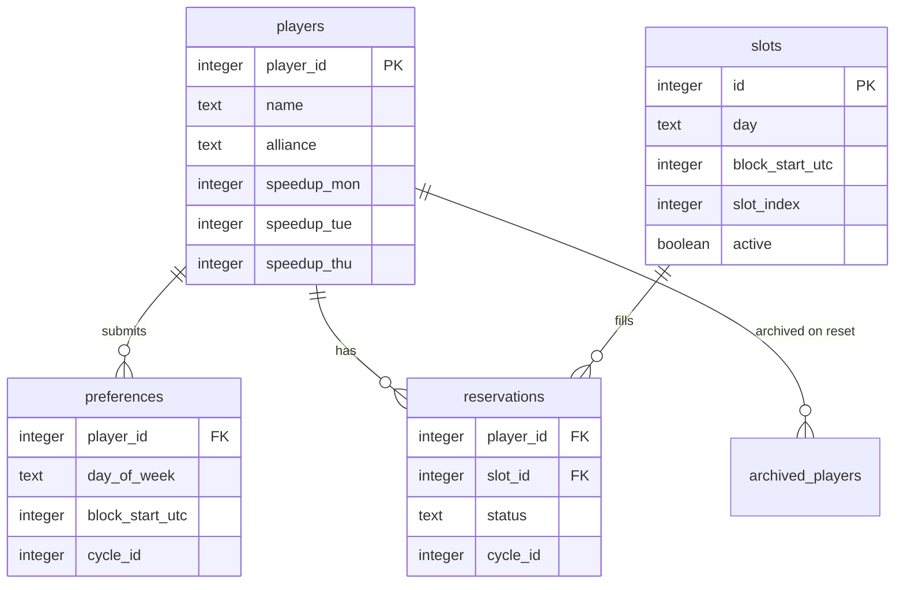
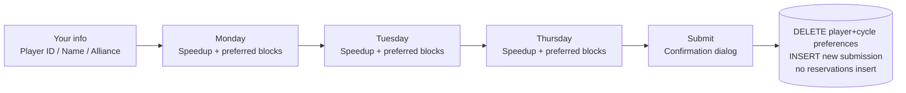
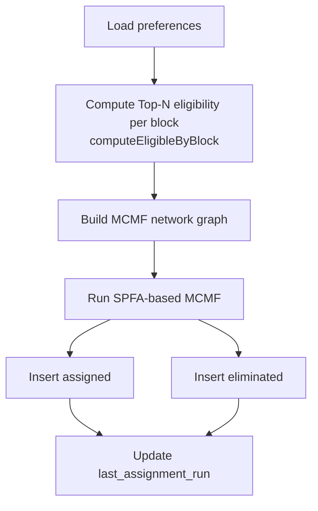
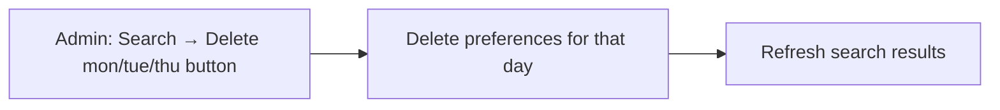
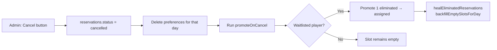
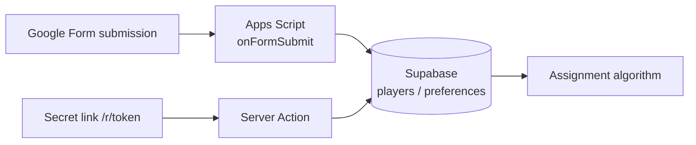

# SVS Reservation System — Technical Reference

Next.js 14 + Supabase based alliance SVS (castle) reservation and assignment system.
Players **submit only their preferred time slots** during the application window, and R4+ admins run a **batch assignment after the deadline**.
The assignment algorithm uses **Min-Cost Max-Flow (MCMF)**.

> 한국어 버전: [RESERVATION_SYSTEM.md](RESERVATION_SYSTEM.md) · **Mobile HTML:** [RESERVATION_SYSTEM_EN.html](RESERVATION_SYSTEM_EN.html)

---

## Table of Contents

1. [Overview](#1-overview)
2. [Environment Variables](#2-environment-variables)
3. [Operations Workflow](#3-operations-workflow)
   - [3.5 Operational Scenarios & Responses](#35-operational-scenarios--responses)
4. [Pages & URLs](#4-pages--urls)
5. [Data Model](#5-data-model)
6. [Time & Slot Structure](#6-time--slot-structure-utc)
7. [Player Application Flow](#7-player-application-flow)
8. [Batch Assignment Algorithm](#8-batch-assignment-algorithm)
9. [Post-Assignment Behavior](#9-post-assignment-behavior-cancellation--promotion)
10. [Admin Features](#10-admin-features)
11. [Public Status Page](#11-public-status-status)
12. [Cycles](#12-cycles)
13. [Settings Keys](#13-settings-keys)
14. [Security & Access Control](#14-security--access-control)
15. [Dev & Test Scripts](#15-dev--test-scripts)
16. [Source Files](#16-source-files)
17. [Google Form Integration](#17-google-form-integration-apps-script-pipeline)
18. [Changelog from Previous Version](#18-changelog-from-previous-version)

---

## 1. Overview

| Item | Description |
|------|-------------|
| Purpose | Fair assignment of Mon/Tue (VP) and Thu (MO) castle slots, prioritized by speedup |
| Application | Secret URL `/r/[token]` or Google Form — only **preferences** are saved to DB, no slot assignment |
| Assignment | Admin **Run full assignment** — recalculates entire cycle in Mon → Tue → Thu order |
| Algorithm | Min-Cost Max-Flow (MCMF) — resolves empty-slot-with-waitlist and speedup reversal bugs |
| Timezone | UTC only (no KST toggle) |
| Auth | Players: URL token / Admins: password via iron-session |



---

## 2. Environment Variables

| Variable | Description |
|----------|-------------|
| `NEXT_PUBLIC_SUPABASE_URL` | Supabase project URL (e.g. `https://xxxx.supabase.co`) |
| `NEXT_PUBLIC_SUPABASE_ANON_KEY` | Supabase anon public key |
| `SUPABASE_SERVICE_ROLE_KEY` | Service role key — **server-only, never expose to client** |
| `IRON_SESSION_SECRET` | Admin session encryption key (32+ random characters) |

```bash
# Generate session secret
node -e "console.log(require('crypto').randomBytes(32).toString('hex'))"

# Validate environment variables
npm run check-env
```

---

## 3. Operations Workflow



| Step | Owner | Action | DB Change |
|------|-------|--------|-----------|
| Application window | Players | Submit day, speedup, preferred blocks via `/r/[token]` or Google Form | `players`, `preferences` |
| Close bookings | R4+ Admin | Toggle **Close reservations** | `settings.reservation_open = false` |
| Speedup verification | R4+ Admin | Cross-check and edit actual speedup values in the reservation list | `players` (if needed) |
| Run assignment | R4+ Admin | **Run full assignment** | `reservations` (assigned / eliminated), `last_assignment_run` |
| Announce results | R4+ | Share `/status` link | — (read only) |

> **Note:** During the application window, no `assigned` rows are created in `reservations`. An empty grid at this stage is expected.

### 3.5 Operational Scenarios & Responses

The tables below summarize **situation-specific responses** from production testing and code review. (Summary in [README](../README.md#운영-시나리오-요약))

#### Reservation Changes & Edits

| # | Timing | Application path | Player action | R4+ Admin action | DB change |
|---|--------|------------------|---------------|------------------|-----------|
| A | During application window · **needs to change answers** | `/r/[token]` or Google Form re-submit | **Re-submit with same Player ID** (full replace) | (Optional) Search → **Delete** if removal only | DELETE all `preferences` + INSERT new |
| B | After form close · **before Run full assignment** | `/r/[token]` (secret link) | Contact R4 → **re-submit** via secret link | (Optional) Search → **Delete** | Full `preferences` replace for cycle |
| B-2 | After B | `/r/[token]` | Re-submit via secret link (only days in this submit remain) | — | Full `preferences` replace |
| C | **After assignment run** | Either | Request cancellation from R4 | Schedule Grid **Cancel** | `cancelled` + day `preferences` deleted |
| C-2 | After C | — | **Self re-apply blocked** (`last_assignment_run` set) | Manual adjustment or next cycle | `ASSIGNMENT_LOCKED_MESSAGE` |
| D | After admin cancel/delete · **no re-apply** | — | Excluded from assignment that cycle/day | — | No preferences → not eligible |

> **Delete vs Cancel:** Delete appears in Search **only before assignment** (`last_assignment_run` unset). Cancel is per-slot on the Schedule Grid after assignment, with waitlist promotion.

#### Player Application

| # | Situation | Condition | Result | User message |
|---|-----------|-----------|--------|--------------|
| 1 | First valid submission | `reservation_open = true`, no `last_assignment_run` | `players` upsert + `preferences` INSERT | *Your application has been received.* |
| 2 | Re-submit same `player_id` | Existing `preferences` in cycle | DELETE all + INSERT new | *Your application has been updated.* |
| 3 | After deadline | `reservation_open = false` | Rejected | *Reservations are currently closed.* |
| 4 | After assignment run | `last_assignment_run` set | Rejected | `ASSIGNMENT_LOCKED_MESSAGE` |
| 5 | Empty day (no blocks) | speedup/blocks blank | Day skipped (not in submission) | — |
| 6 | Status check | `/r/[token]/check` | Before/after assignment | Application received / Assigned / On waitlist |

#### Admin Operational Phases

| Phase | `last_assignment_run` | Admin UI | Key actions |
|-------|-------------------------|----------|-------------|
| 1. Open window | unset | Secret URL, Open | Share `access_token`, `reservation_open = true` |
| 2. Collect applications | unset | Applicants, Search | Review applicants and speedups |
| 3. Close | unset | Close reservations | `reservation_open = false` |
| 4. Verify | unset | Search, Export | Cross-check actual speedup values |
| 5. Assign | unset → set | **Run full assignment** | MCMF batch: mon → tue → thu |
| 6. Announce | set | `/status` | Share status link |
| 7. Post-adjust | set | Grid Cancel, Waitlist | Cancel, promotion, re-apply |
| 8. End cycle | — | Reset cycle (`RESET`) | Backup to `archived_*`, `cycle_id` +1 |

#### Post-Assignment Cancel & Promotion

| # | Situation | Admin action | Algorithm / DB |
|---|-----------|--------------|----------------|
| 1 | Cancel assigned slot | Grid **Cancel** | `status = cancelled`, delete day `preferences` |
| 2 | Waitlisted player available | (automatic) | `promoteOnCancel` → 1 `eliminated` → `assigned` |
| 3 | No waitlist | Cancel only | Slot stays empty (`healEliminated` / backfill) |
| 4 | Cancelled player re-applies | Player uses `/r/[token]` (**before** assignment only) | `clearCancelledDayReservations` then full-replace re-submit |
| 5 | Re-run assignment | Run full assignment again | Deletes that day's assignments, full MCMF recalc |

#### Assignment Verification (`verify:assignment`)

| Code | Severity | Meaning | After MCMF |
|------|----------|---------|------------|
| V1 | Warning | Empty slot + waitlist simultaneously | **Target: 0** (occurred with Hopcroft-Karp) |
| V2 | Error | Duplicate assignment same day | Must always be 0 |
| V3 | Error | Assignment to inactive slot | Must always be 0 |
| V4 | Warning | Speedup reversal | **Target: 0** |
| V5 | Error | Assignment without preferences | Must always be 0 |

---

## 4. Pages & URLs

| Path | Access | Description |
|------|--------|-------------|
| `/r/[token]` | Matching secret token | Multi-step application form (info → Mon → Tue → Thu) |
| `/r/[token]/check` | Same token | Check application, assignment, and waitlist status by Player ID |
| `/status` | Public | Live schedule and waitlist (different text before/after assignment) |
| `/admin` | After login | URL, close, assign, search, grid, reset |
| `/admin/login` | — | Password login |
| `/admin/setup` | One-time setup | Store admin password hash |

**API (admin session required)**

| Method | Path | Body | Description |
|--------|------|------|-------------|
| POST | `/api/admin/login` | `{ password }` | Create session |
| POST | `/api/admin/action` | `{ action: "run_batch_assignment" }` | Same as button |
| GET | `/api/admin/assignment-preview` | — | Applicant count and last assignment time |

---

## 5. Data Model

### Table Structure



### `reservations.status` Values

| status | slot_id | Meaning |
|--------|---------|---------|
| `assigned` | Slot ID | Assigned to a 30-minute slot |
| `eliminated` | `NULL` | No slot available for that day (waitlist) |
| `cancelled` | (original slot) | Admin cancelled — player's `preferences` deleted, re-application allowed |

### Archive Tables

Current cycle data is backed up before deletion when Reset cycle is executed.

| Table | Source |
|-------|--------|
| `archived_players` | `players` |
| `archived_preferences` | `preferences` |
| `archived_reservations` | `reservations` |

---

## 6. Time & Slot Structure (UTC)

### Day & Role Mapping

| Day | Role | Speedup Field |
|-----|------|---------------|
| Monday | VP | `speedup_mon` |
| Tuesday | VP | `speedup_tue` |
| Thursday | MO | `speedup_thu` |

Wednesday, Friday, Saturday, and Sunday are not part of the system.

### Block & Slot Structure

```
One day (UTC)
├── Block 0  (00:00~02:00)  ── Slots 0~3 (30 min each)
├── Block 2  (02:00~04:00)  ── Slots 0~3
├── ...
└── Block 22 (22:00~24:00)  ── Slots 0~3

Total: 12 blocks × 4 slots = 48 slots / day
```

---

## 7. Player Application Flow

### Application Steps



### Server-Side Rules

| Condition | Result |
|-----------|--------|
| `reservation_open = false` | Rejected |
| `last_assignment_run` set | Rejected (`ASSIGNMENT_LOCKED_MESSAGE`) |
| Valid (first submit) | `players` upsert + DELETE (player+cycle) + INSERT `preferences` | *Your application has been received.* |
| Valid (re-submit) | Same full replace | *Your application has been updated.* |

> Re-submitting keeps **only the days included in this submission**. Example: if you first applied for Mon+Tue then re-submit Tue only, Mon preferences are removed.  
> The check page (`/r/[token]/check`) pending text still uses *"Your application has been received. Assignment results will be announced after the booking window closes."* (`SUBMIT_SUCCESS_MESSAGE`)

### Full Replace on Re-Submit

Re-submitting with the same `player_id` + `cycle_id` **DELETEs all** `preferences` for that cycle, then INSERTs the new submission. Applies equally to Google Form and secret link. Different `player_id` values are independent.

### Self-Check (`/r/[token]/check`)

| Timing | Status Displayed |
|--------|-----------------|
| Before assignment | **Application received** |
| After assignment — slot found | **Assigned** + time |
| After assignment — no slot | **On waitlist** + preferred blocks |

---

## 8. Batch Assignment Algorithm

Entry point: `runBatchAssignmentForCycle` → per-day `runBatchAssignment` (order: **mon → tue → thu**)

### Processing Flow



### Block-Level Eligibility (Top-N)

For each 2-hour block, applicants who listed that block as a preference are sorted by:

1. Speedup descending
2. Application time (`appliedAt`) ascending
3. `player_id` ascending (tiebreaker)

Only the top N are eligible (N = number of active slots in that block, max 4). A single player cannot occupy Top-N seats in multiple blocks simultaneously.

### MCMF Network Model

```
Source
  └── Player node (capacity: 1, cost: 0)
        ├── Top-N eligible slot node (capacity: 1, cost: R)
        └── Top-N ineligible slot node (capacity: 1, cost: R + 1,000,000)
              └── Sink (capacity: 1, cost: 0)

R = player's global speedup rank (1st = 1, 2nd = 2, ...)
```

- Algorithm: MCMF using SPFA (Shortest Path Faster Algorithm)
- Goal: Maximize total assignments (Max Flow) while prioritizing higher speedup players (Min Cost)

> **Why MCMF replaced Hopcroft-Karp:** The previous 2-phase Hopcroft-Karp approach had two known bugs — empty slots coexisting with waitlisted players (V1), and lower-speedup players receiving better slots than higher-speedup ones (V4). MCMF encodes priority directly into the cost function and resolves both in a single pass.

**Re-run behavior:** Running assignment again on the same cycle deletes and fully recalculates that day's assignments.

---

## 9. Post-Assignment Behavior (Cancellation & Promotion) and Pre-Assignment Deletion

### Pre-Assignment: Delete Application per Day



- **Visibility:** Delete buttons appear in search results only when `last_assignment_run` is not set (pre-assignment)
- Buttons are automatically hidden after assignment is run
- `players` table is not affected — only `preferences` are deleted
- Server action: `deletePreferenceByDay(player_id, day_of_week, cycle_id)`
- Confirmation dialog → loading spinner → completion toast notification

### Post-Assignment: Admin Slot Cancellation



- The cancelled player can re-apply
- Admin UI shows a completion toast notification

### Waitlist Promotion (`promoteOnCancel`)

From `eliminated` players who preferred that block and are unassigned for that day, the same Top-N eligibility criteria are applied to promote 1 player to `assigned`.

---

## 10. Admin Features

Login: bcrypt hash (`settings.admin_password_hash`) + iron-session cookie

| Feature | Description |
|---------|-------------|
| Secret URL | Show, copy, or regenerate `access_token` (regenerating invalidates existing `/r/...` links) |
| Open / Close reservations | Toggle `reservation_open` |
| Export Excel | Per-cycle sheets (by day, etc.) |
| **Run full assignment** | `runFullBatchAssignment` — yellow panel above Search Reservations |
| Reset cycle | Type `RESET` — archives then deletes players/preferences/reservations, increments `current_cycle_id` |
| Search | Before assignment: search applicants (with per-day Delete buttons) / After: search reservations and waitlist |
| Delete application per day | Before assignment only — delete a player's specific day `preferences` from search results |
| Applicants | Before assignment only — applicant list from `preferences` |
| Schedule Grid | After assignment only — UTC grid with per-slot Cancel button |
| Waitlist | After assignment only — `eliminated` players with preferred blocks |

---

## 11. Public Status (/status)

- Anonymous (anon) read access + Supabase Realtime subscription on `reservations`
- No `last_assignment_run` → shows "assignment not yet published", empty grid
- After assignment → displays `assigned` slots + Waitlist (VP/MO)
- Closed banner: `reservation_open === false`

---

## 12. Cycles

- `settings.current_cycle_id` (integer, default 1)
- All `preferences` / `reservations` are scoped by `cycle_id`
- **Reset cycle** backs up data to `archived_*` tables before deletion, then increments the ID

---

## 13. Settings Keys

| Key | Purpose |
|-----|---------|
| `access_token` | Secret string for `/r/[token]` |
| `admin_password_hash` | Admin bcrypt hash |
| `current_cycle_id` | Current cycle number |
| `reservation_open` | `"true"` / `"false"` |
| `last_assignment_run` | ISO timestamp of last batch assignment |

---

## 14. Security & Access Control

| Layer | Detail |
|-------|--------|
| RLS | anon can SELECT only (`players`, `slots`, `reservations`, `preferences`, `reservation_open`) |
| Writes | Server Actions / API use service role (`createServiceClient`) |
| Admin | `requireAdmin()` fails without a valid session |
| Token URL | Token validated in both middleware and server |

`SUPABASE_SERVICE_ROLE_KEY` in `.env.local` is server-only — never expose to the client.

---

## 15. Dev & Test Scripts

**Development**

| npm script | Description |
|------------|-------------|
| `inject:random -- N` | Inject N random applications (default 120, preferences only) |
| `inject:test` | Inject real test data |
| `clear:assignments` | Delete only current cycle's assignment results |
| `seed:stress` | clear + inject 120 random players |

**Assignment & Verification**

| npm script | Description |
|------------|-------------|
| `run:batch` | Run batch assignment (same as Admin button) |
| `verify:assignment` | Verify assignment results (V1~V5) — exits with code 1 on error |
| `audit:reservations` | Full cycle audit |
| `validate:assignment` | Assignment validity check |

**Maintenance**

| npm script | Description |
|------------|-------------|
| `recover:waitlist` | Recover waitlist |
| `backfill:slots` | Backfill empty slots |
| `reconcile:waitlist` | Fix eliminated consistency |
| `purge:orphans` | Delete players with no preferences |

### `verify:assignment` Checks

| Code | Severity | Check |
|------|----------|-------|
| V1 | Warning | Empty slot with waitlisted player simultaneously |
| V2 | Error | Same player assigned to the same day twice |
| V3 | Error | Assignment to an inactive slot |
| V4 | Warning | Speedup reversal (lower rank gets better slot) |
| V5 | Error | Assignment without corresponding preferences |

Exits with `process.exit(1)` if any error is found.

<details>
<summary>Local assignment test flow</summary>

```bash
npm run inject:random -- 10
npm run run:batch
npm run verify:assignment
```

</details>

---

## 16. Source Files

| Area | File |
|------|------|
| Assignment & MCMF | `lib/assignment.ts` |
| Re-submit & messages | `lib/reservation-guard.ts` |
| Day & block constants | `lib/types.ts` |
| UTC formatting | `lib/utils.ts` |
| Admin UI | `app/admin/AdminDashboard.tsx`, `app/admin/actions.ts` |
| Application & check | `app/r/[token]/ReservationForm.tsx`, `app/r/[token]/actions.ts` |
| Public status | `app/status/StatusView.tsx`, `app/status/page.tsx` |
| Assignment verification | `scripts/verify/verify-assignment.ts` |
| Audit & validation | `scripts/verify/audit-reservations.ts`, `scripts/verify/validate-assignment.ts` |
| Maintenance | `scripts/maintenance/` |
| Dev tools | `scripts/dev/` |
| Admin scripts | `scripts/admin/` |
| Apps Script | `scripts/appscript/onFormSubmit.gs` |
| Schema | `supabase/schema.sql` |
| Migrations | `supabase/migrations/` |

---

## 17. Google Form Integration (Apps Script Pipeline)

A Google Form submission path runs in parallel to work around Vercel cold starts and improve accessibility.

### Architecture



Both paths write to the same `players` / `preferences` tables.

### Form description (copy-paste)

Paste into the Google Form description. **Email collection is off** — members cannot edit after submit via the form.

**English**

> Resubmitting with the same Player ID **replaces your entire application** for this cycle with your latest submission.  
> Monday, Tuesday, and Thursday can each be applied for separately. **Days not included in this submission are removed** from your preferences.  
> If you play multiple characters, **submit the form once per Player ID**.  
> You cannot edit a Google Form response after submit — submit the form again with the same Player ID, use the **secret link**, or contact ops (r4). After assignment runs, changes are locked — contact r4.

**한글**

> 같은 Player ID로 **다시 제출하면 이번 제출 내용으로 신청 전체가 교체**됩니다 (해당 사이클).  
> 월·화·목은 각각 별도로 신청할 수 있습니다. **이번 제출에 넣지 않은 요일은 preferences에서 제거**됩니다.  
> 여러 캐릭터를 운영하는 경우 **Player ID마다 폼을 따로 제출**하세요.  
> 구글 폼은 **제출 후 수정 링크가 없습니다** — 내용 변경은 **같은 Player ID로 폼을 다시 제출**하거나 **시크릿 링크**로 재제출하세요. 배정 실행 후에는 변경할 수 없습니다 — 운영진(r4)에게 문의하세요.

**Behavior summary**

| Situation | Result |
|-----------|--------|
| Same Player ID re-submit (same cycle) | **Latest submission only** in DB (full DELETE + INSERT) |
| Same Player ID, different days (Mon/Tue/Thu) | Multiple days in one submission |
| **Different Player IDs** (same Google account) | **Each counted** — submit once per Player ID |
| After Google Form submit — need to change | **Re-submit form** or secret link (before assignment) |
| Same Player ID via Form and secret link | **Latest submission overwrites** previous |
| After assignment (`last_assignment_run`) | Preference changes **rejected** |

### Google Form Fields

| row index | Field | Type |
|-----------|-------|------|
| `row[0]` | Timestamp | Auto |
| `row[1]` | Player ID | Short answer — integer validation |
| `row[2]` | Player Name | Short answer |
| `row[3]` | Alliance | Short answer |
| `row[4]` | Monday Speedups (days) | Short answer — integer validation |
| `row[5]` | Preferred time on Monday | Checkboxes |
| `row[6]` | Tuesday Speedups (days) | Short answer — integer validation |
| `row[7]` | Preferred time on Tuesday | Checkboxes |
| `row[8]` | Thursday Speedups (days) | Short answer — integer validation |
| `row[9]` | Preferred time on Thursday | Checkboxes |

Checkbox block options (same for all three days):

```
0  (00:00~02:00 UTC)      12 (12:00~14:00 UTC)
2  (02:00~04:00 UTC)      14 (14:00~16:00 UTC)
4  (04:00~06:00 UTC)      16 (16:00~18:00 UTC)
6  (06:00~08:00 UTC)      18 (18:00~20:00 UTC)
8  (08:00~10:00 UTC)      20 (20:00~22:00 UTC)
10 (10:00~12:00 UTC)      22 (22:00~24:00 UTC)
```

### Form Setup

1. Create a new form at [Google Forms](https://forms.google.com)
2. Form settings (gear icon) → **Responses** tab:
   - Collect email addresses: **Off** (no confirmation email or edit link after submit)
   - Limit to 1 response: **Off** (one person may submit **multiple Player IDs**)
   - Allow response editing: ineffective without email collection — **Off recommended**
3. After building the form: Responses tab → spreadsheet icon → **Create new spreadsheet**
4. Submit a test response and confirm `row[1]` in the sheet is Player ID (must match `onFormSubmit.gs` indices)

### Apps Script Setup

1. Open the linked Google Sheet → **Extensions → Apps Script**
2. Delete all existing code and paste the contents of [`scripts/appscript/onFormSubmit.gs`](../scripts/appscript/onFormSubmit.gs)
3. Add `GOOGLE_FORM_WEBHOOK_SECRET` (a long random string) to Vercel env vars and redeploy
4. **Project Settings → Script properties** (not in source code):
   - `WEBHOOK_SECRET` = same value as Vercel `GOOGLE_FORM_WEBHOOK_SECRET`
   - (optional) `WEBHOOK_URL` = `https://wos1234.vercel.app/api/google-form-submit` — only if different from default
5. Run `testWebhookConnection` in the editor → expect `OK — webhook reachable`
6. Set up the trigger:
   - Left menu clock icon (Triggers) → **Add trigger**
   - Function to run: `onFormSubmit`
   - Event source: **From spreadsheet**
   - Event type: **On form submit**
7. Submit a test response and confirm data appears in Supabase `players` and `preferences` tables

> **Why not put Supabase keys in Apps Script?**  
> Supabase `sb_secret_` keys reject Google Apps Script's User-Agent (`Mozilla/5.0 (compatible; Google-Apps-Script)`) with 401. Apps Script cannot override User-Agent, so the Vercel API calls Supabase server-side instead.

### Full Replace Behavior

| Path | Behavior |
|------|----------|
| Google Form | Full **DELETE + INSERT** per `player_id + cycle_id` — **multiple submissions per Google account** when **Player IDs differ** |
| Secret link | Same (full replace) |

Re-submitting with the same `player_id` via **either path** keeps **only the latest submission**.  
**Different days** (Mon/Tue/Thu) can be included in one submission. **Different Player IDs** may each submit via the same Google account.  
With email collection **off**, Google Form responses have **no edit link** — use **form re-submit** or **secret link** re-submit. After assignment runs, rejected with `ASSIGNMENT_LOCKED_MESSAGE`.

### Security Notes

- Keep `WEBHOOK_SECRET` only in Apps Script script properties — **never share it on GitHub, chat, or anywhere else.** If leaked, rotate `GOOGLE_FORM_WEBHOOK_SECRET` on Vercel.
- Keep the Supabase `service_role` key **only in Vercel env vars**, not in Apps Script.

---

## 18. Changelog from Previous Version

| Item | Previous | Current |
|------|----------|---------|
| On application | Immediately assigned via `assignToBlock` | Only `preferences` saved |
| Assignment timing | Real-time on each submission | Admin **Run full assignment** batch |
| Waitlist creation | `eliminated` created immediately | Created after batch assignment with `slot_id = null` |
| Algorithm | Hopcroft-Karp | Min-Cost Max-Flow (MCMF) |
| Speedup fields | `speedup_vp`, `speedup_mo` | `speedup_mon`, `speedup_tue`, `speedup_thu` |
| Re-submit behavior | (legacy) one per day, duplicate rejected | Full DELETE + INSERT per `player_id + cycle_id` |
| Reset behavior | Data permanently deleted | Backed up to `archived_*` tables before deletion |
| Application paths | Secret link only | Secret link + Google Form |
| Time display | UTC/KST toggle | UTC only |
| Cancel button | Instant cancel | Loading spinner + completion toast |
| Pre-assignment deletion | Not available | Delete per-day `preferences` from search results (pre-assignment only) |

---

*Document based on: `main` branch (MCMF assignment + UTC-only UI + Google Form pipeline)*
