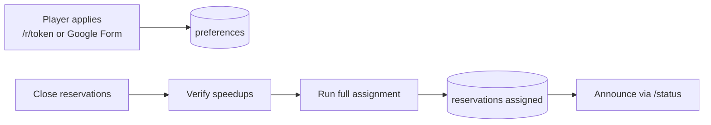
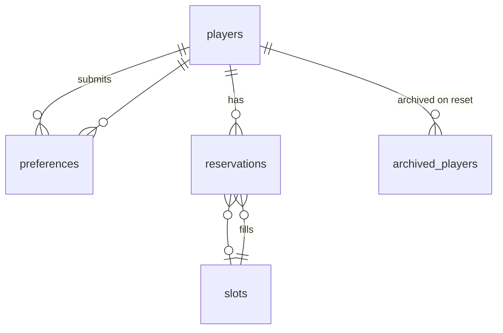
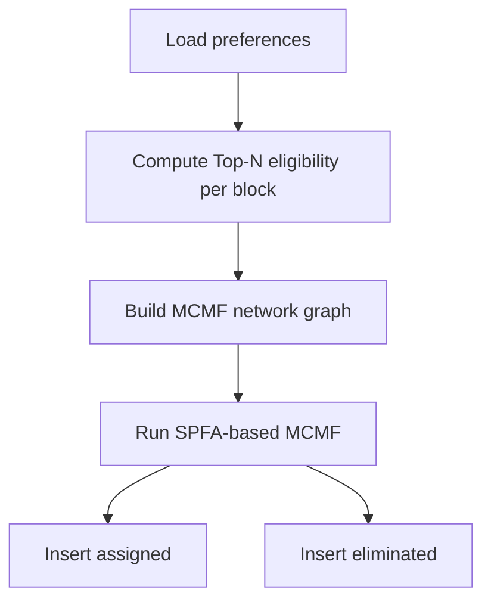
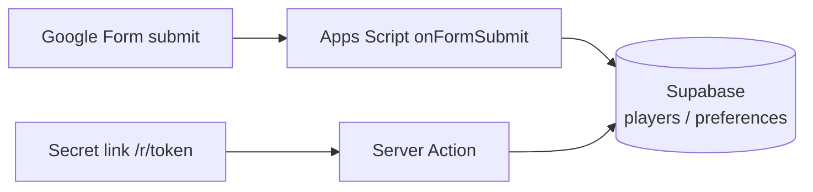

# SVS Reservation System — Technical Reference

A reservation and assignment system for alliance SVS (Castle) built on Next.js 14 + Supabase.  
Players **submit time preferences during the application window**, and R4+ operators **run batch assignment after closing**.  
The assignment algorithm uses **Min-Cost Max-Flow (MCMF)**.

> 🇰🇷 Korean version: [RESERVATION_SYSTEM.md](RESERVATION_SYSTEM.md)

---

## Table of Contents

1. [Overview](#1-overview)
2. [Environment Variables](#2-environment-variables)
3. [Operator Workflow (5 Steps)](#3-operator-workflow-5-steps)
4. [Pages & URLs](#4-pages--urls)
5. [Data Model](#5-data-model)
6. [Time & Slot Structure (UTC)](#6-time--slot-structure-utc)
7. [Player Application Flow](#7-player-application-flow)
8. [Batch Assignment Algorithm](#8-batch-assignment-algorithm)
9. [Post-Assignment Behavior (Cancel & Promote)](#9-post-assignment-behavior-cancel--promote)
10. [Admin Features](#10-admin-features)
11. [Public Status (/status)](#11-public-status-status)
12. [Cycle](#12-cycle)
13. [Settings Keys](#13-settings-keys)
14. [Security & Access Control](#14-security--access-control)
15. [Dev & Test Scripts](#15-dev--test-scripts)
16. [Source Files](#16-source-files)
17. [Google Form Integration (Apps Script Pipeline)](#17-google-form-integration-apps-script-pipeline)
18. [Appendix: Differences from Previous Version](#18-appendix-differences-from-previous-version)

---

## 1. Overview

| Item | Description |
|------|-------------|
| Purpose | Fair assignment of Mon/Tue (VP) · Thu (MO) castle slots, prioritized by speedup |
| Application | Secret URL `/r/[token]` or **Google Form** — only **preferences saved to DB**, no slot assignment |
| Assignment | Admin **Run full assignment** — recalculates entire cycle in Mon → Tue → Thu order |
| Algorithm | **Min-Cost Max-Flow (MCMF)** — resolves empty-slot+waitlist coexistence and speedup reversal |
| Timezone | **UTC only** (no KST toggle) |
| Auth | Players: URL token / Operators: Admin password (iron-session) |



---

## 2. Environment Variables

The following 4 variables must be present in `.env.local`.

| Variable | Description |
|----------|-------------|
| `NEXT_PUBLIC_SUPABASE_URL` | Supabase project URL (e.g. `https://xxxx.supabase.co`) |
| `NEXT_PUBLIC_SUPABASE_ANON_KEY` | Supabase anon public key |
| `SUPABASE_SERVICE_ROLE_KEY` | Supabase service role key — **server-only, never expose to client** |
| `IRON_SESSION_SECRET` | Admin session encryption key (random string, 32+ chars) |

Generate session secret:
```bash
node -e "console.log(require('crypto').randomBytes(32).toString('hex'))"
```

Validate environment:
```bash
npm run check-env
```

---

## 3. Operator Workflow (5 Steps)

| Step | Who | Action | DB Change |
|------|-----|--------|-----------|
| ① Application window | Players | Submit day, speedup, preferred blocks via `/r/[token]` or Google Form | `players`, `preferences` |
| ② Close reservations | R4+ Admin | Toggle **Close reservations** | `settings.reservation_open = false` |
| ③ Verify speedups | R4+ Admin | Cross-check actual values in reservation list / search / grid | `players` (if needed) |
| ④ Run assignment | R4+ Admin | **Run full assignment** | `reservations` (assigned / eliminated), `last_assignment_run` |
| ⑤ Announce results | R4+ | Share `/status` link | — (read-only) |

**Important:** During step ①, no `assigned` rows are created in `reservations`. An empty grid is expected and correct.

---

## 4. Pages & URLs

| Path | Access | Description |
|------|--------|-------------|
| `/r/[token]` | Secret token match | Multi-step application form (Info → Mon → Tue → Thu) |
| `/r/[token]/check` | Same token | Check application / assignment / waitlist status by Game ID |
| `/status` | Public | Live schedule and waitlist (pre/post-assignment messaging) |
| `/admin` | After login | URL, close, assignment, search, grid, Reset |
| `/admin/login` | — | Password login |
| `/admin/setup` | One-time | Store admin password hash |

**API (admin session required)**

| Method | Path | Body | Description |
|--------|------|------|-------------|
| POST | `/api/admin/login` | `{ password }` | Create session |
| POST | `/api/admin/action` | `{ action: "run_batch_assignment" }` | Same as button |
| GET | `/api/admin/assignment-preview` | — | Applicant counts and last run time |

---

## 5. Data Model

### 5.1 Tables

```
players               game_id(integer PK), name, alliance
                      speedup_mon, speedup_tue, speedup_thu
slots                 day, block, 30-min slot (0~3), active flag
preferences           (player_id→integer, day, block, cycle) — core of applications
reservations          assignment result: assigned | eliminated | cancelled
settings              token, cycle ID, open flag, admin hash, last_assignment_run
archived_players      backup on Reset (archive_id, game_id, name, alliance, speedup_*)
archived_preferences  backup on Reset (original_id, player_id, day, block, cycle)
archived_reservations backup on Reset (original_id, player_id, slot_id, status, cycle)
```

### 5.2 `players` Key Columns

| Column | Type | Description |
|--------|------|-------------|
| `game_id` | integer PK | Unique in-game ID (integer) |
| `name` | text NOT NULL | Player name |
| `alliance` | text NOT NULL | Alliance name |
| `speedup_mon` | integer (default 0) | Monday speedup (days) |
| `speedup_tue` | integer (default 0) | Tuesday speedup (days) |
| `speedup_thu` | integer (default 0) | Thursday speedup (days) |

> **Note:** The `players` table has an `email` column (nullable) but it is not used by the current codebase. Duplicate checking is based solely on `game_id + cycle_id + day_of_week`.

### 5.3 `preferences` (Application Data)

- A player can select multiple **2-hour blocks** for the same **cycle + day**.
- Unique key: `(player_id, day_of_week, block_start_utc, cycle_id)`.
- Batch assignment reads only this table to build the applicant list.

### 5.4 `reservations` (Assignment Results)

| status | slot_id | Meaning |
|--------|---------|---------|
| `assigned` | Slot ID | Assigned to a 30-min slot |
| `eliminated` | `NULL` | No slot for that day (waitlist) |
| `cancelled` | (prev slot) | Admin cancelled — `preferences` deleted, player can re-apply |

Before assignment: no `assigned`/`eliminated` rows for the cycle → **empty grid**.

### 5.5 Archive Tables

Before deleting data during Reset cycle, current cycle data is backed up to archive tables.

| Table | Source |
|-------|--------|
| `archived_players` | `players` |
| `archived_preferences` | `preferences` |
| `archived_reservations` | `reservations` |

### 5.6 ER Overview



---

## 6. Time & Slot Structure (UTC)

### 6.1 Days & Offices

| Day | Code | Office | Speedup Field |
|-----|------|--------|---------------|
| Monday | `mon` | VP | `speedup_mon` |
| Tuesday | `tue` | VP | `speedup_tue` |
| Thursday | `thu` | MO | `speedup_thu` |

Wed, Fri, Sat, Sun are not in the system.

### 6.2 Blocks & Slots

- **Block:** 2-hour intervals in UTC. `block_start_utc` = 0, 2, 4, …, 22 (12 blocks/day).
- **Slot:** **4 slots** per block (`slot_index` 0~3), each **30 minutes**.
- DB: `slots` table contains day × block × index combinations (seeded in `supabase/schema.sql`).

Display example: `10:00~10:30 UTC`, `10:00~12:00 UTC` (block header).

---

## 7. Player Application Flow

### 7.1 URL Protection

`middleware.ts` compares the token in `/r/[token]` against `settings.access_token`. Returns 404 on mismatch.

### 7.2 Application Steps (`ReservationForm`)

1. **Your info** — Game ID, name, alliance (existing reserved days shown via API to prevent duplicates).
2. **Monday (VP)** — speedup (days), preferred blocks (UTC, multiple selection).
3. **Tuesday (VP)** — same.
4. **Thursday (MO)** — same, then **Submit** → confirm dialog → finalize.

### 7.3 Server Processing (`processReservation` / `processMultiDayReservation`)

Conditions:
- `reservation_open !== "false"` (rejected if closed).
- If `preferences` already exist for the same cycle + day, rejected with `DUPLICATE_DAY_MESSAGE`.

Processing:
1. Upsert `players` (save speedup to the corresponding column: `speedup_mon`, `speedup_tue`, `speedup_thu`).
2. Upsert day-specific `preferences`.
3. **No `reservations` insert** — success message:

   > Your application has been received. Assignment results will be announced after the booking window closes.

### 7.4 Duplicate Prevention (`lib/reservation-guard.ts`)

Checks `game_id + cycle_id + day_of_week`. If `preferences` already exist for the same day in the same cycle, the request is rejected. **Applications from different `game_id`s are allowed.**

### 7.5 Self-Check (`/r/[token]/check`)

| Before assignment | After assignment |
|---|---|
| Has preferences → **Application received** | Has slot → **Assigned** + time |
| | No slot → **On waitlist** + preferred blocks |

---

## 8. Batch Assignment Algorithm

Entry point: `runBatchAssignmentForCycle` → per-day `runBatchAssignment` (order: **mon → tue → thu**).

### 8.1 Per-Day Processing Order

1. Load **active slots** for the day.
2. Build applicant map from **preferences** for that cycle + day (`BatchApplicant`: playerId, speedup, appliedAt, blocks).
3. Delete existing `assigned` rows for that day's slots; clean up `eliminated` rows for unassigned applicants.
4. Run matching → insert `assigned` / `eliminated`.
5. After all three days, update `settings.last_assignment_run`.

**Re-run:** Running again in the same cycle **deletes and recalculates** all assignments for each day.

### 8.2 Per-Block Eligibility (Top-N)

`computeEligibleByBlock`:
- For each 2-hour block, sort applicants who included that block in their preferences by **speedup desc → appliedAt asc → player_id asc (tiebreaker)**.
- Only the top **N** are eligible (N = number of active slots in that block, max 4).
- `countedPlayers` prevents a single player from occupying Top-N spots in multiple blocks simultaneously.

### 8.3 Min-Cost Max-Flow (MCMF)

`solveDayAssignmentMCMF`:

- **Network modeling:**
  - Source → player node (capacity: 1, cost: 0)
  - Player node → slot node (capacity: 1, cost: weight)
  - Slot node → Sink (capacity: 1, cost: 0)
- **Cost policy:**
  - Global speedup rank R (1st = 1, 2nd = 2, ...).
  - Top-N eligible edge: `Cost = R`
  - Non-eligible edge: `Cost = R + 1,000,000` (backfill when capacity reached)
- **Algorithm:** SPFA (Shortest Path Faster Algorithm)-based MCMF.
- **Goal:** Maximize total assignments (Max Flow) while prioritizing higher speedup (Min Cost) in a single pass.

> **Why MCMF replaced Hopcroft-Karp:** The previous 2-phase approach caused (V1) empty slots + waitlisted players coexisting in specific scenarios, and (V4) lower-speedup players getting better slots than higher-speedup ones. MCMF encodes priority into the cost function and resolves both issues in a single pass.



### 8.4 appliedAt

During batch assignment, `preferences.applied_at` is used as the application timestamp. (For multi-block preferences, the earliest timestamp is used.)

---

## 9. Post-Assignment Behavior (Cancel & Promote)

### 9.1 Admin Slot Cancel (`cancelReservation`)

1. Set `reservations.status = cancelled`.
2. Delete day-specific `preferences` → player **can re-apply**.
3. Call `promoteOnCancel(slotId)` — attempt to promote a waitlisted player to the freed slot.
4. After cancellation, a toast notification is shown in the Admin UI ("Cancelled. Waitlisted player will be auto-promoted if available.").

### 9.2 `promoteOnCancel`

- Targets only `eliminated` players who preferred that **block** and are not yet assigned for that day.
- Uses the same Top-N eligibility and ranking to promote the best-fit player to **that one slot**.
- Followed by `healEliminatedReservations` and `backfillEmptySlotsForDay` for cascading cleanup.

**Note:** Initial batch assignment uses the Admin button only. Auto-promotion runs only after a cancellation.

---

## 10. Admin Features

Login: bcrypt hash (`settings.admin_password_hash`), iron-session cookie.

| Feature | Description |
|---------|-------------|
| Secret URL | Display / copy / regenerate `access_token` (old `/r/...` URLs become invalid after regeneration) |
| Open / Close reservations | Toggle `reservation_open` |
| Export Excel | Per-cycle sheets (by day, etc.) |
| **Run full assignment** | `runFullBatchAssignment` — amber panel **above** Search Reservations |
| Reset cycle | Type `RESET` — **archives** then deletes players·preferences·reservations, increments `current_cycle_id`, clears `last_assignment_run` |
| Search | Before assignment: search applicants / After: search reservations + waitlist |
| Applicants | Before assignment only — applicant list based on `preferences` |
| Schedule Grid | After assignment only — UTC grid, per-slot Cancel (with loading spinner + toast on completion) |
| Waitlist | After assignment only — `eliminated` for that day + preferred blocks |

---

## 11. Public Status (/status)

- Anonymous (anon) read + Supabase Realtime subscription on `reservations` changes.
- No `last_assignment_run` → "Assignment not yet published" notice; grid is empty or pre-assignment.
- After assignment → assigned slots displayed + Waitlist (VP/MO).
- Closed banner when `reservation_open === false`.

---

## 12. Cycle

- `settings.current_cycle_id` (integer, default 1).
- All `preferences` / `reservations` are partitioned by `cycle_id`.
- **Reset cycle** backs up data to `archived_*` tables before deletion, then increments the ID.

---

## 13. Settings Keys

| key | Purpose |
|-----|---------|
| `access_token` | Secret string for `/r/[token]` |
| `admin_password_hash` | Admin bcrypt hash |
| `current_cycle_id` | Current cycle |
| `reservation_open` | `"true"` / `"false"` |
| `last_assignment_run` | ISO timestamp of last batch assignment |

---

## 14. Security & Access Control

| Layer | Detail |
|-------|--------|
| RLS | anon: SELECT only (players, slots, reservations, preferences, reservation_open) |
| Writes | Server Actions / API use **service role** (`createServiceClient`) |
| Admin | `requireAdmin()` fails without a valid session |
| Token URL | Token validated in middleware and server |

`SUPABASE_SERVICE_ROLE_KEY` in `.env.local` is server-only; never expose to the client.

---

## 15. Dev & Test Scripts

| npm script | Location | Description |
|------------|----------|-------------|
| `inject:random -- N` | `scripts/dev/` | Inject N random applications (default 120, preferences only) |
| `inject:test` | `scripts/dev/` | Inject real test data |
| `clear:assignments` | `scripts/dev/` | Delete only current cycle's assignment results |
| `seed:stress` | `scripts/dev/` | clear + inject 120 |
| `verify:assignment` | `scripts/verify/` | Verify assignment results (V1~V5) — exits(1) on any error |
| `audit:reservations` | `scripts/verify/` | Full cycle audit |
| `validate:assignment` | `scripts/verify/` | Assignment validity check |
| `run:batch` | `scripts/maintenance/` | Same as Admin Run full assignment |
| `recover:waitlist` | `scripts/maintenance/` | Recover waitlist |
| `backfill:slots` | `scripts/maintenance/` | Backfill empty slots |
| `reconcile:waitlist` | `scripts/maintenance/` | Clean up eliminated consistency |
| `purge:orphans` | `scripts/maintenance/` | Delete orphaned players (no preferences) |
| `check-env` | `scripts/admin/` | Validate environment variables |
| `set-admin-password` | `scripts/admin/` | Set admin password |

### `verify:assignment` Checks

| Code | Severity | Check |
|------|----------|-------|
| V1 | Warning | Empty slot + waitlisted player coexist |
| V2 | Error | Player assigned to same day twice |
| V3 | Error | Assignment to inactive slot |
| V4 | Warning | Speedup reversal (lower-ranked player gets better slot) |
| V5 | Error | Assignment without preferences |

Exits with `process.exit(1)` if any error is found.

**Local assignment test:**

```bash
npm run inject:random -- 10
npm run run:batch
npm run verify:assignment
```

---

## 16. Source Files

| Area | File |
|------|------|
| Assignment & MCMF | `lib/assignment.ts` |
| Duplicate check & messages | `lib/reservation-guard.ts` |
| Day & block constants | `lib/types.ts` |
| UTC formatting | `lib/utils.ts` |
| Admin UI | `app/admin/AdminDashboard.tsx`, `app/admin/actions.ts` |
| Application & check | `app/r/[token]/ReservationForm.tsx`, `app/r/[token]/actions.ts` |
| Public status | `app/status/StatusView.tsx`, `app/status/page.tsx` |
| Assignment verification | `scripts/verify/verify-assignment.ts` |
| Audit & validation | `scripts/verify/audit-reservations.ts`, `scripts/verify/validate-assignment.ts` |
| Maintenance | `scripts/maintenance/` |
| Dev tools | `scripts/dev/` |
| Admin setup | `scripts/admin/` |
| Apps Script | `scripts/appscript/onFormSubmit.gs` |
| Schema | `supabase/schema.sql` |
| Migrations | `supabase/migrations/` |

---

## 17. Google Form Integration (Apps Script Pipeline)

A Google Form application path is run in parallel to work around Vercel cold starts and improve accessibility.

### 17.1 Architecture



Both paths write to the **same `players` / `preferences` tables**.

### 17.2 Google Form Setup

1. Create a new form at [Google Forms](https://forms.google.com).
2. Form settings (gear icon) → **Responses** tab:
   - **Collect email addresses**: ON (required for response editing)
   - **Limit to 1 response**: ON
   - **Allow response editing**: ON (lets players fix mistakes)
3. Question structure and `row[]` indices:

| row index | Field | Type | Note |
|-----------|-------|------|------|
| `row[0]` | Timestamp | Auto | — |
| `row[1]` | Email address | Auto-collected | Not used by Apps Script (required for response editing) |
| `row[2]` | Game ID | Short answer (integer validation) | Required |
| `row[3]` | Game Name | Short answer | Required |
| `row[4]` | Alliance | Short answer | Required |
| `row[5]` | Monday Speedups (days) | Short answer (integer validation) | Required |
| `row[6]` | Preferred time on Monday | Checkbox | Block options below |
| `row[7]` | Tuesday Speedups (days) | Short answer (integer validation) | Required |
| `row[8]` | Preferred time on Tuesday | Checkbox | Block options below |
| `row[9]` | Thursday Speedups (days) | Short answer (integer validation) | Required |
| `row[10]` | Preferred time on Thursday | Checkbox | Block options below |

4. Checkbox block options (same for all three days):
```
0 (00:00~02:00 UTC)
2 (02:00~04:00 UTC)
4 (04:00~06:00 UTC)
6 (06:00~08:00 UTC)
8 (08:00~10:00 UTC)
10 (10:00~12:00 UTC)
12 (12:00~14:00 UTC)
14 (14:00~16:00 UTC)
16 (16:00~18:00 UTC)
18 (18:00~20:00 UTC)
20 (20:00~22:00 UTC)
22 (22:00~24:00 UTC)
```

5. After creating the form: **Responses tab** → spreadsheet icon → **Create new spreadsheet**.

### 17.3 Apps Script Setup

1. Open the linked Google Sheet → **Extensions → Apps Script**.
2. Delete all existing code and paste the contents of [`scripts/appscript/onFormSubmit.gs`](../scripts/appscript/onFormSubmit.gs).
3. Replace `SUPABASE_URL` and `SUPABASE_SERVICE_KEY` with your project values.
4. **Set up trigger:**
   - Click the clock icon (Triggers) in the left menu
   - **+ Add Trigger**
   - Function to run: `onFormSubmit`
   - Event source: **From spreadsheet**
   - Event type: **On form submit**
   - Save and allow Google account permissions

5. **Test:** Submit a test response via the Google Form → Check **Execution log** in Apps Script for `신청 완료: [gameId]` → Verify data in Supabase `players` and `preferences` tables.

### 17.4 cycle_id Management

`getCurrentCycleId()` dynamically fetches the current cycle ID from the Supabase `settings` table. **No code changes needed after running Reset cycle in Admin.**

### 17.5 Duplicate Prevention

| Path | 1st check | 2nd check |
|------|-----------|-----------|
| Google Form | 1 response per Google account | Apps Script: `game_id + cycle_id + day_of_week` |
| Secret link | `game_id + cycle_id + day_of_week` | — |

If the same `game_id` applies for the same day via both paths, the second attempt is ignored. **Applications from different `game_id`s are allowed on both paths.**

### 17.6 Security Notes

- Keep `SUPABASE_SERVICE_KEY` only in Apps Script code — **never share it on GitHub, chat, or anywhere public.** If leaked, regenerate it immediately from the Supabase dashboard.
- Apps Script runs only on Google's servers and is never exposed to clients, making it safe to store the service role key there.
- Restrict unnecessary edit access in the Google Form's linked spreadsheet sharing settings.

---

## 18. Appendix: Differences from Previous Version

| Item | Previous | Current |
|------|----------|---------|
| On application | Immediately called `assignToBlock` to assign a slot | Only saves `preferences` |
| Assignment | Real-time per application | Admin **Run full assignment** batch |
| Waitlist | `eliminated` created immediately | `eliminated` with `slot_id = null` after batch |
| Algorithm | Hopcroft-Karp | **Min-Cost Max-Flow (MCMF)** |
| Speedup fields | `speedup_vp`, `speedup_mo` | `speedup_mon`, `speedup_tue`, `speedup_thu` |
| Duplicate check | email + game_id mixed | `game_id + cycle_id + day_of_week` only |
| Archive | Data deleted on Reset | Backed up to `archived_*` tables before Reset |
| Application paths | Secret link only | Secret link + **Google Form** |
| Timezone display | UTC/KST toggle | **UTC only** |
| Cancel button | Immediate cancel | Loading spinner + completion toast |

---

*Document reflects the `main` branch (MCMF assignment + UTC-only UI + Google Form pipeline).*
